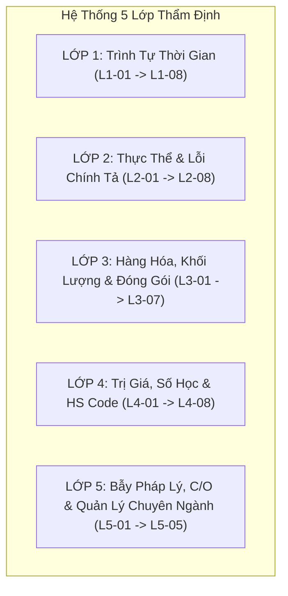

# SỔ TAY QUY CHUẨN KIỂM SOÁT & DANH MỤC 36 BẪY LỖI CHỨNG TỪ XUẤT NHẬP KHẨU

> **Tài liệu nghiệp vụ chuyên sâu:** Dành cho Chuyên viên Kiểm soát Chứng từ (customs:doc-auditor)  
> **Căn cứ pháp lý & Thông lệ quốc tế:**  
> - Luật Hải quan số 54/2014/QH13  
> - Thông tư số 38/2015/TT-BTC, Thông tư số 39/2018/TT-BTC, Thông tư số 121/2025/TT-BTC của Bộ Tài chính  
> - Nghị định số 128/2020/NĐ-CP (Xử phạt vi phạm hành chính trong lĩnh vực hải quan)  
> - Nghị định số 69/2018/NĐ-CP (Quy định chi tiết Luật Quản lý Ngoại thương)  
> - Các Hiệp định FTA (AKFTA, ACFTA, ATIGA, EVFTA, CPTPP, RCEP) & Thông tư hướng dẫn quy tắc xuất xứ  
> - Quy tắc thực hành thống nhất tín dụng chứng từ UCP 600 & Incoterms 2020 (ICC)

---

## MỤC LỤC DANH MỤC 36 BẪY LỖI & SAI LỆCH THỰC CHIẾN

---

## 1. LỚP 1: RÀNG BUỘC LOGIC TRÌNH TỰ THỜI GIAN (8 BẪY LỖI)

### L1-01. Hóa đơn xuất trước Hợp đồng (`Invoice Date < Contract Date`)
- **Bản chất:** Hóa đơn thương mại được phát hành trước khi hai bên ký kết hợp đồng mua bán ngoại thương hoặc đơn đặt hàng chính thức (PO) mà không có thỏa thuận nguyên tắc từ trước.
- **Rủi ro Hải quan:** Hải quan nghi ngờ hợp đồng lập khống để hợp thức hóa bộ chứng từ đối phó; nguy cơ bị thanh tra sau thông quan về tính xác thực của giao dịch thương mại.
- **Đề xuất khắc phục:** Yêu cầu Shipper điều chỉnh lại ngày phát hành Commercial Invoice bằng hoặc sau ngày ký kết hợp đồng.

### L1-02. Vận đơn bốc hàng trước Hóa đơn (`B/L On-board Date < Invoice Date`)
- **Bản chất:** Hàng đã được bốc lên tàu và khởi hành từ cảng xuất khẩu, nhưng ngày hóa đơn thương mại lại phát hành sau đó nhiều ngày.
- **Rủi ro Hải quan:** Bất hợp lý nghiêm trọng về quy trình giao thương; Hải quan nghi ngờ hóa đơn đối phó hoặc gian lận trị giá hải quan, hồ sơ lập tức bị chuyển luồng Đỏ kiểm hóa 100%.
- **Đề xuất khắc phục:** Shipper thu hồi hóa đơn lỗi và phát hành lại hóa đơn mới trước hoặc tại thời điểm hàng bốc lên tàu (B/L Date).

### L1-03. C/O cấp sau ngày tàu chạy thiếu đánh dấu Retroactive
- **Bản chất:** C/O phát hành sau ngày tàu chạy (B/L Date) quá 03 ngày làm việc nhưng tại Ô số 13 không tích chọn ô `[x] ISSUED RETROACTIVELY` (hoặc `RETROSPECTIVE`).
- **Rủi ro Hải quan:** Vi phạm quy tắc cấp C/O hồi tố của Hiệp định thương mại tự do (FTA). Hải quan cửa khẩu sẽ **bác bỏ C/O ngay lập tức**, từ chối áp dụng thuế suất ưu đãi đặc biệt.
- **Đề xuất khắc phục:**  
  1) Đề nghị Shipper liên hệ cơ quan cấp xuất xứ (KCCI, VCCI, MOFCOM...) cấp lại C/O thay thế có tích chọn ô Retroactive.  
  2) Làm thủ tục **Khai Nợ C/O trong vòng 30 ngày** theo Thông tư 38/2015 và TT 121/2025/TT-BTC để giải phóng hàng trước.

### L1-04. C/O hết thời hạn hiệu lực xuất trình (Expired C/O)
- **Bản chất:** C/O xuất trình cho cơ quan hải quan quá 12 tháng kể từ ngày cấp (hoặc quá hạn nộp bổ sung).
- **Rủi ro Hải quan:** C/O mất hiệu lực pháp lý, không được chấp nhận hoàn thuế.
- **Đề xuất khắc phục:** Xin gia hạn hoặc làm việc với cơ quan cấp nước xuất khẩu nếu có lý do bất khả kháng (force majeure) theo điều khoản hiệp định.

### L1-05. Ngày hiệu lực Bảo hiểm sau ngày tàu chạy (`Insurance Date > B/L Date`)
- **Bản chất:** Trong điều kiện CIF hoặc CIP, chứng thư bảo hiểm có ngày hiệu lực sau ngày tàu chạy.
- **Rủi ro Hải quan:** Hàng hóa chịu rủi ro trên biển trước khi có bảo hiểm; không thỏa mãn điều kiện giao hàng CIF/CIP theo Incoterms 2020.
- **Đề xuất khắc phục:** Yêu cầu công ty bảo hiểm cấp phụ lục xác nhận bảo hiểm có hiệu lực từ kho của người bán hoặc tại thời điểm xếp hàng lên phương tiện vận tải.

### L1-06. Ngày lập Packing List sau ngày tàu chạy (`PL Date > B/L Date`)
- **Bản chất:** Phiếu đóng gói chi tiết được lập sau khi tàu đã rời cảng.
- **Rủi ro Hải quan:** Mâu thuẫn logic: Làm sao hãng tàu có số liệu GW/NW và số kiện để phát hành B/L trước khi người bán lập Packing List?
- **Đề xuất khắc phục:** Điều chỉnh ngày phát hành Packing List trước hoặc trùng ngày B/L.

### L1-07. Ngày giao hàng trễ hạn theo L/C (`B/L Date > Latest Shipment Date`)
- **Bản chất:** Hàng giao sau ngày quy định giao hàng muộn nhất trong Thư tín dụng chứng từ (L/C).
- **Rủi ro Hải quan:** Ngân hàng phát hành từ chối thanh toán L/C vì lỗi chứng từ bất hợp lệ (Discrepancy theo UCP 600).
- **Đề xuất khắc phục:** Tu chỉnh L/C (L/C Amendment) gia hạn ngày giao hàng trước khi xuất trình bộ chứng từ cho ngân hàng.

### L1-08. Giấy phép chuyên ngành cấp sau ngày tàu cập cảng / đăng ký tờ khai
- **Bản chất:** Hàng thuộc diện phải có Giấy phép nhập khẩu trước khi thông quan, nhưng giấy phép lại được cấp sau ngày đăng ký tờ khai hải quan.
- **Rủi ro Hải quan:** Xử phạt vi phạm hành chính theo Điều 15 Nghị định 128/2020/NĐ-CP, buộc tái xuất hoặc tiêu hủy hàng hóa.
- **Đề xuất khắc phục:** Hoàn tất xin giấy phép nhập khẩu trước khi tàu cập cảng và trước khi truyền tờ khai.

---

## 2. LỚP 2: THỰC THỂ, CHỦ THỂ PHÁP LÝ & LỖI CHÍNH TẢ (8 BẪY LỖI)

### L2-01. Lỗi chính tả tên pháp nhân (Typo in Entity Name)
- **Bản chất:** Tên công ty Người gửi hàng (Shipper) hoặc Người nhận hàng (Consignee) bị gõ nhầm ký tự, thiếu/thừa chữ (vd: `Vietnam` $\rightarrow$ `Vienam`, `Engineering` $\rightarrow$ `Enginering`).
- **Rủi ro Hải quan:** Nghi ngờ giao nhầm đối tượng, hải quan yêu cầu dừng thông quan để xác minh.
- **Đề xuất khắc phục:** Làm công văn giải trình lỗi đánh máy gửi Chi cục Hải quan kèm B/L sửa đổi từ hãng tàu.

### L2-02. Sai hình thức pháp lý / viết tắt sai (Company Type Typo)
- **Bản chất:** `Co., Ltd.` viết thành `Co., Ldt.`, `JSC` viết thành `JSCo`, `Corporation` thành `Copr.`.
- **Rủi ro Hải quan:** Dễ bị các cơ quan cấp C/O hoặc kiểm tra chuyên ngành từ chối chấp nhận chứng từ.
- **Đề xuất khắc phục:** Chuẩn hóa cách viết tắt tên loại hình doanh nghiệp trên toàn bộ các chứng từ.

### L2-03. Bất nhất địa chỉ trụ sở (Address Mismatch)
- **Bản chất:** Khác biệt tên đường, số nhà, phường/xã, quận/huyện giữa Giấy ĐKKD, Invoice, B/L và C/O (vd: B/L ghi `Quan Haong Mai` thay vì `Quan Hoang Mai`).
- **Rủi ro Hải quan:** Bị từ chối C/O vì thông tin người nhận hàng không khớp với dữ liệu đăng ký kinh doanh.
- **Đề xuất khắc phục:** Hãng tàu gửi điện sửa Manifest trên Cổng thông tin một cửa quốc gia (NSW) và phát hành B/L đính chính.

### L2-04. Sai Mã số thuế của Người nhập khẩu (Tax ID Mismatch)
- **Bản chất:** Mã số thuế của doanh nghiệp nhập khẩu trên Invoice/Contract bị gõ sai một vài chữ số so với CSDL Tổng cục Thuế.
- **Rủi ro Hải quan:** Không thể truyền tờ khai VNACCS do hệ thống đối chiếu tự động mã số thuế với CSDL quốc gia.
- **Đề xuất khắc phục:** Sửa lại hóa đơn và hợp đồng khớp 100% với Giấy chứng nhận đăng ký doanh nghiệp.

### L2-05. Vận đơn "To Order" nhưng thiếu ký hậu (Missing Endorsement)
- **Bản chất:** B/L ghi Consignee là "To order" hoặc "To order of shipper" nhưng mặt sau của B/L gốc chưa có con dấu và chữ ký hậu của Shipper.
- **Rủi ro Hải quan:** Hãng tàu không cho phép lấy Lệnh giao hàng (D/O) do chưa hoàn tất thủ tục chuyển quyền sở hữu hàng hóa.
- **Đề xuất khắc phục:** Gửi B/L về cho Shipper hoặc ngân hàng để ký hậu (Blank endorsement hoặc Specific endorsement).

### L2-06. Thiếu khai báo Hóa đơn bên thứ ba (Third-party Invoicing)
- **Bản chất:** Hóa đơn thương mại được phát hành bởi một công ty đặt tại quốc gia thứ 3 (không phải quốc gia xuất xứ trên C/O), nhưng C/O không tích chọn ô "Third-party Invoicing" hoặc không ghi rõ tên, nước của công ty phát hành hóa đơn tại Ô số 7/10.
- **Rủi ro Hải quan:** C/O bị bác bỏ do không chứng minh được chuỗi giao dịch hợp lệ giữa bên bán và bên cấp C/O.
- **Đề xuất khắc phục:** Đề nghị cấp lại C/O tích chọn ô Third-party invoicing và ghi rõ số, ngày hóa đơn bên thứ ba.

### L2-07. Sai lệch tên hoặc mã Cảng (Port / UN-LOCODE Mismatch)
- **Bản chất:** Tên cảng dỡ (POD) trên B/L ghi `Cat Lai Port` nhưng C/O lại ghi `Hai Phong Port` hoặc ghi chung chung `Vietnam Port`.
- **Rủi ro Hải quan:** Vi phạm tính thống nhất của tuyến vận tải; hải quan từ chối C/O vì nghi ngờ hàng đi đến địa điểm khác.
- **Đề xuất khắc phục:** Cấp lại C/O hoặc đính chính B/L đồng nhất tên cảng dỡ hàng thực tế.

### L2-08. Hàng chuyển tải thiếu chứng minh vận chuyển thẳng (Direct Consignment)
- **Bản chất:** Hàng hóa đi qua một hoặc nhiều nước trung gian trước khi về Việt Nam nhưng không có Giấy xác nhận chuyển tải (Non-manipulation Certificate) hoặc Thư xác nhận chuyển tải nguyên container của hãng tàu.
- **Rủi ro Hải quan:** Bác bỏ C/O vì vi phạm Quy tắc vận tải đơn giản (Direct Consignment rule).
- **Đề xuất khắc phục:** Yêu cầu hãng tàu cung cấp Through B/L (Vận đơn suốt) hoặc Thư xác nhận hàng không qua can thiệp/chế biến tại cảng chuyển tải.

---

## 3. LỚP 3: HÀNG HÓA, KHỐI LƯỢNG, ĐÓNG GÓI & CONTAINER (7 BẪY LỖI)

### L3-01. Nghịch lý vật lý Gross Weight < Net Weight (`GW < NW`)
- **Bản chất:** Trọng lượng cả bao bì (Gross Weight) nhỏ hơn trọng lượng tịnh (Net Weight).
- **Rủi ro Hải quan:** Vi phạm quy chuẩn vật lý cơ bản, hồ sơ bị trả về ngay lập tức.
- **Đề xuất khắc phục:** Tính toán và sửa lại Packing List: $GW = NW + \text{Trọng lượng bao bì/pallet}$.

### L3-02. Lệch Gross Weight giữa Packing List và B/L
- **Bản chất:** PL ghi `18,450.00 KGS` nhưng B/L ghi `18,050.00 KGS` (lệch 400 KGS) do hãng tàu nhập sai hoặc do lỗi làm tròn số.
- **Rủi ro Hải quan:** Lệch Manifest trên cổng NSW. Khi xe kéo qua cân cầu cảng Cát Lái/Hải Phòng, độ lệch $> 0.5\%$ sẽ bị lập biên bản, xử phạt vi phạm hành chính theo Điều 7, 8 Nghị định 128/2020/NĐ-CP và chuyển luồng Đỏ kiểm hóa.
- **Đề xuất khắc phục:** Hãng tàu gửi điện sửa Manifest và cấp Giấy đính chính vận đơn (B/L Correction).

### L3-03. Bất nhất số lượng kiện và loại bao bì (Packages Mismatch)
- **Bản chất:** PL ghi 100 Cartons nhưng B/L ghi 10 Pallets hoặc 95 Cartons.
- **Rủi ro Hải quan:** Nghi ngờ thừa/thiếu hàng thực tế so với khai báo, bắt buộc khui kiểm đếm từng kiện.
- **Đề xuất khắc phục:** Thống nhất quy cách đóng gói: Ghi rõ số kiện nhỏ và số kiện lớn (vd: `100 Cartons packed on 10 Wooden Pallets`).

### L3-04. Bất nhất Đơn vị tính (UOM Mismatch)
- **Bản chất:** Invoice ghi `SETS`, Contract ghi `PCS`, Packing List ghi `KGS`, Tờ khai hải quan khai `CÁI`.
- **Rủi ro Hải quan:** Hệ thống VNACCS báo lỗi sai chuẩn đơn vị tính theo Biểu thuế XNK.
- **Đề xuất khắc phục:** Quy đổi và thống nhất đơn vị tính theo danh mục Biểu thuế XNK Việt Nam.

### L3-05. Sai lệch Số Container hoặc Số Chì (Container/Seal Mismatch)
- **Bản chất:** Nhầm lẫn các ký tự tương đồng như chữ `O` và số `0`, chữ `I` và số `1` giữa B/L và Packing List.
- **Rủi ro Hải quan:** Biên phòng cảng và Hải quan giám sát không cho giải phóng container ra khỏi cổng cảng do sai số niêm chì.
- **Đề xuất khắc phục:** Đối chiếu lại với biên bản bàn giao vỏ cont/chì của hãng tàu và làm công văn đính chính số seal.

### L3-06. Bao bì gỗ thiếu chứng chỉ hun trùng ISPM 15
- **Bản chất:** Hàng nhập khẩu đóng trong thùng gỗ/pallet gỗ nhưng không có dấu mộc hun trùng đạt chuẩn ISPM 15 và thiếu Chứng thư hun trùng (Fumigation Certificate).
- **Rủi ro Hải quan:** Cơ quan Kiểm dịch thực vật buộc phải hun trùng lại tại cảng với chi phí rất cao hoặc buộc tái xuất lô hàng.
- **Đề xuất khắc phục:** Kiểm tra dấu mộc ISPM 15 trên gỗ và yêu cầu người bán gửi chứng thư hun trùng trước khi hàng đến.

### L3-07. Bất nhất thể tích khối (Measurement CBM Mismatch)
- **Bản chất:** Sai lệch CBM giữa Packing List và B/L làm lệch số liệu cước vận tải biển (LCL) hoặc phí lưu kho CFS.
- **Rủi ro Hải quan:** Làm sai lệch phân bổ chi phí vận tải vào trị giá hải quan.
- **Đề xuất khắc phục:** Đo đạc lại kích thước ba chiều $(D \times R \times C)$ của từng kiện và đính chính số CBM.

---

## 4. LỚP 4: TRỊ GIÁ, SỐ HỌC, ĐIỀU KIỆN GIAO HÀNG & HS CODE (8 BẪY LỖI)

### L4-01. Phép tính số học sai từng dòng (`Qty x Unit Price != Line Total`)
- **Bản chất:** Nhân sai đơn giá với số lượng trên một dòng hàng (vd: $1 \times 25,000 = 23,000$).
- **Rủi ro Hải quan:** Hệ thống VNACCS từ chối tiếp nhận vì tổng giá trị dòng không bằng tích của đơn giá và lượng; Hải quan nghi ngờ khai sai trị giá hải quan.
- **Đề xuất khắc phục:** Sửa lại hóa đơn đảm bảo phép nhân số học chính xác tuyệt đối.

### L4-02. Tổng cộng hóa đơn sai (Subtotal Mismatch)
- **Bản chất:** Tổng các dòng hàng cộng lại không bằng số tiền `Total Amount` ghi ở chân hóa đơn.
- **Rủi ro Hải quan:** Tờ khai hải quan không đối ứng được trị giá tính thuế với tổng tiền thanh toán quốc tế.
- **Đề xuất khắc phục:** Cộng lại chính xác toàn bộ các dòng hàng và cập nhật tổng tiền bằng số và bằng chữ.

### L4-03. Tổng giá trị Invoice không khớp Hợp đồng / PO / L/C
- **Bản chất:** Invoice ghi $113,000 nhưng Contract ký $115,000 mà không có điều khoản dung sai (Tolerance) hoặc phụ lục hợp đồng giải trình.
- **Rủi ro Hải quan:** Ngân hàng từ chối chuyển tiền T/T hoặc thanh toán L/C; Hải quan nghi ngờ chuyển tiền lậu hoặc trốn thuế.
- **Đề xuất khắc phục:** Lập Phụ lục hợp đồng (Addendum) điều chỉnh giá trị hoặc phát hành lại Invoice khớp hợp đồng.

### L4-04. Lệch phân nhóm mã HS 6 số giữa Invoice và C/O
- **Bản chất:** Invoice ghi `8479.89` (máy nguyên chiếc) nhưng C/O ghi `8479.90` (phụ tùng).
- **Rủi ro Hải quan:** Hải quan từ chối áp thuế FTA (0%) cho máy móc vì C/O chỉ cấp cho phụ tùng; doanh nghiệp bị áp thuế MFN.
- **Đề xuất khắc phục:** Cấp lại C/O với mã HS 8479.89 hoặc Khai nợ C/O trong 30 ngày để lấy hàng trước.

### L4-05. Sai lệch điều kiện giao hàng Incoterms
- **Bản chất:** Hợp đồng thỏa thuận FOB nhưng Invoice lại ghi CIF hoặc ghi thiếu địa điểm chỉ định (vd: `CIF Vietnam` thay vì `CIF Cat Lai Port`).
- **Rủi ro Hải quan:** Khó khăn trong việc xác định chi phí vận tải và bảo hiểm để cộng/trừ vào trị giá tính thuế hải quan.
- **Đề xuất khắc phục:** Ghi chuẩn xác điều kiện Incoterms 2020 kèm cảng dỡ hàng chỉ định.

### L4-06. Không bóc tách chi phí cước biển (F) và bảo hiểm (I) trong CIF
- **Bản chất:** Trong điều kiện CIF/CFR, người bán không thể hiện rõ cước biển F trong invoice hoặc phụ lục khi hải quan yêu cầu kiểm tra trị giá tính thuế.
- **Rủi ro Hải quan:** Dễ bị hải quan ấn định thuế hoặc bác bỏ trị giá giao dịch nếu có nghi ngờ cước biển bất hợp lý.
- **Đề xuất khắc phục:** Yêu cầu Shipper cung cấp bản kê cước biển (Freight Breakdown) của hãng tàu.

### L4-07. Mô tả tên hàng chung chung / sai bản chất hàng hóa
- **Bản chất:** Tên hàng ghi "Spare parts", "Electronic components", "Chemicals" mà không có tên thương mại, model, thành phần cụ thể.
- **Rủi ro Hải quan:** Không đủ cơ sở để xác định mã HS 8 số, hồ sơ bị dừng chuyển luồng Vàng/Đỏ để kiểm tra thực tế.
- **Đề xuất khắc phục:** Khai tên hàng theo công thức: `Tên hàng tiếng Việt + Tên thương mại tiếng Anh + Model/Part No. + Nhãn hiệu + Công dụng/Chất liệu + Tình trạng (mới 100%)`.

### L4-08. Sai lệch đồng tiền thanh toán (Currency Code)
- **Bản chất:** Hợp đồng thỏa thuận USD nhưng Invoice phát hành đồng EUR hoặc JPY.
- **Rủi ro Hải quan:** Gây sai lệch tỷ giá tính thuế hải quan tại thời điểm đăng ký tờ khai.
- **Đề xuất khắc phục:** Đổi lại hóa đơn thương mại đúng đồng tiền thanh toán đã ký kết.

---

## 5. LỚP 5: BẪY PHÁP LÝ HẢI QUAN & QUẢN LÝ CHUYÊN NGÀNH (5 BẪY LỖI)

### L5-01. Tiêu chí xuất xứ (Origin Criterion) trên C/O không hợp lệ
- **Bản chất:** Ghi sai ký hiệu tiêu chí xuất xứ (vd: Hàng lắp ráp từ linh kiện đa quốc gia nhưng C/O ghi nhầm tiêu chí `WO` - Thuần túy; hoặc hàng Form E nhưng ghi nhầm tiêu chí của Form D).
- **Rủi ro Hải quan:** Bác bỏ C/O ngay tại khâu tiếp nhận vì tiêu chí xuất xứ không tồn tại hoặc không đáp ứng PSR của Hiệp định.
- **Đề xuất khắc phục:** Tra cứu Quy tắc cụ thể mặt hàng (PSR) của hiệp định và đề nghị cơ quan cấp xuất xứ cấp lại C/O đúng tiêu chí (`CTH`, `CTSH`, hoặc `RVC 40%`).

### L5-02. C/O có vết tẩy xóa, sửa chữa không hợp lệ
- **Bản chất:** C/O bản giấy có vết bút tẩy, gạch xóa sửa chữ viết tay nhưng không có con dấu và chữ ký xác nhận của cơ quan cấp C/O.
- **Rủi ro Hải quan:** C/O bị coi là giả mạo hoặc bị hủy tính pháp lý.
- **Đề xuất khắc phục:** Xin cấp C/O mới thay thế, tuyệt đối không tự ý tẩy xóa lên bản gốc C/O.

### L5-03. Thiếu đăng ký kiểm tra chất lượng / kiểm dịch trước khi mở tờ khai
- **Bản chất:** Hàng thuộc Danh mục quản lý chuyên ngành (Nghị định 69/2018/NĐ-CP, Bộ KH&CN, Bộ NN&PTNT, Bộ Y tế...) nhưng doanh nghiệp chưa nộp Giấy đăng ký kiểm tra lên Cổng thông tin một cửa quốc gia (NSW).
- **Rủi ro Hải quan:** Không thể thông quan hoặc không được mang hàng về kho bảo quản, phát sinh chi phí lưu bãi container (DEM/DET) rất lớn tại cảng.
- **Đề xuất khắc phục:** Nộp hồ sơ đăng ký kiểm tra chất lượng/kiểm dịch trên NSW để nhận Giấy đăng ký kiểm tra trước khi truyền tờ khai.

### L5-04. Bỏ lỡ thời điểm khai báo nợ C/O trên tờ khai hải quan
- **Bản chất:** Tại thời điểm truyền tờ khai hải quan chưa có bản gốc C/O nhưng người khai quên không tích chọn mã khai báo **NỢ C/O TRONG VÒNG 30 NGÀY** trên phần mềm VNACCS.
- **Rủi ro Hải quan:** Căn cứ Điều 16 Thông tư 38/2015/TT-BTC (sửa đổi tại TT 39/2018 và TT 121/2025/TT-BTC), nếu không khai báo nợ C/O tại thời điểm đăng ký tờ khai thì doanh nghiệp **mất vĩnh viễn quyền nộp bổ sung C/O để hưởng ưu đãi thuế**.
- **Đề xuất khắc phục:** Bắt buộc phải khai báo chỉ tiêu nợ C/O ngay khi truyền tờ khai chính thức.

### L5-05. Rủi ro xử phạt vi phạm hành chính theo Nghị định 128/2020/NĐ-CP
- **Bảng mức xử phạt phổ biến:**
  - *Khai sai số lượng, trọng lượng:* Phạt 1.000.000đ - 3.000.000đ (Điều 8).
  - *Khai sai mã HS dẫn đến thiếu thuế:* Phạt 10% đến 20% số tiền thuế khai thiếu (Điều 9).
  - *Trốn thuế, gian lận thuế:* Phạt từ 1 đến 3 lần số thuế trốn (Điều 14).
  - *Hãng tàu khai sai thông tin Manifest B/L:* Phạt 1.000.000đ - 2.000.000đ (Điều 7).
