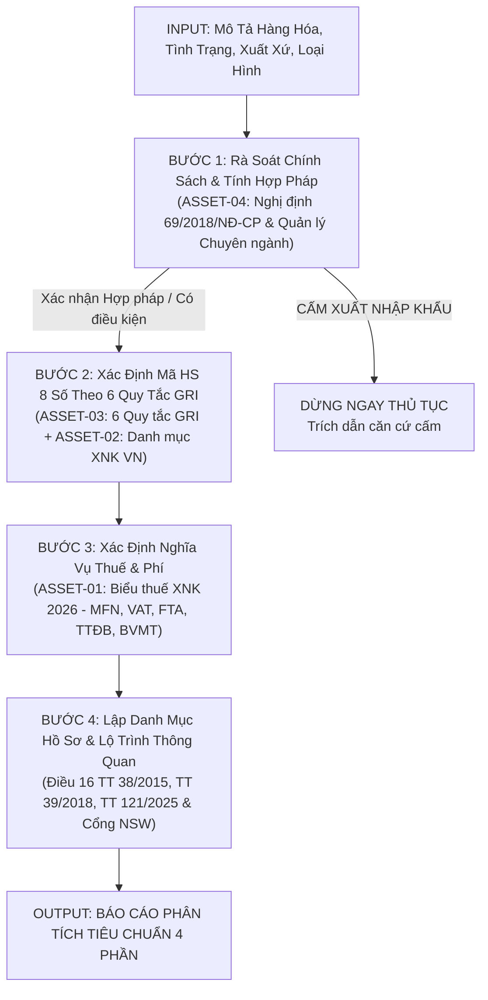

# CUSTOMS HS CLASSIFIER & CLEARANCE SPECIALIST
## Chuyên Gia Phân Loại Hàng Hóa & Thủ Tục Hải Quan

> **Đóng gói chuẩn Antigravity Customization System (v1.0.0)**  
> *Vận hành quy trình phân loại hàng hóa 4 bước khép kín, tra cứu mã HS 8 số theo 6 Quy tắc GRI, tính toán toàn bộ biểu thuế và xác lập lộ trình thông quan thực tế kết hợp Thư viện Tài sản Riêng biệt (Dedicated Assets).*

---

## 1. Bản Hợp Đồng Thực Thi (Core Contract)

1. **Outcome:**
   - Báo cáo kết quả phân tích tiêu chuẩn gồm **đúng 4 phần cấu trúc**:
     1. Kết luận về tính pháp lý mặt hàng (Cấm XNK, Có điều kiện - Giấy phép, XNK tự do).
     2. Phân loại mã HS Code (8 chữ số), mô tả chi tiết song ngữ, mã dự phòng, lập luận kỹ thuật & trích dẫn GRI.
     3. Nghĩa vụ thuế & phí (Thuế thông thường, MFN, VAT, Form E, Form D, EUR.1, CPTPP, TTĐB, BVMT, điều kiện miễn thuế).
     4. Danh mục bộ chứng từ hải quan bắt buộc và Quy trình 3 bước thực thi thông quan thực tế tại cảng.
2. **Constraints:**
   - **Bắt buộc dẫn chiếu căn cứ pháp lý rõ ràng:** Luật Hải quan số 54/2014, Luật Quản lý ngoại thương số 05/2017, Luật Thuế XNK số 107/2016, Nghị định 69/2018/NĐ-CP, Nghị định 26/2023/NĐ-CP, Thông tư 38/2015/TT-BTC sửa đổi bổ sung bởi Thông tư 39/2018/TT-BTC và Thông tư 121/2025/TT-BTC.
   - Khai thác trực tiếp từ **Mục Assets riêng biệt** nằm trong Skill này (`assets/`), tuyệt đối không bịa đặt mã HS hoặc mức thuế suất.
   - Bảo mật PII và thông tin nội bộ của doanh nghiệp.
3. **Non-goals:**
   - Không truyền nộp tờ khai chính thức lên cổng kết nối của Tổng cục Hải quan (VNACCS thật) trong môi trường thử nghiệm.
   - Không tự ý giải thích hoặc suy diễn mở rộng vượt ngoài câu chữ của Biểu thuế và Chú giải HS.
4. **Acceptance Criteria:**
   - 100% mã HS được xác định tới cấp độ 8 chữ số chuẩn hóa quốc gia.
   - Bóc tách đầy đủ các mức thuế theo từng hiệp định thương mại tự do tương ứng với nước xuất xứ và điều kiện C/O form.
   - Lập checklist hồ sơ hải quan đầy đủ và cảnh báo các bẫy rủi ro thực tế (kiểm dịch, tuổi thiết bị, kiểm tra chất lượng).

---

## 2. Thư Viện Tài Sản Riêng Biệt Của Skill (Dedicated Assets)

Toàn bộ tài nguyên nghiệp vụ được lưu trữ độc lập tại thư mục `assets/` nội bộ của Skill:

| Mã Tài Sản | Tên Tệp Tin | Định Dạng & Kích Thước | Căn Cứ Ban Hành / Thẩm Quyền | Vai Trò & Ứng Dụng Trong Skill |
|:---:|---|:---:|---|---|
| **ASSET-01** | `Bieu_thue_XNK_2026.xlsx`<br>*(kèm `hs_tariff_index.sqlite`)* | Excel (.xlsx) ~32.3 MB<br>SQLite Index ~3.8 MB | Bộ Tài chính, Tổng cục Hải quan, các Nghị định Biểu thuế FTA | Tra cứu tức thì mã HS 8 số, thuế NK Thông thường, MFN, VAT, Form E (ACFTA), Form D (ATIGA), EUR.1 (EVFTA), CPTPP, VKFTA, TTĐB, BVMT. |
| **ASSET-02** | `Phu_luc_I_Danh_muc_hang_hoa_XNK_VN.pdf` | PDF Vector ~11.7 MB (604 trang) | Thông tư 31/2022/TT-BTC của Bộ Tài chính | Danh mục chuẩn hóa quốc gia gồm 21 Phần, 97 Chương, mô tả song ngữ Anh - Việt và Đơn vị tính tiêu chuẩn. |
| **ASSET-03** | `Phu_luc_II_Sau_quy_tac_tong_quat_GRI.doc`<br>*(kèm bản UTF-8: `.txt`)* | Word (.doc) + Plain text UTF-8 | Thông tư 31/2022/TT-BTC của Bộ Tài chính / WCO HS Convention | Toàn văn 6 Quy tắc tổng quát (GRI 1 đến GRI 6) và Chú giải chi tiết (Explanatory Notes) phục vụ lập luận phân loại. |
| **ASSET-04** | `danh_muc_hang_can_giay_phep_ND69.pdf` | PDF Scan ~3.44 MB (89 trang) | Nghị định số 69/2018/NĐ-CP của Chính phủ | Rà soát danh mục hàng cấm XNK (Phụ lục I) và hàng XNK theo giấy phép/điều kiện quản lý của 8 Bộ chuyên ngành. |

---

## 3. Quy Trình Phân Tích Thực Thi 4 Bước (4-Step Process)



### Bước 1: Rà soát chính sách mặt hàng & Tính hợp pháp
- **Kiểm tra hàng cấm:** Đối chiếu mô tả với Phụ lục I Nghị định 69/2018/NĐ-CP (vũ khí, pháo, hóa chất cấm, phế liệu độc hại, rác thải e-waste...).
- **Kiểm tra hàng đã qua sử dụng:** Nếu là máy móc, thiết bị, dây chuyền công nghệ đã qua sử dụng: kiểm tra giới hạn tuổi thiết bị (tối đa 10 năm theo Quyết định 18/2019/QĐ-TTg). Nếu là thiết bị điện tử tiêu dùng/CNTT cũ: CẤM nhập khẩu tuyệt đối theo Thông tư 11/2018/TT-BTTTT.
- **Kết luận:** Xác nhận hàng được phép XNK tự do, XNK có điều kiện/giấy phép, hay bị CẤM. Nếu bị CẤM, dừng ngay quy trình và trích dẫn văn bản cấm.

### Bước 2: Xác định mã HS Code theo 6 quy tắc GRI & Chuẩn hóa 8 Chữ Số Quốc Gia
- **Nguyên tắc bắt buộc xác định mã HS 8 số:** Theo Điều 16 & 29 Luật Hải quan số 54/2014/QH13 và Thông tư 38/2015/TT-BTC (sửa đổi bởi TT 39/2018/TT-BTC), việc khai báo hải quan điện tử trên hệ thống VNACCS/ECUS5 và tính thuế nhập khẩu bắt buộc phải áp dụng **mã HS 8 chữ số quốc gia (National Tariff Line)**. Tuyệt đối không để mã khuyến nghị ở cấp độ 4 số (Heading) hay 6 số (Subheading) và không đẩy mã 8 số vào mã dự phòng.
- **Phân tích kỹ thuật:** Tách biệt bản chất vật lý, chất liệu, chức năng chính, công dụng, thành phần cấu tạo.
- **Áp dụng tuần tự 6 Quy tắc tổng quát (Phụ lục II):**
  - *GRI 1:* Xác định Nhóm 4 số (Heading) căn cứ nội dung tên nhóm và Chú giải Phần/Chương liên quan.
  - *GRI 2(a):* Hàng chưa hoàn chỉnh/tháo rời mang đặc trưng cơ bản của hàng hoàn thiện.
  - *GRI 2(b):* Hỗn hợp, hợp chất của nguyên liệu hoặc chất.
  - *GRI 3(a):* Nhóm có mô tả cụ thể, đặc trưng nhất được ưu tiên hơn mô tả khái quát.
  - *GRI 3(b):* Hàng hỗn hợp, ghép bộ bán lẻ phân loại theo thành phần/bộ phận tạo nên **đặc tính cơ bản (Essential Character)**.
  - *GRI 3(c):* Phân loại vào nhóm có thứ tự đánh số cuối cùng trong số các nhóm tương đương.
  - *GRI 4:* Hàng hóa không thể phân loại theo GRI 1-3 thì xếp vào nhóm hàng giống chúng nhất.
  - *GRI 5(a) & 5(b):* Phân loại bao bì, hộp chứa chuyên dụng và bao bì thông thường.
  - *GRI 6:* So sánh cấp độ phân nhóm 6 số và ấn định dòng thuế 8 số quốc gia giữa các dòng có cùng cấp độ gạch (-).
- **Dẫn chứng tiền lệ & Ranh giới phân loại:** Rõ ràng đối chiếu với các mã HS lân cận dễ gây nhầm lẫn hoặc tranh chấp phân loại.

### Bước 3: Xác định nghĩa vụ thuế, phí thực tế theo Nước Xuất Xứ (Origin)
> ⚖️ **LƯU Ý VỀ CĂN CỨ PHÁP LÝ:** Tập tin `assets/Bieu_thue_XNK_2026.xlsx` chỉ là tài liệu tổng hợp nghiệp vụ dùng để tra cứu tham khảo. Căn cứ pháp lý có hiệu lực thi hành bắt buộc là các **Luật của Quốc hội và Nghị định của Chính phủ** được trích dẫn cụ thể.
- **Nguyên tắc tinh gọn:** CHỈ đưa ra con số và các sắc thuế mà sản phẩm và mã HS đó **THỰC SỰ PHẢI CHỊU** cho lô hàng cụ thể, không liệt kê tràn lan tất cả các biểu thuế FTA không liên quan.
- **Cơ chế xác định Thuế Nhập Khẩu theo Origin:**
  - *Trường hợp 1 (Có FTA & Có C/O):* Nước xuất xứ nằm trong các hiệp định thương mại tự do với Việt Nam VÀ có chứng từ chứng nhận xuất xứ hợp lệ (Form E, Form D, EUR.1, CPTPP...) $\rightarrow$ Áp dụng **Thuế NK Ưu đãi Đặc biệt (FTA)** theo Nghị định Biểu thuế FTA tương ứng (Nghị định 118/2022 cho ACFTA, 126/2022 cho ATIGA, 116/2022 cho EVFTA, 115/2022 cho CPTPP...).
  - *Trường hợp 2 (WTO MFN):* Nước xuất xứ là quốc gia thành viên WTO có quan hệ Tối huệ quốc với Việt Nam (như Hoa Kỳ, Brazil, Argentina...) hoặc hàng hóa từ nước có FTA nhưng không có C/O ưu đãi $\rightarrow$ Áp dụng **Thuế NK Ưu đãi (MFN)** theo **Nghị định số 26/2023/NĐ-CP** (sửa đổi bởi Nghị định số 144/2024/NĐ-CP), **chứ KHÔNG áp dụng thuế nhập khẩu thông thường**.
  - *Trường hợp 3 (Non-MFN):* Hàng hóa từ quốc gia/vùng lãnh thổ chưa có quan hệ MFN với Việt Nam $\rightarrow$ Áp dụng **Thuế NK Thông thường** (theo Quyết định số 15/2023/QĐ-TTg của Thủ tướng Chính phủ).
- **Thuế Giá trị gia tăng (VAT):** Căn cứ Luật Thuế GTGT số 13/2008/QH12 (sửa đổi) và Thông tư số 219/2013/TT-BTC. Xác định chính xác hàng hóa thuộc diện: Không chịu thuế GTGT khâu nhập khẩu (Khoản 1 Điều 4 TT 219 đối với nông sản, cây trồng chưa chế biến), thuế suất 5%, hay 8%/10% (theo Nghị định 174/2025/NĐ-CP).
- **Thuế TTĐB & BVMT:**
  - Nếu sản phẩm **KHÔNG** thuộc diện chịu thuế theo Luật Thuế TTĐB số 27/2008 và Luật Thuế BVMT số 57/2010: **Không đưa vào bảng thuế phải chịu**, chỉ ghi 1 dòng xác nhận rõ ràng "Không áp dụng".
  - Nếu sản phẩm **THUỘC** diện chịu thuế (rượu bia, ô tô, xăng dầu, túi ni lông...): Đưa vào bảng tính thuế với mức thuế suất và căn cứ pháp lý quy định.
- **Mô phỏng công thức tính thuế:** Cung cấp ví dụ tính thuế minh họa cho lô hàng giả định trị giá CIF cụ thể (Thuế NK $\rightarrow$ Thuế VAT $\rightarrow$ Tổng thuế phải nộp).

### Bước 4: Lập danh mục hồ sơ chứng từ & Thủ tục thông quan
- **Bộ hồ sơ hải quan cơ bản (Điều 16 TT 38/2015 sửa đổi bởi TT 39/2018 & TT 121/2025):** Tờ khai hải quan điện tử, Commercial Invoice, Packing List, Bill of Lading, C/O...
- **Kiểm tra chuyên ngành (Chính sách ngành):** Xác định thuộc diện Kiểm dịch thực vật/động vật, An toàn thực phẩm (Bộ NN&PTNT), Kiểm tra chất lượng nhà nước QCVN (Bộ KH&CN), Dán nhãn năng lượng (Bộ Công Thương), Hợp quy viễn thông (Bộ TT&TT)...
- **Quy trình 3 bước thông quan:** Đăng ký chuyên ngành trên Cổng một cửa quốc gia (NSW) $\rightarrow$ Khai tờ khai VNACCS/ECUS5 và nhận phân luồng $\rightarrow$ Làm việc tại Chi cục Hải quan cửa khẩu lấy mẫu và thông quan giải phóng hàng.

---

## 4. Công Cụ Khai Thác Cục Bộ Bằng Dòng Lệnh (CLI Tools)

Agent hoặc người dùng có thể kích hoạt trực tiếp các công cụ tự động hóa cao:

```powershell
# 1. Tra cứu Biểu thuế XNK 2026 (Mã HS 8 số, thuế MFN, VAT, Form E, Form D, EUR.1, CPTPP...)
python .agents/skills/customs-hs-classifier/scripts/query_hs_tariff.py -q "đậu tương" -l 5
python .agents/skills/customs-hs-classifier/scripts/query_hs_tariff.py -q "1201.90.00"

# 2. Tra cứu 6 Quy tắc GRI và Chú giải Explanatory Notes
python .agents/skills/customs-hs-classifier/scripts/query_gri_rules.py -r 3b
python .agents/skills/customs-hs-classifier/scripts/query_gri_rules.py -k "tháo rời"

# 3. Tra cứu chính sách mặt hàng & điều kiện giấy phép Nghị định 69/2018/NĐ-CP
python .agents/skills/customs-hs-classifier/scripts/query_conditional_goods.py -q "đậu tương"
python .agents/skills/customs-hs-classifier/scripts/query_conditional_goods.py -q "máy móc đã qua sử dụng"

# 4. Tra cứu Giấy phép Nhập khẩu & Thủ tục Quản lý Chuyên ngành chi tiết
python .agents/skills/customs-hs-classifier/scripts/query_permits.py -q "đậu tương" --hs "1201.90.00"
python .agents/skills/customs-hs-classifier/scripts/query_permits.py -q "mỹ phẩm"
python .agents/skills/customs-hs-classifier/scripts/query_permits.py -q "hóa chất"

# 5. Tự động xuất bản Báo cáo Thông quan Tiêu chuẩn 4 phần (lọc thuế theo Nước xuất xứ & Giấy phép)
python .agents/skills/customs-hs-classifier/scripts/generate_clearance_report.py -c "Đậu tương" -o "Mỹ (USA)" -code "A11" -out "outputs/reports/Bao_Cao_Thong_Quan_Dau_Tuong_Master.md"
python .agents/skills/customs-hs-classifier/scripts/generate_clearance_report.py -c "Đậu tương" -o "Trung Quốc" -co "Form E" -code "A11"
```

---

## 5. Cấu Trúc Báo Cáo Kết Quả Phân Tích Chuẩn Hóa (Standard Output Format)

Mọi báo cáo xuất ra bắt buộc tuân theo mẫu chuẩn 4 phần:
```markdown
# BÁO CÁO KẾT QUẢ PHÂN TÍCH TIÊU CHUẨN — HỒ SƠ THÔNG QUAN HÀNG HÓA

## 1. KẾT LUẬN VỀ TÍNH PHÁP LÝ & GIẤY PHÉP NHẬP KHẨU BẮT BUỘC
### A. Tình Trạng Pháp Lý & Cơ Quan Quản Lý Chuyên Ngành
- **Tình trạng:** [ĐƯỢC PHÉP XNK TỰ DO / XNK CÓ ĐIỀU KIỆN - PHẢI XIN PHÉP / CẤM XNK]
- **Cơ quan chuyên ngành quản lý:** (Tên Bộ & Cục/Vụ chuyên trách)
- **Căn cứ pháp lý quy phạm pháp luật:** Tên văn bản, số Điều, Khoản cụ thể.

### B. Danh Mục Giấy Phép & Xác Nhận Chuyên Ngành Bắt Buộc (Import Licenses & Permits Matrix)
*(Bảng tra cứu chi tiết Tên Giấy phép, Cơ quan cấp, Điều kiện bắt buộc, Điều kiện miễn trừ, Thời điểm xin & Kênh nộp trên NSW)*

### C. Danh Mục Chứng Từ Chuyên Ngành Đi Kèm Lô Hàng
- Checklist các chứng thư bắt buộc (Phytosanitary Certificate gốc, Health Cert, Chứng nhận GMO...).

### D. Cảnh Báo Bẫy Rủi Ro Pháp Lý & Chế Tài Xử Phạt (Risk Warning)
- Cảnh báo các bẫy rủi ro đình chỉ thông quan và chế tài phạt tiền / buộc tái xuất theo Nghị định 128/2020/NĐ-CP.

## 2. PHÂN LOẠI MÃ HS CODE & MÔ TẢ CHI TIẾT
- **Mã HS khuyến nghị (8 số chuẩn hóa):** `xxxx.xx.xx`
- **Mô tả hàng hóa theo Danh mục hàng hóa XNK Việt Nam:** (Tiếng Việt & Tiếng Anh, Đơn vị tính)
- **Mã HS dự phòng / Tiềm năng có thể tranh chấp:**
- **Lập luận phân loại:**
  - Quy tắc phân loại áp dụng (GRI 1 đến GRI 6).
  - Phân tích kỹ thuật bản chất hàng hóa.
  - Trích dẫn Chú giải Chương/Nhóm (Legal Notes / Explanatory Notes).
  - Tiền lệ tham khảo: Công văn hướng dẫn TCHQ hoặc kết quả phân loại trước.

## 3. NGHĨA VỤ THUẾ & PHÍ THỰC TẾ PHẢI NỘP CHO LÔ HÀNG
*(Chỉ hiển thị các loại thuế và con số mà sản phẩm và mã HS đó thực sự phải chịu)*
- **Lưu ý pháp lý:** Biểu thuế 2026 trong assets là tài liệu tham khảo nghiệp vụ; căn cứ áp thuế là các Luật và Nghị định được trích dẫn.
- **Bảng các sắc thuế lô hàng thực sự phải chịu:** (Thuế NK áp dụng theo Origin, Thuế VAT...) kèm số Nghị định/Luật và điều kiện hưởng.
- **Xác nhận các sắc thuế không phải chịu:** Thuế TTĐB, Thuế BVMT (nêu rõ căn cứ điều khoản luật).
- **Cơ chế xác định thuế NK ưu đãi theo Nước Xuất Xứ (Origin):** Phân tích rõ FTA vs MFN WTO.
- **Mô phỏng công thức tính thuế cho lô hàng:** Tính toán số tiền thuế cụ thể trên trị giá tính thuế CIF.

## 4. BỘ HỒ SƠ CHỨNG TỪ & HƯỚNG DẪN THỰC THI THÔNG QUAN
- **Hồ sơ hải quan bắt buộc:** Checklist các chứng từ theo Điều 16 Thông tư 38/2015/TT-BTC sửa đổi bởi TT 39/2018 & TT 121/2025.
- **Quy trình 3 bước thực hiện thực tế:**
  - Bước 1 (Đăng ký chuyên ngành trên Cổng Một cửa Quốc gia NSW trước khi tàu cập cảng).
  - Bước 2 (Khai báo Hải quan điện tử VNACCS/ECUS5 và nhận phân luồng).
  - Bước 3 (Thủ tục thực địa tại Cảng & Giải phóng hàng/Thông quan).
```
