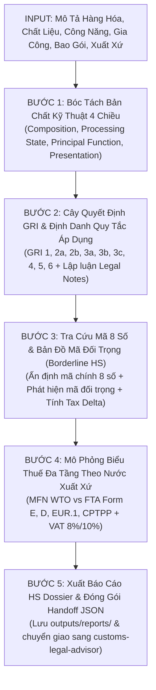

# CUSTOMS HS CLASSIFIER & TARIFF SPECIALIST v2.0
## Chuyên Gia Thẩm Định & Biện Luận Phân Loại Mã HS Chuyên Sâu

> **Đóng gói chuẩn Antigravity Customization System (v2.0.0)**  
> *Chuyên môn hóa tuyệt đối vào bài toán Phân loại Mã HS & Thuế XNK: Tích hợp Ma trận bóc tách kỹ thuật 4 chiều, Chỉ định rõ ràng Quy tắc phân loại GRI áp dụng & Lập luận giải thích chi tiết, Bản đồ cảnh báo Mã đối trọng lân cận (Borderline HS) & Chênh lệch thuế (Tax Delta), Mô phỏng Biểu thuế theo Nước xuất xứ & C/O Form, và Giao thức bàn giao dữ liệu (Handoff Protocol) sang `customs-legal-advisor`.*

---

## 1. Bản Hợp Đồng Thực Thi (Core Contract)

1. **Outcome:**
   - **Báo Cáo Thẩm Định & Biện Luận Phân Loại Mã HS (HS Classification Dossier)** gồm đúng 6 phần chuẩn mực:
     1. Thẩm định bản chất kỹ thuật & Bóc tách 4 chiều (Chất liệu, Gia công, Công năng, Bao gói).
     2. Kết quả phân loại Mã HS 8 số quốc gia (AHTN 2026) kèm mô tả song ngữ chuẩn Thông tư 31/2022/TT-BTC.
     3. **Quy tắc phân loại áp dụng (GRI Rule) & Lập luận giải thích chi tiết** (Dẫn chiếu Chú giải pháp lý Legal Notes & Explanatory Notes; lý do bác bỏ các quy tắc khác).
     4. Ma trận Mã đối trọng tiềm ẩn (Borderline HS), Chênh lệch thuế (Tax Delta) & Cảnh báo rủi ro tham vấn/ấn định thuế.
     5. Bảng tính nghĩa vụ thuế thực tế theo Origin & Mô phỏng số thuế phải nộp của lô hàng.
     6. Giao thức bàn giao Handoff Payload (JSON Block) sang `customs-legal-advisor`.
2. **Constraints:**
   - **Vận hành hoàn toàn Offline:** Khai thác 100% tài nguyên nội bộ độc lập tại `assets/`: `Bieu_thue_XNK_2026.xlsx`, `hs_tariff_index.sqlite`, `Phu_luc_I_Danh_muc_hang_hoa_XNK_VN.pdf`, `Phu_luc_II_Sau_quy_tac_tong_quat_GRI.txt`.
   - **Bắt buộc dẫn chiếu chính xác Quy tắc GRI & Căn cứ pháp lý:** 6 Quy tắc tổng quát GRI, Chú giải Chương/Phần (Legal Notes), Danh mục hàng hóa XNK Việt Nam (Thông tư 31/2022/TT-BTC), Nghị định Biểu thuế FTA tương ứng.
   - Tuyệt đối không suy diễn mã HS chủ quan; luôn có cơ sở kỹ thuật và cơ chế đối trọng kiểm chứng.
3. **Non-goals (Ranh giới cấm & Phân tách trách nhiệm):**
   - **Không làm thủ tục thông quan & giấy phép chuyên ngành:** Toàn bộ phần kiểm tra giấy phép 8 Bộ (Nghị định 69/2018/NĐ-CP), checklist chứng từ Điều 16 (TT 38/39/121) và quy trình thực địa tại Cảng/NSW đã được chuyển giao hoàn toàn cho skill [`customs-legal-advisor`](file:///c:/Minh%20Hoang/Antigravity%20h%E1%BB%8Dc/my-workspace/.agents/skills/customs-legal-advisor/SKILL.md).
   - Không truyền nộp tờ khai lên hệ thống VNACCS thật.
4. **Acceptance Criteria:**
   - 100% kết quả phân loại đạt cấp độ **Mã HS 8 chữ số chuẩn hóa quốc gia**.
   - Chỉ rõ chính xác **quy tắc nào trong 6 Quy tắc GRI** được áp dụng (GRI 1, 2a, 2b, 3a, 3b, 3c, 4, 5a, 5b, 6) và có đoạn văn **giải thích lập luận đầy đủ** vì sao chọn quy tắc đó.
   - Có bảng so sánh Mã HS đối trọng lân cận và đo lường chênh lệch thuế (Tax Delta).
   - Xuất bản file Markdown Dossier và file JSON Handoff sang `outputs/reports/`.

---

## 2. Thư Viện Tài Sản Riêng Biệt Của Skill (Dedicated Assets)

Toàn bộ tài nguyên phục vụ việc phân loại và tính thuế được lưu trữ độc lập tại thư mục `assets/`:

| Mã Tài Sản | Tên Tệp Tin | Định Dạng & Quy Mô | Thẩm Quyền / Cơ Sở Ban Hành | Vai Trò Chuyên Sâu Trong Skill |
|:---:|---|:---:|---|---|
| **ASSET-01** | `Bieu_thue_XNK_2026.xlsx`<br>*(kèm `hs_tariff_index.sqlite`)* | Excel (.xlsx) ~32.3 MB<br>SQLite Index ~13.8 MB | Bộ Tài chính, Tổng cục Hải quan, các Nghị định Biểu thuế FTA | Tra cứu siêu tốc toàn bộ dòng thuế 8 số, thuế Thông thường, MFN, VAT, Form E (ACFTA), Form D (ATIGA), EUR.1 (EVFTA), CPTPP, VKFTA, TTĐB, BVMT. |
| **ASSET-02** | `Phu_luc_I_Danh_muc_hang_hoa_XNK_VN.pdf` | PDF Vector ~11.7 MB (604 trang) | Thông tư số 31/2022/TT-BTC của Bộ Tài chính | Danh mục chuẩn hóa quốc gia (21 Phần, 97 Chương), mô tả song ngữ Anh - Việt và Đơn vị tính tiêu chuẩn. |
| **ASSET-03** | `Phu_luc_II_Sau_quy_tac_tong_quat_GRI.doc`<br>*(kèm bản UTF-8: `.txt`)* | Word (.doc) + Plain text UTF-8 (~53 KB) | Thông tư số 31/2022/TT-BTC / Công ước HS WCO | Toàn văn 6 Quy tắc tổng quát (GRI 1 đến GRI 6) và Chú giải chi tiết (Explanatory Notes) phục vụ lập luận phân loại. |

---

## 3. Quy Trình Thẩm Định & Biện Luận Phân Loại 5 Bước (5-Step Engine)



### Bước 1: Bóc tách bản chất kỹ thuật 4 chiều (Technical Dissection)
Hải quan không phân loại theo tên thương mại cảm tính. Chuyên viên bóc tách 4 yếu tố:
1. *Thành phần / Chất liệu:* Kim loại, polyme, hữu cơ, khoáng sản, sợi dệt...
2. *Mức độ gia công:* Sống, tươi, đông lạnh, sơ chế, tinh chế, tháo rời, thành phẩm...
3. *Chức năng chính:* Công nghiệp vs gia dụng; chuyên dùng cho máy nào (Chú giải 2 Phần XVI).
4. *Quy cách bao gói:* Hàng rời, đóng thùng, bao bì chuyên dụng (GRI 5a) hay bộ kẹp bán lẻ (GRI 3b).

### Bước 2: Cây quyết định GRI, định danh quy tắc áp dụng & lập luận chi tiết
- **Nguyên tắc bắt buộc:** Phải nêu rõ **Tên và số hiệu Quy tắc GRI** được áp dụng và **Giải thích cặn kẽ lý do**:
  - **GRI 1 (Phân loại theo tên Nhóm & Chú giải):** Dẫn chiếu câu chữ Heading 4 số và Chú giải pháp lý Chương/Phần (Legal Notes). Chứng minh sản phẩm thỏa mãn tiêu chí nhóm và không bị loại trừ.
  - **GRI 2(a) (Hàng chưa hoàn chỉnh / Tháo rời):** Chứng minh hàng dở dang hoặc bộ linh kiện tháo rời đã mang *đặc trưng cơ bản* của thành phẩm hoàn chỉnh.
  - **GRI 2(b) (Hỗn hợp, hợp chất):** Phân loại hợp chất của nhiều nguyên liệu.
  - **GRI 3(a) (Mô tả cụ thể nhất):** Ưu tiên nhóm định danh cụ thể sản phẩm thay vì nhóm mô tả công năng chung.
  - **GRI 3(b) (Hàng ghép bộ bán lẻ / Composite goods):** Xác định thành phần nào mang lại **Đặc tính cơ bản (Essential Character)** chi phối công năng/giá trị để áp mã cho cả bộ.
  - **GRI 3(c) (Thứ tự đánh số cuối cùng):** Áp dụng khi các nhóm tương đương không thể phân định theo 3(a) hoặc 3(b).
  - **GRI 4 (Hàng giống chúng nhất):** Chỉ dùng khi không thể áp dụng GRI 1-3.
  - **GRI 5(a) & 5(b) (Bao bì, hộp chứa):** Phân loại bao bì chuyên dụng hoặc bao bì thông thường đi kèm.
  - **GRI 6 (Phân nhóm 6 số & Dòng thuế 8 số):** So sánh các dòng có cùng cấp độ gạch (- và --) để chốt mã 8 số quốc gia.
- **Biện luận loại trừ:** Giải thích ngắn gọn vì sao không áp dụng các quy tắc khác.

### Bước 3: Định vị Mã HS đối trọng (Borderline HS) & Đo lường chênh lệch thuế (Tax Delta)
- Tự động phát hiện 1–2 mã HS lân cận có nguy cơ bị Hải quan nghi ngờ hoặc ấn định mã (thường là mã có thuế suất cao hơn).
- So sánh thuế suất MFN/VAT giữa Mã Khuyến Nghị và Mã Đối Trọng để tính **Tax Delta**.
- Đưa ra cảnh báo nguy cơ bị truy thu và phạt 20% theo Điều 9 Nghị định 128/2020/NĐ-CP nếu áp sai mã.
- Cung cấp **Bộ tiêu chí phân định kỹ thuật (Discrimination Criteria)**: Các bằng chứng kỹ thuật (COA, MSDS, Test Report, Catalog) doanh nghiệp cần chuẩn bị trước để bảo vệ mã khi bị tham vấn.

### Bước 4: Mô phỏng Biểu thuế theo Nước xuất xứ (Origin-Based Tariff Engine)
- Tra cứu biểu thuế tương ứng với Nước xuất xứ và chứng từ C/O:
  - Nếu có FTA & C/O hợp lệ $\rightarrow$ Thuế NK Ưu đãi Đặc biệt (Form E ACFTA, Form D ATIGA, EUR.1 EVFTA...).
  - Nếu từ nước thành viên WTO hoặc không có C/O $\rightarrow$ Thuế NK Ưu đãi (MFN) theo Nghị định 26/2023/NĐ-CP (sửa đổi bởi NĐ 144/2024/NĐ-CP).
  - Thuế GTGT (VAT) căn cứ Luật Thuế GTGT số 48/2024/QH15 và Nghị định 174/2025/NĐ-CP (8% hay 10% hay không chịu thuế khâu nhập khẩu).
- Tính toán mô phỏng tiền thuế lô hàng trên trị giá CIF cụ thể.

### Bước 5: Đóng gói Dossier & Giao thức bàn giao Handoff Payload
- Tự động xuất bản file Markdown chuyên sâu: `outputs/reports/HS_Classification_Dossier_[Mặt_Hàng].md`.
- Xuất file JSON `outputs/reports/hs_handoff_payload.json` sẵn sàng bàn giao cho `customs-legal-advisor`.

---

## 4. Bộ Công Cụ Dòng Lệnh Nghiệp Vụ (CLI Toolset v2.0)

Toàn bộ công cụ đều hoạt động zero-dependency trên PowerShell:

```powershell
# 1. Thẩm định phân loại HS chuyên sâu: Bóc tách 4 chiều, chọn quy tắc GRI & giải thích, bắt mã đối trọng
python .agents/skills/customs-hs-classifier/scripts/classify_hs_expert.py -c "Hạt đậu tương" -m "Đậu tương hạt nguyên chất" -f "Làm dầu ăn và thức ăn chăn nuôi" -s "Đã làm sạch, chưa bóc vỏ" -o "Mỹ"

# 2. Phân loại hàng ghép bộ bán lẻ (GRI 3b) có C/O Form E từ Trung Quốc
python .agents/skills/customs-hs-classifier/scripts/classify_hs_expert.py -c "Bộ dụng cụ sửa chữa" -m "Thép và nhựa" -f "Sửa chữa cơ khí gia dụng" -p "Đóng trong hộp nhựa tạo dáng thành bộ bán lẻ" -o "Trung Quốc" --co "Form E"

# 3. Xuất bản Hồ sơ Biện luận Phân loại Mã HS (HS Classification Dossier) & Handoff Payload JSON
python .agents/skills/customs-hs-classifier/scripts/generate_hs_dossier.py -c "Hạt đậu tương" -m "Đậu tương hạt nguyên chất" -f "Ép dầu thực phẩm" -s "Nguyên hạt chưa chế biến" -o "Hoa Kỳ" --cif 50000

# 4. Tra cứu nhanh Biểu thuế XNK 2026 (Mã 8 số, MFN, VAT, Form E, Form D, EUR.1, CPTPP...)
python .agents/skills/customs-hs-classifier/scripts/query_hs_tariff.py -q "1201.90.00"
python .agents/skills/customs-hs-classifier/scripts/query_hs_tariff.py -q "máy tính xách tay" --only-8

# 5. Tra cứu 6 Quy tắc GRI và Chú giải Explanatory Notes
python .agents/skills/customs-hs-classifier/scripts/query_gri_rules.py -r 3b
python .agents/skills/customs-hs-classifier/scripts/query_gri_rules.py -k "tháo rời"
```

---

## 5. Giao Thức Bàn Giao Hệ Sinh Thái (Ecosystem Handoff Protocol)

Sau khi `customs-hs-classifier` hoàn tất phân loại mã HS và tính thuế, gói dữ liệu được bàn giao liền mạch sang `customs-legal-advisor`:

```json
{
  "service": "customs:legal-advisor",
  "action": "clearance_and_permits_audit",
  "payload_timestamp": "2026-10-02",
  "commodity_dossier": {
    "commodity_name": "Hạt đậu tương",
    "classified_hs_code": "1201.90.00",
    "full_description_vn": "Đậu tương, đã hoặc chưa vỡ mảnh - - Loại khác",
    "unit": "kg",
    "country_of_origin": "Mỹ",
    "co_form_provided": "None (MFN Rate Applied)",
    "applicable_import_duty": "0%",
    "applicable_vat": "Không chịu thuế GTGT khâu nhập khẩu",
    "borderline_risk_code": "1201.10.00",
    "borderline_risk_level": "CAO (RỦI RO THAM VẤN & ẤN ĐỊNH THUẾ)"
  },
  "delegated_tasks": [
    "1. Tra cứu chính sách quản lý chuyên ngành & giấy phép kiểm dịch theo Nghị định 69/2018/NĐ-CP.",
    "2. Lập danh mục thành phần bộ hồ sơ hải quan bắt buộc theo Điều 16 Thông tư 38/39/121.",
    "3. Hướng dẫn quy trình 3 bước thông quan thực tế tại cảng và đăng ký Một cửa quốc gia (NSW)."
  ]
}
```

---

## 6. Ranh Giới & Guardrails Nghiệp Vụ

1. **Tuyệt đối không giải đáp thủ tục thông quan tại cảng biển hoặc danh mục giấy phép 8 Bộ trong Skill này:** Chuyển giao ngay lập tức cho `customs-legal-advisor` qua lệnh `/customs:legal-advisor`.
2. **Bắt buộc ấn định mã ở cấp độ 8 số quốc gia:** Tuyệt đối không dừng lại ở mã 4 số (Heading) hoặc 6 số (Subheading).
3. **Luôn cung cấp Mã HS đối trọng & Chênh lệch thuế (Tax Delta):** Để bảo vệ doanh nghiệp trước các đợt kiểm tra sau thông quan và tham vấn giá/mã của Hải quan.
