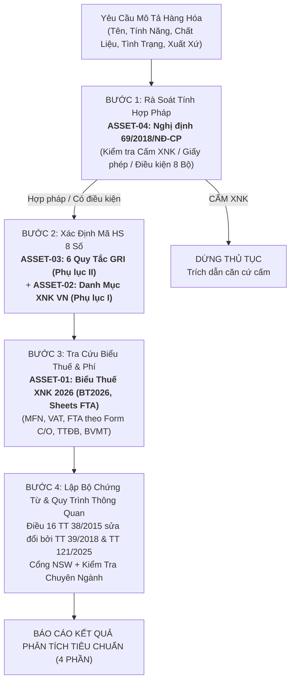

# THƯ VIỆN TÀI SẢN NGHIỆP VỤ — DEDICATED ASSETS DIRECTORY
## Skill: `customs:hs-classifier` (Chuyên Gia Phân Loại Hàng Hóa & Thủ Tục Hải Quan)

> **Lưu ý thiết kế:** Toàn bộ 4 nguồn dữ liệu do người dùng cung cấp được lưu trữ độc lập tại thư mục `assets/` riêng của Skill này (không gộp chung vào thư viện chung), phục vụ trực tiếp cho việc tra cứu tự động và xác minh tính pháp lý khi phân loại HS, tra cứu thuế và lập thủ tục thông quan.

---

## 📂 Danh Mục Tài Sản Nghiệp Vụ (Assets Inventory)

| Mã Tài Sản | Tên Tệp Tin | Định Dạng | Kích Thước | Căn Cứ Ban Hành / Thẩm Quyền | Vai Trò Trong Quy Trình |
|:---:|---|:---:|:---:|---|---|
| **ASSET-01** | `Bieu_thue_XNK_2026.xlsx` | Excel (.xlsx) | ~32.3 MB | Bộ Tài chính, Tổng cục Hải quan, các Nghị định Biểu thuế FTA | **Bước 3 (Thuế & Phí):** Cung cấp mã HS 8 số, thuế suất Thông thường, MFN, VAT (5%/8%/10%), các biểu thuế FTA (ACFTA, ATIGA, AJCEP, VJEPA, AKFTA, AANZFTA, AIFTA, VKFTA, CPTPP, EVFTA, UKVFTA, RCEP...), TTĐB, BVMT. |
| **ASSET-02** | `Phu_luc_I_Danh_muc_hang_hoa_XNK_VN.pdf` | PDF (Vector) | ~11.7 MB (604 trang) | Thông tư 31/2022/TT-BTC (thay thế TT 65/2017/TT-BTC) của Bộ Tài chính | **Bước 2 (Mã HS):** Danh mục phân loại quốc gia chuẩn hóa gồm 21 Phần, 97 Chương, mã 8 số kèm mô tả song ngữ Anh - Việt và Đơn vị tính. |
| **ASSET-03** | `Phu_luc_II_Sau_quy_tac_tong_quat_GRI.doc` *(Kèm bản UTF-8: `.txt`)* | Word (.doc) + Plain Text UTF-8 | ~237 KB (.doc) ~54 KB (.txt) | Thông tư 31/2022/TT-BTC của Bộ Tài chính / Công ước HS thế giới (WCO) | **Bước 2 (Mã HS):** Toàn văn 6 Quy tắc tổng quát giải thích phân loại hàng hóa (GRI 1 đến GRI 6) và Chú giải chi tiết (Explanatory Notes) giải quyết các ca khó (tháo rời, hỗn hợp, bộ bán lẻ). |
| **ASSET-04** | `danh_muc_hang_can_giay_phep_ND69.pdf` | PDF (Scan 89 trang) | ~3.44 MB (89 trang) | Nghị định số 69/2018/NĐ-CP của Chính phủ | **Bước 1 (Chính sách):** Danh mục hàng cấm XNK (Phụ lục I) và Danh mục hàng XNK có điều kiện, theo giấy phép quản lý chuyên ngành của 8 Bộ (Phụ lục II đến IX). |

---

## 🗺️ Bản Đồ Phả Hệ & Thứ Bậc Áp Dụng (Hierarchy)

---

## 🛠️ Công Cụ Hỗ Trợ Khai Thác Cục Bộ (Scripts)

Nằm tại thư mục `../scripts/`:
1. `python ../scripts/query_hs_tariff.py -k "<từ khóa hoặc mã HS>"`: Tra cứu trực tiếp mã hàng, mô tả Anh - Việt, thuế MFN, VAT, Form E, Form D, EUR.1 trong `Bieu_thue_XNK_2026.xlsx`.
2. `python ../scripts/query_gri_rules.py -r <1-6>`: Tra cứu câu chữ quy tắc và chú giải chi tiết tương ứng từ `Phu_luc_II_Sau_quy_tac_tong_quat_GRI.txt`.
3. `python ../scripts/query_conditional_goods.py -k "<mặt hàng>"`: Tra cứu chính sách quản lý chuyên ngành và giấy phép theo Nghị định 69/2018/NĐ-CP.
