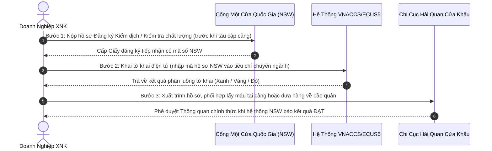

# BÁO CÁO KẾT QUẢ PHÂN TÍCH TIÊU CHUẨN — HỒ SƠ THÔNG QUAN HÀNG HÓA

**Mã hồ sơ tham chiếu:** `CUSTOMS-20260916-9638`  
**Tên hàng hóa phân tích:** **ĐẬU TƯƠNG**  
**Xuất xứ:** Mỹ (USA) | **Loại hình khai báo:** Nhập kinh doanh tiêu dùng (`A11`)  
**Đơn vị thực hiện:** Chuyên gia Phân loại Hàng hóa & Thủ tục Hải quan (Skill `customs:hs-classifier`)  
**Ngày phát hành báo cáo:** 16/09/2026  

---

## 1. KẾT LUẬN VỀ TÍNH PHÁP LÝ & GIẤY PHÉP NHẬP KHẨU BẮT BUỘC

### A. Tình Trạng Pháp Lý & Cơ Quan Quản Lý Chuyên Ngành
- **Tình trạng:** `[XUẤT NHẬP KHẨU CÓ ĐIỀU KIỆN]`
- **Cơ quan chuyên ngành quản lý:** Bộ Nông nghiệp và Phát triển Nông thôn (Cục Bảo vệ Thực vật)
- **Căn cứ pháp lý quy phạm pháp luật:**
- Nghị định 69/2018/NĐ-CP (Phụ lục III); Thông tư 30/2014/TT-BNNPTNT & Thông tư 33/2014/TT-BNNPTNT; Thông tư 15/2018/TT-BNNPTNT & Thông tư 11/2021/TT-BNNPTNT
- Luật Quản lý ngoại thương số 05/2017/QH14
- Thông tư 38/2015/TT-BTC, Thông tư 39/2018/TT-BTC, Thông tư 121/2025/TT-BTC của Bộ Tài chính

### B. Danh Mục Giấy Phép & Xác Nhận Chuyên Ngành Bắt Buộc (Import Licenses & Permits Matrix)
*(Tra cứu đối chiếu Phụ lục III Nghị định 69/2018/NĐ-CP & Quy định quản lý chuyên ngành)*

| Tên Giấy Phép / Xác Nhận Chuyên Ngành | Cơ Quan Thẩm Quyền Cấp | Điều Kiện Bắt Buộc Áp Dụng | Điều Kiện Miễn Trừ Giấy Phép | Thời Điểm Phải Có & Kênh Nộp |
|---|---|---|---|---|
| **Giấy phép Nhập khẩu Giống cây trồng** | Cục Trồng trọt — Bộ NN&PTNT | BẮT BUỘC nếu nhập khẩu hạt giống đậu tương (Mã HS 1201.10.00) để gieo trồng nhân giống. | MIỄN GIẤY PHÉP nếu là hạt đậu tương thương phẩm (Mã HS 1201.90.00) nhập khẩu để tiêu dùng, ép dầu thực vật, hoặc chế biến thức ăn chăn nuôi. | Phải có Giấy phép trước khi ký kết hợp đồng thương mại và trước khi hàng rời cảng xuất khẩu. *(Kênh nộp: Nộp hồ sơ trực tuyến qua Cổng dịch vụ công của Bộ NN&PTNT hoặc Cổng Một cửa Quốc gia (NSW).)* |
| **Giấy phép Kiểm dịch Thực vật Nhập khẩu (Import Phytosanitary Permit)** | Cục Bảo vệ Thực vật — Bộ NN&PTNT | Bắt buộc đối với giống cây trồng, sinh vật có ích hoặc vật thể thuộc diện kiểm dịch có nguy cơ cao mang dịch hại kiểm dịch thực vật của Việt Nam. | Đậu tương thương phẩm từ các quốc gia/vùng đã được phân tích nguy cơ dịch hại (PRA) và mở cửa thị trường (như Mỹ, Brazil, Canada) không cần xin Giấy phép trước, nhưng BẮT BUỘC phải làm thủ tục Kiểm dịch thực vật tại cửa khẩu đến. | Xin cấp trước khi xuất hàng từ nước xuất khẩu. *(Kênh nộp: Cổng thông tin Một cửa Quốc gia (NSW) tại vnsw.gov.vn.)* |
| **Giấy xác nhận Sinh vật Biến đổi Gen (GMO) đủ điều kiện làm Thực phẩm / Thức ăn chăn nuôi** | Bộ Nông nghiệp và Phát triển Nông thôn | BẮT BUỘC đối với đậu tương hoặc ngô biến đổi gen (Genetically Modified Organism - GMO). Sự kiện chuyển gen cụ thể của lô hàng phải nằm trong Danh mục sự kiện biến đổi gen đã được Bộ NN&PTNT cấp Giấy xác nhận. | Hàng hóa là nông sản tự nhiên thuần chủng (Non-GMO) kèm theo Chứng nhận Non-GMO hoặc Giấy kiểm nghiệm không phát hiện biến đổi gen. | Sự kiện GMO phải được cấp Giấy xác nhận và công bố trên cổng thông tin trước thời điểm nhập khẩu. *(Kênh nộp: Kiểm tra đối chiếu mã sự kiện GMO đã cấp phép trên hệ thống dữ liệu của Cục Bảo vệ thực vật.)* |
| **Giấy tiếp nhận Đăng ký Kiểm dịch Thực vật & An toàn Thực phẩm Nhập khẩu** | Chi cục Kiểm dịch Thực vật Vùng (thuộc Cục BVTV) | BẮT BUỘC cho 100% lô hàng nông sản thực vật nhập khẩu ở khâu làm thủ tục hải quan. | Không miễn trừ. | Đăng ký tối thiểu 24h - 48h trước khi tàu/phương tiện vận chuyển cập cảng. *(Kênh nộp: Đăng ký trực tuyến trên Cổng Một cửa Quốc gia (NSW) để lấy Mã số hồ sơ khai báo tờ khai VNACCS.)* |

### C. Danh Mục Chứng Từ Chuyên Ngành Đi Kèm Lô Hàng
- [x] Giấy chứng nhận Kiểm dịch Thực vật (Phytosanitary Certificate) bản gốc do Cơ quan Kiểm dịch nước xuất khẩu cấp (bắt buộc).
- [x] Giấy chứng nhận An toàn thực phẩm / Health Certificate của cơ quan có thẩm quyền nước xuất xứ.
- [x] Giấy chứng nhận kiểm định chất lượng giống (nếu khai mã giống 1201.10.00).
- [x] Bản công bố hợp quy thức ăn chăn nuôi hoặc Giấy đăng ký kiểm tra chất lượng thức ăn chăn nuôi nhập khẩu (nếu dùng làm TĂCN).

### D. Cảnh Báo Bẫy Rủi Ro Pháp Lý & Chế Tài Xử Phạt
> ⚠️ **CẢNH BÁO BẪY RỦI RO:** Nếu thiếu Giấy Phyto gốc từ nước xuất khẩu hoặc lô hàng bị nhiễm đối tượng kiểm dịch thực vật nhóm 1 (côn trùng sống, mọt Trogoderma...), hải quan sẽ không cho thông quan và buộc tái xuất trong vòng 30 ngày!  
> 
> ⚖️ **CHẾ TÀI XỬ PHẠT (Nghị định 128/2020/NĐ-CP):** Nếu nhập khẩu hạt giống mà không có Giấy phép của Cục Trồng trọt, hoặc đậu tương biến đổi gen chưa được cấp phép sự kiện GMO, hoặc thiếu Giấy Phyto gốc từ nước xuất xứ: Cơ quan Hải quan và Kiểm dịch sẽ lập biên bản đình chỉ thông quan, phạt tiền từ 30.000.000 đến 100.000.000 VNĐ theo Nghị định 128/2020/NĐ-CP và BUỘC TÁI XUẤT trong vòng 30 ngày.

---

## 2. PHÂN LOẠI MÃ HS CODE & MÔ TẢ CHI TIẾT
- **Mã HS khuyến nghị chính thức (8 chữ số chuẩn hóa khai báo Hải quan Việt Nam):** `1201.90.00`
  > 📌 **NGUYÊN TẮC BẮT BUỘC:** Theo quy định tại Điều 16 & 29 Luật Hải quan 54/2014/QH13 và Thông tư 38/2015/TT-BTC (sửa đổi bởi TT 39/2018/TT-BTC), người khai hải quan bắt buộc phải xác định và khai báo mã số hàng hóa theo **đúng 8 chữ số quốc gia**. Hệ thống VNACCS/ECUS5 không chấp nhận mã 4 số (`1201`) hay 6 số (`1201.90`). Do đó, mã `1201.90.00` được xác định là mã số pháp lý duy nhất để tính thuế và thông quan, không để ở dạng mã dự phòng.

- **Cấu trúc phân cấp mã HS theo Danh mục hàng hóa XNK Việt Nam (Phụ lục I - Thông tư 31/2022/TT-BTC):**
  - *Cấp độ Chương (Chapter 12):* Hạt và quả có dầu; các loại hạt, ngũ cốc và quả khác; cây thuốc và cây công nghiệp; rơm, rạ và cỏ làm thức ăn gia súc.
  - *Cấp độ Nhóm 4 số (Heading 12.01):* Đậu tương, đã hoặc chưa vỡ mảnh (Soya beans, whether or not broken).
  - *Cấp độ Phân nhóm 6 số WCO (Subheading 1201.90):* - Loại khác (- Other).
  - *Cấp độ Dòng thuế 8 số quốc gia (Tariff line 1201.90.00):* - Loại khác (- Other).
  - *Mô tả đầy đủ tiếng Việt:* **Đậu tương, đã hoặc chưa vỡ mảnh - - Loại khác**
  - *Mô tả tiếng Anh (AHTN/WCO):* **Soya beans, whether or not broken — Other**
  - *Đơn vị tính tiêu chuẩn:* `kg`

- **Lập luận phân loại kỹ thuật & Căn cứ 6 Quy tắc Tổng quát (GRI):**
  - **Căn cứ pháp lý phân loại:** Phụ lục II ban hành kèm Thông tư số 31/2022/TT-BTC ngày 08/06/2022 của Bộ Tài chính về 6 Quy tắc tổng quát giải thích việc phân loại hàng hóa theo Danh mục hàng hóa XNK Việt Nam.
  - **Phân tích bản chất hàng hóa:** Mặt hàng là Đậu tương nguyên hạt tự nhiên (hoặc vỡ mảnh), chưa qua chiết xuất tách dầu thực vật, chưa xay nghiền thành bột mịn, giữ nguyên trạng thái tự nhiên của nông sản hạt.
  - **Áp dụng Quy tắc GRI 1 (Xác định Nhóm 4 số):**
    Theo GRI 1, phân loại hàng hóa được xác định căn cứ theo nội dung của các nhóm hàng (Heading) và các chú giải Phần, Chương có liên quan. Mặt hàng thỏa mãn hoàn toàn câu từ định danh của Nhóm Heading `12.01`: *"Đậu tương, đã hoặc chưa vỡ mảnh"*, thuộc Phần II, Chương 12.
  - **Áp dụng Quy tắc GRI 6 (Quyết định ấn định dòng thuế 8 chữ số):**
    Theo GRI 6, việc phân loại hàng hóa vào các phân nhóm của một nhóm phải phù hợp theo nội dung của từng phân nhóm và chú giải phân nhóm; chỉ những phân nhóm ở cùng cấp độ gạch mới được so sánh với nhau:
    Trong Nhóm `12.01`, chỉ có 2 dòng thuế 8 số ở cùng cấp độ một gạch (-):
    + `1201.10.00`: `- Hạt giống (Seed)` → Chỉ áp dụng cho hạt giống thuần chủng nhập khẩu để gieo trồng nhân giống (bắt buộc có Giấy chứng nhận kiểm định chất lượng giống cây trồng của Cục Trồng trọt).
    + `1201.90.00`: `- Loại khác (Other)` → Áp dụng cho toàn bộ đậu tương hạt thương phẩm (dùng để ép dầu, sản xuất thực phẩm, hoặc làm thức ăn chăn nuôi).
    ⇒ **Kết luận:** Do lô hàng là đậu tương thương phẩm tiêu dùng/sản xuất, không phải giống cây trồng gieo giống, căn cứ GRI 6 ấn định mã HS 8 số chuẩn hóa duy nhất của lô hàng là **`1201.90.00`**.

- **Lưu ý ranh giới phân loại & Phân biệt các mã số dễ gây tranh chấp (Boundary Notes):**
  - `1201.10.00`: Đậu tương, đã hoặc chưa vỡ mảnh — - - Hạt giống (Seed). Lưu ý ranh giới: Chỉ phân loại vào mã này nếu có Giấy chứng nhận kiểm định chất lượng giống cây trồng của Cục Trồng trọt và nhập khẩu với mục đích nhân giống gieo trồng.
  - `1208.10.00`: Bột mịn và bột thô từ hạt đậu tương (nếu hàng hóa đã qua xay nghiền thành bột, làm mất cấu trúc hạt tự nhiên).
  - `2304.00.90`: Khô dầu đậu tương (bã đậu nành sau khi chiết xuất ép dầu dùng làm thức ăn chăn nuôi).

---

## 3. NGHĨA VỤ THUẾ & PHÍ THỰC TẾ PHẢI NỘP CHO LÔ HÀNG
> ⚖️ **LƯU Ý VỀ CĂN CỨ PHÁP LÝ ÁP THUẾ:**  
> File bảng tính `assets/Bieu_thue_XNK_2026.xlsx` là **tài liệu tổng hợp nghiệp vụ dùng để tra cứu tham khảo**. Căn cứ pháp lý có hiệu lực thi hành bắt buộc của các mức thuế suất dưới đây là các **Luật của Quốc hội và Nghị định của Chính phủ** được trích dẫn đích danh cho từng sắc thuế.

### A. Bảng các loại thuế và thuế suất lô hàng THỰC SỰ PHẢI CHỊU

| Sắc Thuế Phải Chịu | Thuế Suất Áp Dụng | Căn Cứ Pháp Lý Quy Phạm Pháp Luật | Điều Kiện & Cơ Chế Áp Dụng Thực Tế |
|---|:---:|---|---|
| **Thuế Nhập khẩu Ưu đãi (MFN)** | `0%` | Nghị định số 26/2023/NĐ-CP ngày 31/05/2023 của Chính phủ (sửa đổi, bổ sung bởi Nghị định số 144/2024/NĐ-CP) | Nước xuất xứ Mỹ (USA) là thành viên của Tổ chức Thương mại Thế giới (WTO) có quan hệ Tối huệ quốc (MFN) với Việt Nam. |
| **Thuế Giá trị gia tăng (VAT)** | `0% (Không chịu thuế)` | Khoản 1 Điều 4 Thông tư số 219/2013/TT-BTC ngày 31/12/2013 của Bộ Tài chính hướng dẫn thi hành Luật Thuế Giá trị gia tăng | Sản phẩm trồng trọt chưa qua chế biến thành các sản phẩm khác hoặc chỉ qua sơ chế thông thường ở khâu nhập khẩu thuộc đối tượng KHÔNG CHỊU THUẾ GTGT. (Trường hợp kinh doanh thương mại tiếp theo cho DN/HTX không phải kê khai nộp thuế; bán cho hộ/cá nhân chịu 5%). |

### B. Xác nhận các sắc thuế KHÔNG PHẢI CHỊU
- **Thuế Tiêu thụ đặc biệt (TTĐB):** `Không áp dụng` — Hàng hóa không thuộc đối tượng chịu thuế TTĐB theo quy định tại Điều 2 Luật Thuế Tiêu thụ đặc biệt số 27/2008/QH12 (sửa đổi, bổ sung).
- **Thuế Bảo vệ môi trường (BVMT):** `Không áp dụng` — Hàng hóa không thuộc đối tượng chịu thuế BVMT theo quy định tại Điều 3 Luật Thuế Bảo vệ môi trường số 57/2010/QH12.

### C. Cơ chế xác định thuế NK ưu đãi theo Nước Xuất Xứ (Origin)
- **Quy tắc áp dụng:** 
  1. Nếu nước xuất xứ (Mỹ (USA)) là thành viên thuộc Hiệp định Thương mại Tự do (FTA) với Việt Nam VÀ có chứng từ chứng nhận xuất xứ hợp lệ (C/O ưu đãi tương ứng): Hàng hóa sẽ được áp dụng **Thuế Nhập khẩu Ưu đãi Đặc biệt (FTA)** theo Nghị định Biểu thuế FTA tương ứng.
  2. Nếu nước xuất xứ (Mỹ (USA)) là quốc gia thành viên WTO có quan hệ Tối huệ quốc (như Hoa Kỳ, Brazil, Argentina...) hoặc hàng hóa từ nước có FTA nhưng không có C/O ưu đãi: Hàng hóa sẽ áp dụng **Thuế Nhập khẩu Ưu đãi (MFN)** theo Nghị định số 26/2023/NĐ-CP (sửa đổi, bổ sung bởi Nghị định số 144/2024/NĐ-CP), **chứ KHÔNG áp dụng thuế nhập khẩu thông thường**.
  3. Thuế NK Thông thường (theo Quyết định số 15/2023/QĐ-TTg của Thủ tướng Chính phủ) chỉ áp dụng đối với hàng hóa có xuất xứ từ các quốc gia/vùng lãnh thổ không có quan hệ tối huệ quốc (non-MFN) với Việt Nam.

### D. Mô phỏng Công thức Tính thuế cho Lô hàng Cụ thể
*(Giả định lô hàng có Trị giá tính thuế CIF = **100.000.000 VNĐ**)*:
- **Tiền thuế Nhập khẩu phải nộp:**  
  *Công thức:* `Tiền thuế NK = Trị giá CIF × Thuế suất NK = 100.000.000 × 0%` = **0 VNĐ**
- **Tiền thuế Giá trị gia tăng (VAT) phải nộp:**  
  *Công thức:* `Tiền thuế VAT = (Trị giá CIF + Thuế NK) × Thuế suất VAT` = **0 VNĐ (Không chịu thuế ở khâu nhập khẩu)**
- **TỔNG NGHĨA VỤ THUẾ PHẢI NỘP CỦA LÔ HÀNG:** **0 VNĐ**

---

## 4. BỘ HỒ SƠ CHỨNG TỪ & HƯỚNG DẪN THỰC THI THÔNG QUAN

### A. Danh mục Bộ chứng từ Hải quan Bắt buộc
*(Căn cứ Điều 16 Thông tư 38/2015/TT-BTC, sửa đổi bổ sung tại Thông tư 39/2018/TT-BTC và Thông tư 121/2025/TT-BTC)*

- [x] **Tờ khai hải quan điện tử (Import Declaration):** Khai báo và truyền qua hệ thống VNACCS/ECUS5 (Mã loại hình `A11`).
- [x] **Hóa đơn thương mại (Commercial Invoice):** 01 bản chụp điện tử có xác thực chữ ký số.
- [x] **Phiếu đóng gói hàng hóa (Packing List):** 01 bản chụp điện tử chi tiết quy cách đóng gói và trọng lượng.
- [x] **Vận tải đơn đường biển (Bill of Lading / Sea Waybill):** 01 bản chụp có xác nhận nhận hàng.
- [x] **Chứng từ chứng nhận xuất xứ (C/O):** Nộp C/O ưu đãi để xét hưởng thuế suất FTA tương ứng (nếu có).
- [x] **Giấy chứng nhận Kiểm dịch thực vật (Phytosanitary Certificate) bản gốc:** Do Bộ Nông nghiệp nước xuất xứ cấp (bắt buộc nộp bản gốc đối chiếu tại cảng đến).
- [x] **Giấy tiếp nhận đăng ký Kiểm dịch & An toàn thực phẩm trên Cổng Một cửa Quốc gia (NSW):** Nhập mã số tiếp nhận NSW vào tiêu chí giấy phép trên tờ khai VNACCS.
- [x] **Giấy xác nhận sự kiện biến đổi gen GMO (nếu là giống GMO) / Bản cam kết Non-GMO:** Đậu tương biến đổi gen phải thuộc danh mục sự kiện được Bộ NN&PTNT cấp Giấy xác nhận.
- [ ] **Giấy phép nhập khẩu giống cây trồng của Cục Trồng trọt:** *(MIỄN TRỪ đối với đậu tương hạt thương phẩm mã 1201.90.00; Chỉ bắt buộc nếu là hạt giống gieo giống mã 1201.10.00)*.
- [x] **Giấy thông báo kết quả kiểm tra chuyên ngành ĐẠT CHUẨN:** Cập nhật điện tử trên Cổng NSW để công chức hải quan phê duyệt thông quan chính thức.

### B. Quy trình 3 Bước Thực Thi Tại Chi Cục Hải Quan Cửa Khẩu

1. **Bước 1 — Đăng ký Chuyên ngành trên Cổng Một cửa Quốc gia (NSW):**  
   Đăng ký hồ sơ tối thiểu 24h - 48h trước khi tàu cập cảng tại `vnsw.gov.vn`. Đính kèm file mềm: Hóa đơn, Packing list, Vận đơn, Giấy chứng nhận từ nước xuất khẩu. Nhận mã số tiếp nhận hồ sơ NSW.
2. **Bước 2 — Khai báo Hải quan điện tử (VNACCS/ECUS5):**  
   Nhập dữ liệu tờ khai, nhập mã số tiếp nhận NSW vào ô "Giấy phép/Chứng từ chuyên ngành". Truyền tờ khai và nhận kết quả phân luồng.
3. **Bước 3 — Thủ tục thực địa tại Cảng & Giải phóng hàng:**  
   - Xuất trình Giấy đăng ký kiểm tra có xác nhận tiếp nhận của cơ quan chuyên ngành để xin Hải quan đưa hàng về bảo quản tại kho bãi của doanh nghiệp (nếu đủ điều kiện kho bãi theo Thông tư 38/2015).
   - Cơ quan chuyên ngành tiến hành kiểm tra, lấy mẫu và trả kết quả ĐẠT trên hệ thống NSW.
   - Hải quan kiểm tra số liệu thuế đã nộp, đối chiếu kết quả NSW và ấn định trạng thái **THÔNG QUAN (Customs Cleared)**.
