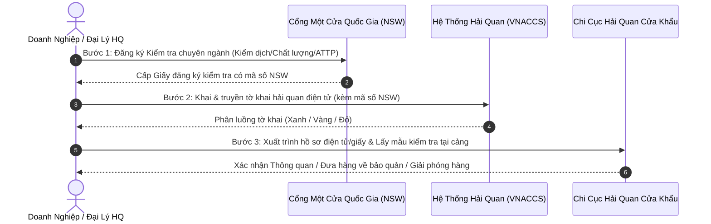

# BÁO CÁO KẾT QUẢ PHÂN TÍCH TIÊU CHUẨN — HỒ SƠ THÔNG QUAN HÀNG HÓA
**Mã hồ sơ:** {{FILE_REF_ID}}  
**Mặt hàng:** {{COMMODITY_NAME}}  
**Xuất xứ:** {{ORIGIN_COUNTRY}} | **Loại hình khai báo:** {{DECLARATION_TYPE}} ({{DECLARATION_CODE}})  
**Chuyên gia thực hiện:** Chuyên gia Phân loại Hàng hóa & Thủ tục Hải quan (Skill `customs:hs-classifier`)  
**Ngày lập báo cáo:** {{REPORT_DATE}}  

---

## 1. KẾT LUẬN VỀ TÍNH PHÁP LÝ & GIẤY PHÉP NHẬP KHẨU BẮT BUỘC

### A. Tình Trạng Pháp Lý & Cơ Quan Quản Lý Chuyên Ngành
- **Tình trạng:** `[{{LEGAL_STATUS}}]`  
  *(ĐƯỢC PHÉP XNK TỰ DO / XNK CÓ ĐIỀU KIỆN - PHẢI XIN GIẤY PHÉP / CẤM XUẤT NHẬP KHẨU)*
- **Cơ quan chuyên ngành quản lý:** {{GOVERNING_MINISTRY}}
- **Căn cứ pháp lý dẫn chiếu:**
  - {{LEGAL_BASIS_1}}
  - {{LEGAL_BASIS_2}}
  - {{LEGAL_BASIS_3}}

### B. Danh Mục Giấy Phép & Xác Nhận Chuyên Ngành Bắt Buộc (Import Licenses & Permits Matrix)
*(Tra cứu đối chiếu Phụ lục III Nghị định 69/2018/NĐ-CP & Quy định quản lý chuyên ngành)*

| Tên Giấy Phép / Xác Nhận Chuyên Ngành | Cơ Quan Thẩm Quyền Cấp | Điều Kiện Bắt Buộc Áp Dụng | Điều Kiện Miễn Trừ Giấy Phép | Thời Điểm Phải Có & Kênh Nộp |
|---|---|---|---|---|
| **{{PERMIT_NAME_1}}** | {{PERMIT_AUTHORITY_1}} | {{PERMIT_CONDITION_1}} | {{PERMIT_EXEMPTION_1}} | {{PERMIT_TIMING_1}} *(Kênh nộp: {{PERMIT_CHANNEL_1}})* |
| **{{PERMIT_NAME_2}}** | {{PERMIT_AUTHORITY_2}} | {{PERMIT_CONDITION_2}} | {{PERMIT_EXEMPTION_2}} | {{PERMIT_TIMING_2}} *(Kênh nộp: {{PERMIT_CHANNEL_2}})* |

### C. Danh Mục Chứng Từ Chuyên Ngành Đi Kèm Lô Hàng
- [x] {{MANDATORY_CERTIFICATE_1}}
- [x] {{MANDATORY_CERTIFICATE_2}}
- [x] {{MANDATORY_CERTIFICATE_3}}

### D. Cảnh Báo Bẫy Rủi Ro Pháp Lý & Chế Tài Xử Phạt
> ⚠️ **CẢNH BÁO BẪY RỦI RO:** {{RISK_WARNING}}  
> 
> ⚖️ **CHẾ TÀI XỬ PHẠT (Nghị định 128/2020/NĐ-CP):** {{PENALTY_WARNING_DETAILS}}

---

## 2. PHÂN LOẠI MÃ HS CODE & MÔ TẢ CHI TIẾT
- **Mã HS khuyến nghị chính thức (8 chữ số chuẩn hóa khai báo Hải quan Việt Nam):** `{{RECOMMENDED_HS_8_DIGITS}}`
  > 📌 **NGUYÊN TẮC BẮT BUỘC:** Theo Điều 16 & 29 Luật Hải quan 54/2014/QH13 và Thông tư 38/2015/TT-BTC (sửa đổi bởi TT 39/2018/TT-BTC), người khai hải quan bắt buộc phải xác định và khai báo mã số hàng hóa theo **đúng 8 chữ số quốc gia**. Hệ thống VNACCS/ECUS5 không chấp nhận mã 4 số hay 6 số. Mã 8 chữ số này là căn cứ duy nhất để áp dụng chính sách thuế và thủ tục kiểm tra chuyên ngành.

- **Cấu trúc phân cấp mã HS theo Danh mục hàng hóa XNK Việt Nam (Phụ lục I - Thông tư 31/2022/TT-BTC):**
  - *Cấp độ Chương (Chapter):* {{CHAPTER_INFO}}
  - *Cấp độ Nhóm 4 số (Heading):* {{HEADING_4_DIGITS_INFO}}
  - *Cấp độ Phân nhóm 6 số WCO (Subheading):* {{SUBHEADING_6_DIGITS_INFO}}
  - *Cấp độ Dòng thuế 8 số quốc gia (National Tariff Line):* {{TARIFF_LINE_8_DIGITS}}
  - *Mô tả đầy đủ tiếng Việt:* **{{FULL_DESC_VIETNAMESE}}**
  - *Mô tả tiếng Anh (AHTN/WCO):* **{{FULL_DESC_ENGLISH}}**
  - *Đơn vị tính tiêu chuẩn (Unit):* `{{UNIT_OF_MEASURE}}`

- **Lập luận phân loại kỹ thuật & Căn cứ 6 Quy tắc Tổng quát (GRI):**
  - **Căn cứ pháp lý phân loại:** Phụ lục II ban hành kèm Thông tư số 31/2022/TT-BTC ngày 08/06/2022 của Bộ Tài chính về 6 Quy tắc tổng quát giải thích việc phân loại hàng hóa theo Danh mục hàng hóa XNK Việt Nam.
  - **Phân tích bản chất hàng hóa:** {{TECHNICAL_ANALYSIS_DETAILS}}
  - **Áp dụng Quy tắc GRI 1 (Xác định Nhóm Heading 4 số):** {{GRI_1_REASONING}}
  - **Áp dụng Quy tắc GRI 6 (Quyết định ấn định dòng thuế 8 chữ số quốc gia):** {{GRI_6_COMPARATIVE_REASONING_BETWEEN_SUBHEADINGS}}
  - **Trích dẫn Chú giải Phần / Chương liên quan (Legal Notes):**
    > *"{{LEGAL_NOTE_EXCERPT}}"*

- **Lưu ý ranh giới phân loại & Phân biệt các mã số dễ gây tranh chấp (Boundary Notes):**
  - `{{POTENTIAL_DISPUTE_HS_1}}`: {{DISPUTE_EXPLANATION_1}}
  - `{{POTENTIAL_DISPUTE_HS_2}}`: {{DISPUTE_EXPLANATION_2}}
  - `{{POTENTIAL_DISPUTE_HS_3}}`: {{DISPUTE_EXPLANATION_3}}

---

## 3. NGHĨA VỤ THUẾ & PHÍ THỰC TẾ PHẢI NỘP CHO LÔ HÀNG
> ⚖️ **LƯU Ý VỀ CĂN CỨ PHÁP LÝ ÁP THUẾ:**  
> File bảng tính `assets/Bieu_thue_XNK_2026.xlsx` là **tài liệu tổng hợp nghiệp vụ dùng để tra cứu tham khảo**. Căn cứ pháp lý có hiệu lực thi hành bắt buộc của các mức thuế suất dưới đây là các **Luật của Quốc hội và Nghị định của Chính phủ** được trích dẫn đích danh cho từng sắc thuế.

### A. Bảng các loại thuế và thuế suất lô hàng THỰC SỰ PHẢI CHỊU

| Sắc Thuế Phải Chịu | Thuế Suất Áp Dụng | Căn Cứ Pháp Lý Quy Phạm Pháp Luật | Điều Kiện & Cơ Chế Áp Dụng Thực Tế |
|---|:---:|---|---|
| **Thuế Nhập khẩu ({{TAX_TYPE_APPLIED}})** | `{{TAX_RATE_APPLIED}}` | {{TAX_LEGAL_BASIS}} | {{TAX_ORIGIN_CONDITION}} |
| **Thuế Giá trị gia tăng (VAT)** | `{{VAT_RATE_APPLIED}}` | {{VAT_LEGAL_BASIS}} | {{VAT_CONDITION_NOTE}} |
{{OPTIONAL_EXCISE_TAX_ROW}}
{{OPTIONAL_ENV_TAX_ROW}}

### B. Xác nhận các sắc thuế KHÔNG PHẢI CHỊU
- **Thuế Tiêu thụ đặc biệt (TTĐB):** `Không áp dụng` — Hàng hóa không thuộc đối tượng chịu thuế TTĐB theo quy định tại Điều 2 Luật Thuế Tiêu thụ đặc biệt số 27/2008/QH12 (sửa đổi, bổ sung).
- **Thuế Bảo vệ môi trường (BVMT):** `Không áp dụng` — Hàng hóa không thuộc đối tượng chịu thuế BVMT theo quy định tại Điều 3 Luật Thuế Bảo vệ môi trường số 57/2010/QH12.

### C. Cơ chế xác định thuế NK ưu đãi theo Nước Xuất Xứ (Origin)
- **Quy tắc áp dụng:** 
  1. Nếu nước xuất xứ ({{ORIGIN_COUNTRY}}) là thành viên thuộc Hiệp định Thương mại Tự do (FTA) với Việt Nam VÀ có chứng từ chứng nhận xuất xứ hợp lệ (C/O ưu đãi tương ứng): Hàng hóa sẽ được áp dụng **Thuế Nhập khẩu Ưu đãi Đặc biệt (FTA)** theo Nghị định Biểu thuế FTA tương ứng.
  2. Nếu nước xuất xứ ({{ORIGIN_COUNTRY}}) là quốc gia thành viên WTO có quan hệ Tối huệ quốc (như Hoa Kỳ, Brazil, Argentina...) hoặc hàng hóa từ nước có FTA nhưng không có C/O ưu đãi: Hàng hóa sẽ áp dụng **Thuế Nhập khẩu Ưu đãi (MFN)** theo Nghị định số 26/2023/NĐ-CP (sửa đổi, bổ sung bởi Nghị định số 144/2024/NĐ-CP), **chứ KHÔNG áp dụng thuế nhập khẩu thông thường**.
  3. Thuế NK Thông thường (theo Quyết định số 15/2023/QĐ-TTg của Thủ tướng Chính phủ) chỉ áp dụng đối với hàng hóa có xuất xứ từ các quốc gia/vùng lãnh thổ không có quan hệ tối huệ quốc (non-MFN) với Việt Nam.

### D. Mô phỏng Công thức Tính thuế cho Lô hàng Cụ thể
*(Giả định lô hàng có Trị giá tính thuế CIF = **{{SAMPLE_CIF_VALUE}}**)*:
- **Tiền thuế Nhập khẩu phải nộp:**  
  *Công thức:* `Tiền thuế NK = Trị giá CIF × Thuế suất NK = {{SAMPLE_CIF_VALUE}} × {{TAX_RATE_APPLIED}}` = **{{CALCULATED_IMPORT_TAX}}**
- **Tiền thuế Giá trị gia tăng (VAT) phải nộp:**  
  *Công thức:* `Tiền thuế VAT = (Trị giá CIF + Thuế NK) × Thuế suất VAT` = **{{CALCULATED_VAT}}**
- **TỔNG NGHĨA VỤ THUẾ PHẢI NỘP CỦA LÔ HÀNG:** **{{TOTAL_TAX_PAYABLE}}**

- **Khả năng xét miễn thuế / Giảm thuế:**
  - {{TAX_EXEMPTION_ANALYSIS}} (Căn cứ Điều 16 Luật Thuế xuất khẩu, thuế nhập khẩu số 107/2016/QH13 và Nghị định 134/2016/NĐ-CP).

---

## 4. BỘ HỒ SƠ CHỨNG TỪ & HƯỚNG DẪN THỰC THI THÔNG QUAN

### A. Danh mục Bộ chứng từ Hải quan Bắt buộc
*(Theo Điều 16 Thông tư 38/2015/TT-BTC, sửa đổi bổ sung tại Thông tư 39/2018/TT-BTC và Thông tư 121/2025/TT-BTC)*

- [x] **Tờ khai hải quan điện tử (Import Declaration):** Truyền qua VNACCS/VCIS (Phần mềm ECUS5).
- [x] **Hóa đơn thương mại (Commercial Invoice):** 01 bản chụp điện tử.
- [x] **Phiếu đóng gói hàng hóa (Packing List):** 01 bản chụp điện tử.
- [x] **Vận tải đơn (Bill of Lading / Airway Bill):** 01 bản chụp có xác nhận giao hàng của hãng vận chuyển.
- [x] **Chứng nhận xuất xứ hàng hóa (C/O):** {{CO_REQUIREMENT}}
- [x] **Chứng từ kiểm tra chuyên ngành:** {{SPECIALIZED_DOCUMENTS}}
- [ ] **Chứng từ khác (nếu có):** Hợp đồng thương mại, Chứng thư giám định máy móc cũ, Giấy phép nhập khẩu...

### B. Quy trình 3 Bước Thực Thi Thực Tế Tại Cảng / Cửa Khẩu

1. **Bước 1 — Đăng ký Chuyên ngành trước khi hàng cập cảng:**  
   Thực hiện đăng ký hồ sơ kiểm tra chuyên ngành trên Cổng Thông tin Một cửa Quốc gia (`vnsw.gov.vn`) tối thiểu 24h - 48h trước khi tàu cập cảng để lấy Giấy đăng ký tiếp nhận.
2. **Bước 2 — Khai báo & Nhận luồng tờ khai:**  
   Nhập dữ liệu trên hệ thống VNACCS/ECUS5, đính kèm số tiếp nhận NSW tại tiêu chí đính kèm chứng từ chuyên ngành. Nhận kết quả phân luồng:
   - *Luồng Xanh (1):* Miễn kiểm tra hồ sơ, nộp thuế thông quan ngay.
   - *Luồng Vàng (2):* Nộp hồ sơ điện tử để công chức hải quan kiểm tra chứng từ.
   - *Luồng Đỏ (3):* Kiểm tra thực tế hàng hóa (soi chiếu hoặc khui container tại bãi kiểm hóa cảng).
3. **Bước 3 — Thủ tục thực địa & Giải phóng hàng:**  
   Liên hệ cơ quan kiểm tra chuyên ngành lấy mẫu tại cảng (hoặc làm thủ tục mang hàng về kho bảo quản theo quy định). Khi có Kết quả kiểm tra chuyên ngành ĐẠT trên hệ thống Một cửa quốc gia, Hải quan tự động chuyển trạng thái Tờ khai sang **Thông quan hoàn tất**.
