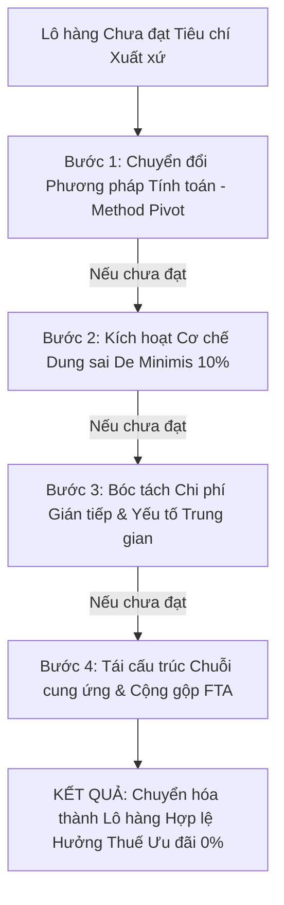

# KHUNG CHIẾN LƯỢC TỐI ƯU HÓA XUẤT XỨ HÀNG HÓA & SO SÁNH ĐA HIỆP ĐỊNH
## Origin Engineering Framework & Multi-FTA Arbitrage Playbook

> **Tài liệu nghiệp vụ chuyên sâu độc quyền thuộc Skill `customs-roo-specialist`**  
> *Định hướng: Chuyển hóa từ tư duy "Kiểm tra thụ động (Auditor)" sang "Kỹ sư tối ưu hóa xuất xứ (Origin Engineer)" & "Chiến lược gia chuỗi cung ứng FTA (FTA Strategist)".*

---

### PHẦN I: FRAMEWORK 4 BƯỚC "GIẢI CỨU" & TỐI ƯU HÓA XUẤT XỨ (RESCUING NON-ORIGINATING GOODS)

Khi phân tích hồ sơ lô hàng hoặc bảng định mức BOM sơ bộ thấy **KHÔNG ĐẠT** tiêu chí quy định (ví dụ: RVC chỉ đạt $35\% - 38\%$ so với ngưỡng yêu cầu $40\%$, hoặc dính nguyên liệu lỗi không đáp ứng CTC), chuyên viên xuất xứ không được vội vã kết luận "Từ chối C/O", mà phải kích hoạt ngay quy trình **Origin Engineering 4 bước**:

#### Bước 1: Chuyển Đổi Phương Pháp Tính Toán (Method Pivot)
* **Quy tắc thực chiến:** Hầu hết các FTA (như ATIGA, RCEP, AKFTA, VKFTA) đều cho phép doanh nghiệp lựa chọn giữa 2 phương pháp tính: **Gián tiếp (Build-down)** hoặc **Trực tiếp (Build-up)**.
  * **Kịch bản 1:** Khi tính theo *Build-down*: $\text{RVC} = \frac{\text{FOB} - \text{VNM}}{\text{FOB}} \times 100\%$ bị trượt do giá mua nguyên liệu nhập khẩu (VNM) bị tính gộp cả cước vận chuyển CIF về cảng Việt Nam.
  * **Giải pháp Pivot:** Chuyển sang tính theo *Build-up*: $\text{RVC} = \frac{\text{VOM} + \text{Direct Labor} + \text{Direct Overhead} + \text{Other Costs} + \text{Profit}}{\text{FOB}} \times 100\%$.
  * *Tại sao hiệu quả?* Đối với các ngành sản xuất sử dụng nhiều lao động hoặc có công nghệ cao (lắp ráp điện tử, may mặc, chế biến gỗ), chi phí nhân công trực tiếp, tiền điện, khấu hao máy móc hiện đại và tỷ suất lợi nhuận tại Việt Nam rất lớn. Khi gom các chi phí này vào tử số của Build-up, tỷ lệ RVC thực tế thường vọt lên từ $42\% - 55\%$, biến lô hàng từ "Trượt" thành "Đỗ xuất sắc".
  * **Lưu ý đặc biệt với CPTPP:** Đổi từ công thức *FOB thông thường* sang *Chi phí tịnh (Net Cost - NC)* đối với nhóm ô tô và linh kiện vận tải để loại bỏ chi phí tiếp thị, bán hàng và vận chuyển ra khỏi mẫu số.

#### Bước 2: Kích Hoạt Cơ Chế Dung Sai De Minimis (10% Tolerance Rescue)
* **Quy tắc thực chiến:** Áp dụng cho các sản phẩm sử dụng tiêu chí **CTC (Chuyển đổi mã số hàng hóa)** nhưng bị kẹt bởi 1 hoặc vài linh kiện nhỏ không chuyển đổi mã số được (hoặc rơi vào nhóm loại trừ: *Except from Chapter/Heading...*).
* **Công thức cứu cánh:**
  $$\text{Tỷ lệ De Minimis} = \frac{\text{Trị giá CIF của các nguyên liệu lỗi không đạt CTC}}{\text{Trị giá FOB của thành phẩm}} \times 100\% \le 10\%$$
* **Cách thực hiện:**
  1. Lọc riêng các dòng nguyên liệu trong bảng BOM không đạt tiêu chí CTC.
  2. Tính tổng giá trị của nhóm nguyên liệu lỗi này.
  3. So sánh với $10\%$ giá FOB (hoặc $10\%$ trọng lượng đối với mặt hàng dệt may Chương 50-63).
  4. Nếu $\le 10\%$: Khẳng định toàn bộ lô hàng **vẫn đáp ứng tiêu chí CTC** và được cấp C/O hợp lệ. Trên C/O chỉ cần khai báo mã tiêu chí kèm ghi chú *"De Minimis"* (hoặc tick ô Box 13 đối với Form D).

#### Bước 3: Bóc Tách Chi Phí Gián Tiếp & Yếu Tố Trung Gian (Indirect Materials Decoupling)
* **Quy tắc thực chiến:** Kế toán nhà máy khi lập Bảng kê chi phí (Cost Statement) thường mắc lỗi cơ bản: Gom tất cả hóa đơn mua hàng vào mục "Nguyên vật liệu" (kể cả dầu nhờn bôi trơn máy, khí nén, hóa chất tẩy rửa khuôn, găng tay bảo hộ, bao bì đóng gói bảo vệ). Điều này vô tình làm thổi phồng giá trị nguyên liệu không có xuất xứ (VNM), kéo tụt chỉ số RVC.
* **Biện pháp bóc tách theo Điều ước quốc tế:**
  * Dẫn chiếu điều khoản về *Yếu tố trung gian (Indirect Materials)* quy định tại tất cả các FTA (như Điều 33 ATIGA, Điều 3.12 CPTPP, Điều 3.10 RCEP): **Nhiên liệu, năng lượng, chất xúc tác, dung môi, găng tay, thiết bị kiểm tra... dùng trong quá trình sản xuất nhưng không hợp thành sản phẩm thì MẶC NHIÊN COI LÀ CÓ XUẤT XỨ**.
  * Chuyển toàn bộ các chi phí này từ mục "Nguyên vật liệu VNM" sang mục "Chi phí sản xuất chung trực tiếp (Direct Overhead)". Khi đó, VNM giảm xuống ngay lập tức $\rightarrow$ RVC tăng vọt qua ngưỡng $40\%$.

#### Bước 4: Tái Cấu Trúc Chuỗi Cung Ứng & Tận Dụng Cộng Gộp FTA (Cumulation Strategy)
* Khi đã áp dụng 3 bước trên mà vẫn chưa đạt, chuyên viên tư vấn chiến lược mua hàng (Sourcing Optimization):
  1. **Xác định "Linh kiện nút thắt cổ chai" (Bottleneck Component):** Chỉ điểm đúng 1 linh kiện có giá trị cao nhất đang kéo tụt xuất xứ.
  2. **Tư vấn chuyển dịch nhà cung ứng nội khối FTA:**
     * Ví dụ xuất khẩu sang Nhật Bản theo RCEP: Thay vì nhập linh kiện điện tử từ Đài Loan hay Mỹ (ngoài khối), chuyển sang mua từ nhà cung cấp tại Trung Quốc, Hàn Quốc hoặc Thái Lan (thành viên RCEP). Nhờ cơ chế **Cộng gộp RCEP (Article 3.4)**, nguyên liệu này lập tức trở thành nguyên liệu có xuất xứ (VOM).
  3. **Tận dụng Cộng gộp từng phần (Partial Cumulation trong ATIGA):**
     * Nếu nhập khẩu bán thành phẩm từ Malaysia có RVC thực tế chỉ đạt $25\%$ (chưa đủ $40\%$ để lấy C/O Form D chính thức), ta vẫn yêu cầu đối tác xin chứng nhận xuất xứ ghi rõ hàm lượng $25\%$ để được cộng gộp chính xác $25\%$ giá trị đó vào tử số của Việt Nam theo Điều 30 ATIGA.
  4. **Tận dụng Cộng gộp dệt may chéo trong EVFTA (Cross-cumulation):**
     * Theo Thông tư 14/2026/TT-BCT: Vải dệt có xuất xứ từ Hàn Quốc (đã có FTA với EU) hoặc Nhật Bản (đối với phụ liệu theo cam kết) khi nhập vào Việt Nam để may quần áo xuất sang EU được coi là **vải có xuất xứ EVFTA**, giải quyết dứt điểm điểm nghẽn "từ vải trở đi".

---

### PHẦN II: CHIẾN LƯỢC SO SÁNH ĐA HIỆP ĐỊNH (MULTI-FTA ARBITRAGE)

Khi xuất/nhập khẩu với một đối tác thương mại có nhiều FTA đan xen, chuyên viên phải lập **Ma trận Đấu thầu Hiệp định (FTA Arbitrage Matrix)** để chọn ra FTA tối ưu nhất dựa trên 3 tiêu chí:
1. **Thuế suất ưu đãi (Tariff Advantage):** Form nào thuế về $0\%$ nhanh nhất?
2. **Độ "dễ thở" của quy tắc xuất xứ (ROO Stringency):** Form nào doanh nghiệp dễ đáp ứng định mức nhất?
3. **Thủ tục & Chi phí tuân thủ (Compliance & Verification Friction):** C/O bản giấy truyền thống hay Tự chứng nhận xuất xứ (Self-certification)?

#### 1. Tuyến Xuất Khẩu Sang NHẬT BẢN (4 FTA Đan Xen)
| Hiệp Định | Mẫu Chứng Nhận | Quy Tắc Xuất Xứ Điển Hình | Đánh Giá Độ Khó & Lời Khuyên Chiến Lược |
|:---|:---:|:---|:---|
| **VJEPA** *(Việt Nam - Nhật Bản)* | Form VJ (Bộ Công Thương) | Linh hoạt: CTC hoặc RVC 40%. Quy tắc nông thủy sản tương đối mở. | **Khuyên dùng cho Nông thủy sản & Thực phẩm chế biến.** Thuế suất về $0\%$ cho hầu hết mặt hàng nông nghiệp; thủ tục VJ đã quen thuộc với Hải quan Nhật. |
| **AJCEP** *(ASEAN - Nhật Bản)* | Form AJ (Bộ Công Thương) | Cho phép cộng gộp toàn bộ nguyên liệu từ 10 nước ASEAN và Nhật Bản. | **Khuyên dùng khi chuỗi cung ứng dùng nhiều nguyên liệu từ Thái Lan, Indonesia, Malaysia.** |
| **CPTPP** | Tự chứng nhận xuất xứ / C/O Form CPTPP | **Dệt may: Quy tắc "Từ sợi trở đi" (Yarn forward) cực kỳ nghiêm ngặt.** Hàng công nghiệp: RVC 45-55% hoặc CTC. | **Khuyên dùng cho Doanh nghiệp FDI, Cơ khí chính xác, Điện tử.** Thuế về $0\%$ sâu; doanh nghiệp được quyền tự chứng nhận xuất xứ, không phải chờ cấp C/O. Không nên dùng cho dệt may nếu vải nhập từ Trung Quốc. |
| **RCEP** | Form RCEP hoặc Tự chứng nhận | Quy tắc linh hoạt; **cho phép dùng nguyên liệu có xuất xứ từ Trung Quốc, Hàn Quốc.** | **VŨ KHÍ TỐI THƯỢNG CHO DỆT MAY & LINH KIỆN ĐIỆN TỬ.** Nếu vải may mặc nhập từ Trung Quốc, dùng CPTPP sẽ rớt $100\%$, nhưng chuyển sang RCEP sẽ đạt ngay tiêu chí chuyển đổi mã số hoặc cộng gộp RCEP để hưởng thuế ưu đãi sang Nhật! |

#### 2. Tuyến Xuất Khẩu Sang HÀN QUỐC (3 FTA Đan Xen)
* **VKFTA (Form VK):** Ưu tiên số 1 vì danh mục cam kết song phương cắt giảm thuế sâu nhất cho hàng Việt Nam (đặc biệt là tôm cá, nông sản chế biến, đồ gỗ).
* **AKFTA (Form AK):** Dùng làm phương án dự phòng khi nguyên liệu cấu thành được nhập từ các nước ASEAN khác để tận dụng cộng gộp ASEAN - Hàn Quốc.
* **RCEP (Form RCEP):** Cứu cánh khi sản phẩm sử dụng linh kiện/nguyên liệu chính nhập khẩu từ Trung Quốc hoặc Nhật Bản.

#### 3. Tuyến Xuất Khẩu Nội Khối ASEAN (2 FTA Đan Xen: ATIGA vs RCEP)
* **Form D (ATIGA):**
  * Hơn $98\%$ dòng thuế giữa các nước ASEAN đã về $0\%$.
  * Hệ thống C/O điện tử Một cửa ASEAN (e-Form D qua ASW) thông quan tự động chỉ trong vài phút, gần như không có độ trễ chứng từ.
  * *Lời khuyên:* **Luôn ưu tiên Form D** trừ khi sản phẩm có hàm lượng nguyên liệu nhập ngoài ASEAN lớn (khi đó mới xét sang RCEP để cộng gộp nguyên liệu Trung Quốc/Hàn Quốc/Nhật Bản).
