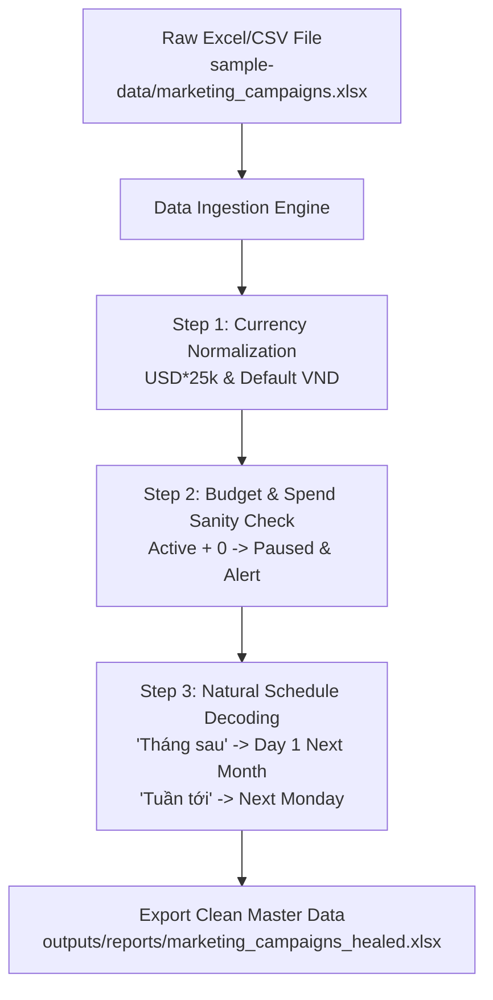

# Marketing Healing Skill (`SKILL.md`)

> **Đóng gói & Chuẩn hóa:** Phạm Minh Hoàng — *Học viên Khóa học Agentic AI with Google Antigravity (AI4A)*  
> **Cố vấn chuyên môn:** MT Đức Thuận (AI4A)  
> **Tài liệu tham chiếu:** [Marketing_Healing_Skill.md](file:///c:/Minh%20Hoang/Antigravity%20học/my-workspace/Marketing_Healing_Skill.md)  
> **Dữ liệu thực hành:** [sample-data/marketing_campaigns.xlsx](file:///c:/Minh%20Hoang/Antigravity%20học/my-workspace/sample-data/marketing_campaigns.xlsx)

---

## 1. MỤC TIÊU VÀ NGUYÊN TẮC VẬN HÀNH

Skill này cung cấp quy chuẩn xử lý và tự động chữa lành các bảng dữ liệu chiến dịch Marketing theo 3 quy tắc bắt buộc:
1. **Quy đổi tiền tệ:** `USD × 25,000 = VND`. Trường hợp thiếu đơn vị (`Currency` là `None`, `NaN`, chuỗi rỗng) $\rightarrow$ Tự động gán mặc định `VND`.
2. **Kiểm tra logic ngân sách:** Chiến dịch `Active` mà ngân sách hoặc chi phí thực tế bằng `0` $\rightarrow$ Tự động đổi trạng thái sang `Paused` và ghi nhận cảnh báo kiểm tra cấu hình tracking/lệnh giải ngân. Đồng thời cảnh báo các chiến dịch có `Budget > 1,000,000,000 VND`.
3. **Giải mã lịch trình:**
   - `"Tháng sau"` $\rightarrow$ Ngày 1 của tháng kế tiếp (`YYYY-MM-01`).
   - `"Tuần tới"` $\rightarrow$ Thứ Hai tuần sau (`YYYY-MM-DD`).
   - Mở rộng: `"Đầu tuần sau"` (= Tuần tới), `"Sau lễ"` (03/09/2026), `"Q3"` (30/09/2026), `"Sau Tết"` (23/02/2026), `"Hết mùa hè"` (31/08/2026).

---

## 2. QUY TRÌNH THỰC THI (WORKFLOW)



---

## 3. LỆNH VẬN HÀNH
Thực thi trực tiếp mã nguồn chữa lành dữ liệu:
```bash
python scratch/heal_marketing_campaigns.py
```
Sau khi hoàn tất, hệ thống tự động xuất bản tệp đã chuẩn hóa tại `sample-data/marketing_campaigns_healed.xlsx`.
