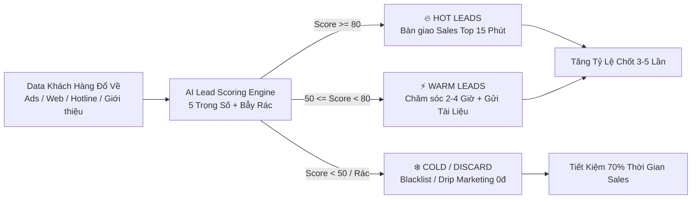
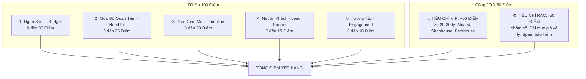
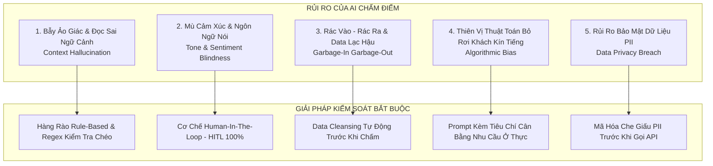
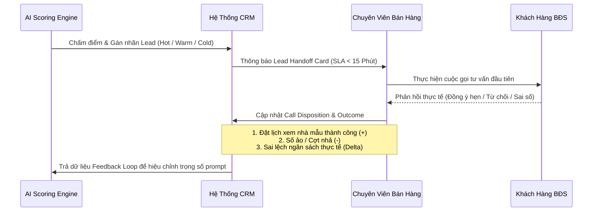

# Real Estate Lead Scoring Skill (`real-estate:lead-scoring`)

> **Đóng gói & Phát triển:** Phạm Minh Hoàng — *Học viên Khóa học Agentic AI with Google Antigravity (AI4A)*  
> **Cố vấn chuyên môn:** MT Đức Thuận (AI4A)  
> **Tài liệu tham chiếu cốt lõi:**  
> - CSDL Khách hàng Bất Động Sản thực tế: [Google Sheets Lead Database](https://docs.google.com/spreadsheets/d/149rRXA8rSQKsAaMW0Kyt3q6Mzv9_KltAXgIXVTnuQoM/edit?gid=1542775777#gid=1542775777)  
> - Quy chuẩn tiêu chí chấm điểm chuyên ngành: [tieu_chi_cham_diem.txt](file:///c:/Minh%20Hoang/Antigravity%20h%E1%BB%8Dc/my-workspace/knowledge-base/tieu_chi_cham_diem.txt)

---

## 1. ĐỊNH NGHĨA LEAD SCORING & TẦM QUAN TRỌNG TRONG BẤT ĐỘNG SẢN

### 1.1. Lead Scoring trong Bất Động Sản là gì?
**Lead Scoring (Chấm điểm khách hàng tiềm năng)** trong ngành Bất Động Sản là phương pháp định lượng hóa mức độ sẵn sàng mua, khả năng tài chính và độ phù hợp của khách hàng đối với danh mục sản phẩm của dự án thông qua một thang điểm số học tiêu chuẩn (thường từ 0 đến 100 điểm, kết hợp điểm thưởng VIP / điểm phạt Lead Rác).

Mỗi dữ liệu thu thập được từ khách hàng (lịch sử duyệt web, ngân sách dự kiến, loại hình BĐS mong muốn, khả năng tài chính tự có so với đòn bẩy ngân hàng, hành vi bắt máy, tần suất tương tác Zalo) đều được gán một trọng số điểm cụ thể.

### 1.2. Tại sao Lead Scoring là "Vũ Khí Sống Còn" của Doanh Nghiệp BĐS?



1. **Chi phí tìm kiếm khách hàng (CPL - Cost Per Lead) ngày càng đắt đỏ:**  
   Chi phí quảng cáo BĐS (Facebook Ads, Google Search, TikTok) hiện dao động từ 300,000đ – 1,500,000đ/lead. Nếu đội ngũ Sales phải gọi dàn trải cho cả những đối tượng "hỏi cho vui", "đòi mua nhà trung tâm giá 1-2 tỷ" hay "nhầm số", doanh nghiệp sẽ đốt cháy ngân sách tiếp thị mà không tạo ra doanh thu.
2. **Quy luật Pareto (80/20) trong Bán Hàng Dự Án:**  
   Thực tế 80% hoa hồng và doanh số của các sàn giao dịch đến từ top 20% khách hàng tiềm năng cao cấp (Nhà đầu tư sỉ, khách mua biệt thự ven sông, penthouse, sàn văn phòng diện tích lớn). Lead Scoring giúp tập trung nguồn lực vào nhóm này ngay từ giây phút đầu tiên.
3. **Quy tắc Vàng "15 Phút Đầu Tiên" (Speed to Lead):**  
   Khách hàng có nhu cầu BĐS thực sự thường để lại thông tin ở nhiều dự án cùng lúc. Nếu Sales liên hệ trong vòng 5-15 phút khi nhu cầu đang ở đỉnh, tỷ lệ đặt lịch hẹn xem nhà mẫu cao gấp 7 lần so với việc liên hệ sau 24 giờ.
4. **Hàn gắn xung đột kinh điển giữa Marketing và Sales:**  
   Marketing thường báo cáo "chạy về hàng trăm số điện thoại rẻ", trong khi Sales than phiền "toàn số ảo, thuê bao, không có tiền". Lead Scoring tạo ra một **Ngôn ngữ chung (Universal SLA)** minh bạch, có bằng chứng dữ liệu rõ ràng.

---

## 2. QUY TRÌNH CHẤM ĐIỂM 5 TIÊU CHÍ (THE 5-PILLAR SCORING MATRIX)

Hệ thống đánh giá vận hành trên **5 Trụ Cột Độc Lập** (Tổng thang điểm cơ sở: 100 điểm), đồng thời tích hợp **Cơ chế Nhân tố Đặc biệt** (Bonus VIP +50 điểm hoặc Penalty Lead Rác -50 điểm) theo quy chuẩn [tieu_chi_cham_diem.txt](file:///c:/Minh%20Hoang/Antigravity%20h%E1%BB%8Dc/my-workspace/knowledge-base/tieu_chi_cham_diem.txt).

```
TỔNG ĐIỂM = Điểm Cơ Sở (Ngân Sách + Quan Tâm + Thời Gian + Nguồn Khách + Tương Tác) + Điểm Thưởng/Phạt Đặc Biệt
```



---

### 2.1. Tiêu chí 1: Ngân Sách & Năng Lực Tài Chính (Budget - Trọng số: 30 điểm)
Phản ánh khả năng chi trả và độ khớp giữa túi tiền của khách với giỏ hàng dự án.

| Mức độ | Điểm | Dấu hiệu nhận biết & Từ khóa thực tế | Hành động đánh giá |
|:---|:---:|:---|:---|
| **Siêu VIP** | **30** *(+50 Thưởng)* | Đề cập rõ ràng tài chính từ 20 tỷ đến trên 30 tỷ; cụm từ *"tài chính mạnh"*, *"thanh toán thẳng 100%"*, *"tiền mặt sẵn"*, *"không thành vấn đề"*. | Cộng 30 điểm cơ sở + Kích hoạt Tiêu chí VIP +50 điểm. |
| **Cao Cấp** | **25** | Ngân sách từ 8 - 15 tỷ (nhà phố nội thành, biệt thự song lập). | Khớp phân khúc trung-cao cấp, tài chính lành mạnh. |
| **Tầm Trung** | **18** | Ngân sách 4 - 7 tỷ (căn hộ cao cấp, chung cư 2PN-3PN), cần hỗ trợ vay ngân hàng 50-70%. | Khách có nhu cầu ở thực, cần tư vấn gói lãi suất ưu đãi. |
| **Vừa Túi Tiền**| **12** | Ngân sách 2 - 3 tỷ (đất nền vùng ven Long An, Đồng Nai, căn hộ studio ngoại thành). | Khách đầu tư dài hạn hoặc tích lũy tài sản ban đầu. |
| **Thiếu Khả Thi**| **0** | Không rõ ngân sách, mức chi trả mập mờ, chỉ tìm thuê vài triệu đồng. | Giữ nguyên điểm tối thiểu. |
| **Phi Thực Tế** | **-50** *(Phạt)* | Đòi hỏi mức giá vô lý so với thị trường: *"Mua nhà Quận 1 giá 1-2 tỷ"*, *"Thuê nhà nguyên căn trung tâm 2 triệu"*. | Trừ thẳng 50 điểm (Cảnh báo Lead rác / Ảo tưởng). |

---

### 2.2. Tiêu chí 2: Mức Độ Quan Tâm & Độ Khớp Nhu Cầu (Need & Product Fit - Trọng số: 25 điểm)
Phân tích tính cụ thể và độ nghiêm túc của loại hình BĐS mà khách hàng đang tìm kiếm.

| Mức độ | Điểm | Dấu hiệu nhận biết & Từ khóa thực tế | Ghi chú nghiệp vụ |
|:---|:---:|:---|:---|
| **Chuyên Nghiệp / VIP**| **25** | Tìm kiếm sản phẩm đặc thù cao cấp: *"Biệt thự đơn lập ven sông"*, *"Penthouse có hồ bơi riêng, thang máy riêng"*, *"Quỹ đất công nghiệp > 2000m2"*, *"Gom sỉ 5-10 căn shophouse mặt đường lớn"*. | Nhu cầu mua để gia tăng tài sản hoặc phát triển sản xuất. |
| **Xác Định Rõ Ràng** | **20** | Nêu chính xác vị trí, diện tích, công năng: *"Căn hộ 2PN Quận 7 cho gia đình trẻ"*, *"Mặt bằng kinh doanh spa 80-100m2 Quận 1"*, *"Đất nền sổ hồng riêng không dính quy hoạch"*. | Nhu cầu đã định hình, chỉ cần đúng sản phẩm là vào việc. |
| **Đang Cân Nhắc So Sánh**| **15** | Đang phân vân giữa 2-3 dự án trong cùng khu vực; quan tâm sâu về *"pháp lý dự án"*, *"tiến độ xây dựng"*, *"chính sách chiết khấu"*. | Khách hàng thông thái, cần chuyên viên có kiến thức chuyên sâu. |
| **Khảo Sát Chung Chung**| **8** | Chỉ hỏi: *"Dự án này ở đâu?"*, *"Gửi mặt bằng xem thử"*, chưa rõ mục đích ở hay đầu tư. | Cần câu hỏi gạn lọc thêm từ Sales. |
| **Không Nhu Cầu / Rác**| **-50** *(Phạt)* | *"Nhầm số"*, *"Không có nhu cầu BĐS"*, *"Dữ liệu cũ ngành khác trộn vào"*, *"Gọi lại chỉ để chào bán bảo hiểm, mời vay vốn"*. | Trừ thẳng 50 điểm, đưa vào danh sách loại trừ. |

---

### 2.3. Tiêu chí 3: Thời Gian Mua & Tính Cấp Thiết (Timeline & Urgency - Trọng số: 20 điểm)
Xác định khoảng thời gian khách hàng dự kiến ra quyết định xuống cọc hoặc ký hợp đồng.

| Khung thời gian | Điểm | Dấu hiệu nhận biết | Phân loại trạng thái |
|:---|:---:|:---|:---|
| **Tức thì (< 7 ngày)** | **20** | *"Muốn đi xem nhà mẫu vào cuối tuần này"*, *"Cần ký hợp đồng dài hạn ngay trong tháng"*, *"Muốn gặp trực tiếp chủ đầu tư để đàm phán chốt cọc"*. | **Khẩn cấp (High Urgency):** Sales phải đặt lịch hẹn lập tức. |
| **Ngắn hạn (1 - 3 tháng)**| **15** | Đang trong giai đoạn rút sổ tiết kiệm, chuẩn bị dòng tiền, chờ ngày đẹp hoặc chốt phương án vay. | **Tiềm năng gần (Near-term):** Bám sát hàng tuần. |
| **Trung hạn (3 - 6 tháng)**| **10** | Mới bắt đầu tìm hiểu quy hoạch, chờ dự án hoàn thiện thêm hạ tầng hoặc móng cọc. | **Nuôi dưỡng (Nurturing):** Gửi cập nhật tiến độ định kỳ. |
| **Dài hạn (> 12 tháng)** | **5** | Dự định mua tích lũy cho con cái hoặc khi có tiền thưởng cuối năm. | **Theo dõi dài hạn (Cold Nurture).** |
| **Trì hoãn / Hỏi cho vui** | **-20** | *"Hỏi giá cho vui"*, *"Chưa có ý định mua trong năm nay"*, *"Bao giờ trúng số mới mua"*. | Trừ 20 điểm (Hạ độ ưu tiên về mức thấp nhất). |

---

### 2.4. Tiêu chí 4: Nguồn Khách Hàng (Lead Source Credibility - Trọng số: 15 điểm)
Kênh tiếp cận phản ánh mức độ tin cậy và chi phí cơ hội của dữ liệu đầu vào.

| Kênh tiếp cận | Điểm | Đặc điểm chất lượng | Đánh giá |
|:---|:---:|:---|:---|
| **Referral / Cựu khách hàng VIP**| **15** | Khách quen đã từng mua nhiều dự án của tập đoàn; đối tác thân thiết hoặc khách hàng cũ giới thiệu người thân. | Chất lượng đỉnh cao, tỷ lệ chốt > 50%. |
| **Inbound Hotline / Form Web Chủ Động**| **12** | Khách tự tìm kiếm Google, vào website chính thức và chủ động điền form đăng ký tư vấn chuyên sâu / tải bảng giá. | Độ quan tâm cao, xuất phát từ nhu cầu nội tại. |
| **Sự Kiện Mở Bán / Tham Quan Nhà Mẫu** | **10** | Khách đã đến trực tiếp sa bàn hoặc nhà mẫu dự án, để lại thông tin tại quầy tiếp tân. | Mức độ xác thực thông tin 100%. |
| **Quảng Cáo Lead Form Mạng Xã Hội** | **6** | Để lại số qua Facebook Instant Lead Form / TikTok Form (dễ bấm nhầm hoặc autofill số điện thoại cũ). | Cần xác minh tính chính danh trước khi dồn sức. |
| **Tệp Dữ Liệu Lạnh (Cold Database / Scraped)**| **2** | Tệp data mua ngoài, quét số điện thoại từ hội nhóm, dữ liệu ngành xe/ngân hàng trộn sang. | Tỷ lệ rác cao, chỉ lọc bằng tin nhắn tự động. |

---

### 2.5. Tiêu chí 5: Mức Độ Tương Tác & Phản Hồi (Engagement & Responsiveness - Trọng số: 10 điểm)
Đo lường sự thiện chí và khả năng kết nối giữa khách hàng với đội ngũ tư vấn.

| Mức độ tương tác | Điểm | Dấu hiệu thực tế từ lịch sử cuộc gọi / tin nhắn | Đánh giá khả năng kết nối |
|:---|:---:|:---|:---|
| **Rất Tích Cực** | **10** | Nghe máy ngay lần đầu, trả lời tin nhắn Zalo nhiệt tình, chủ động kết bạn, gửi căn cước làm thủ tục hoặc hỏi xin file pháp lý PDF. | Mức độ kết nối hoàn hảo. |
| **Thiện Chí / Cần Thời Gian**| **7** | Bận họp nhưng nhắn lại hẹn gọi sau; trao đổi lịch sự qua tin nhắn, đã đọc tài liệu gửi qua Zalo. | Kết nối ổn định. |
| **Hạn Chế / Ít Tương Tác** | **4** | Chỉ xem tin nhắn không trả lời (seen không rep); nghe máy 1 lần rồi im lặng. | Cần thay đổi góc tiếp cận (gửi infographic hoặc video). |
| **Mất Kết Nối / Thuê Bao**| **-20** | Số điện thoại liên tục *"Thuê bao"*, gọi nhiều lần trong các khung giờ khác nhau không bắt máy, nhắn Zalo không gửi được. | Báo động số điện thoại ảo hoặc chặn người lạ. |
| **Thái Độ Bất Hợp Tác** | **-50** | Cúp máy ngang xương, gắt gỏng chửi bới, báo nhầm số hoặc yêu cầu gỡ số khỏi hệ thống. | Trừ 50 điểm, gắn thẻ "Do Not Call" (DNC). |

---

## 3. CÁCH PHÂN LOẠI KHÁCH HÀNG: HOT / WARM / COLD

Sau khi cộng gộp toàn bộ điểm thành phần và điểm thưởng/phạt, hệ thống phân bổ khách hàng vào 3 phân khúc chuẩn:

```
┌────────────────────────────────────────────────────────────────────────┐
│                          THANG ĐIỂM CHUẨN                              │
│                                                                        │
│   < 50 Điểm                 50 - 79 Điểm             80 - 100+ Điểm    │
│  [❄️ COLD LEADS]           [⚡ WARM LEADS]          [🔥 HOT LEADS]     │
│  Lọc rác / Drip Email      Nuôi dưỡng 1-3 tháng     Ưu tiên số 1       │
│  SLA: Không chia Sales     SLA: Gọi trong 2-4h      SLA: Gọi < 15 phút │
└────────────────────────────────────────────────────────────────────────┘
```

### Bảng Ma Trận So Sánh Toàn Diện

| Tiêu chí | 🔥 HOT LEADS (VIP & Urgent) | ⚡ WARM LEADS (Potential & Nurture) | ❄️ COLD LEADS (Unqualified / Junk) |
|:---|:---|:---|:---|
| **Khoảng điểm** | **80 – 100+ Điểm** | **50 – 79 Điểm** | **< 50 Điểm** *(Điểm thấp hoặc âm)* |
| **Chân dung điển hình** | • Đại gia mua Penthouse/Biệt thự ven sông > 20-30 tỷ.<br>• Doanh nghiệp tìm quỹ đất công nghiệp/sàn VP > 2000m2.<br>• Nhà đầu tư gom sỉ 5-10 Shophouse.<br>• Khách mua căn hộ gia đình đã hẹn xem nhà mẫu cuối tuần. | • Khách mua ở tầm trung (3-10 tỷ) cần vay vốn 70%.<br>• Đang so sánh 2 dự án, cần tư vấn chính sách chiết khấu.<br>• Khách đầu tư đất nền vùng ven (2-3 tỷ) dài hạn.<br>• Khách thuê mặt bằng kinh doanh spa giá hợp lý. | • Đòi mua nhà Q1 giá 1 tỷ / thuê nhà 2 triệu.<br>• Khách nhầm số, data cũ trộn ngành khác.<br>• Thuê bao, gọi không bắt máy, không rep Zalo.<br>• Khách hỏi cho vui, chưa có ý định mua.<br>• Dịch vụ spam bảo hiểm, tài chính. |
| **Tỷ lệ chốt dự kiến** | **25% – 45%** | **10% – 20%** | **< 1%** *(Hầu như bằng 0)* |
| **Mục tiêu tương tác** | Chốt lịch hẹn trực tiếp (F2F meeting) hoặc xem sa bàn / nhà mẫu ngay lập tức. | Cung cấp bài toán tài chính, bảng tính dòng tiền ngân hàng, giải tỏa băn khoăn pháp lý. | Tự động hóa gạn lọc; cách ly không để làm phiền đội ngũ bán hàng. |
| **Thời hạn SLA bàn giao**| **Gọi trong vòng 5 - 15 phút** *(Tối đa 30 phút)* | **Gọi trong vòng 2 - 4 giờ làm việc** | Không phân bổ trực tiếp cho Sales qua điện thoại. |
| **Nhân sự xử lý** | **Top Producer / Trưởng phòng kinh doanh / Giám đốc sàn.** | **Chuyên viên tư vấn chính thức (Standard Sales).** | **Hệ thống AI Bot / Marketing Automation (Email/ZNS).** |

---

## 4. LƯU Ý KHI AI CHẤM ĐIỂM TỰ ĐỘNG (GIỚI HẠN & RỦI RO THỰC TẾ)

Mặc dù AI (Large Language Models) có tốc độ xử lý hàng nghìn hồ sơ chỉ trong vài giây, việc ứng dụng AI tự động vào Lead Scoring BĐS tiềm ẩn **5 Rủi Ro Nghiệp Vụ Nghiêm Trọng**:



### 4.1. Chi tiết 5 Rủi Ro & Cơ Chế Khắc Phục Thực Chiến

#### ❌ Rủi ro 1: Bẫy Ảo Giác (Hallucination) & Hiểu sai ngữ cảnh từ ngữ
- **Hiện tượng:** AI dễ bị đánh lừa bởi các từ khóa "bẫy".  
  *Ví dụ:* Khách hàng ghi mô tả *"Đang muốn mua căn hộ Quận 1 nhưng tài chính chỉ có 1 tỷ, đang tìm ai cho vay 10 tỷ không lãi suất"*. Nếu chỉ bắt từ khóa *"Quận 1"*, *"10 tỷ"*, AI có thể ngây thơ chấm đây là khách VIP +50 điểm! Ngược lại, một đại gia nói ngắn gọn: *"Có đất nào ở ngoại ô không em?"* thì bị AI trừ điểm vì mô tả sơ sài.
- **Biện pháp phòng ngừa:** Phải thiết lập **Hàng rào Logic (Rule-based Regex Guards)**:
  - Nếu `Ngân sách < 2 tỷ` VÀ `Vị trí == Quận 1 / Ba Đình` $\rightarrow$ Tự động gắn cờ **IRRATIONAL_BUDGET** và ghim trần điểm số tối đa không vượt quá 30 điểm.
  - Luôn yêu cầu AI trích dẫn câu từ chứng cứ gốc (`reasoning_evidence`) trước khi đưa ra điểm số.

#### ❌ Rủi ro 2: "Mù Cảm Xúc" và Sắc thái giọng nói (Tone Blindness)
- **Hiện tượng:** Bản ghi text trên CRM hoặc transcript cuộc gọi không phản ánh được âm lượng, sự do dự hay thái độ mỉa mai của khách hàng. Khách nói cợt nhả *"Ờ thì cứ gửi penthouse 50 tỷ qua xem chơi"* có thể bị AI chấm nhầm là Hot Lead.
- **Biện pháp phòng ngừa:**
  - AI chỉ đưa ra **Điểm Sơ Bộ (Draft Lead Score)**.
  - Điểm chính thức chỉ được khóa lại sau khi Sales thực hiện cuộc gọi đầu tiên và hoàn thành 1 câu trắc nghiệm cảm xúc: `[ ] Khách thiện chí hào hứng / [ ] Khách bình thường / [ ] Khách cợt nhả, hỏi cho vui`.

#### ❌ Rủi ro 3: Dữ liệu bẩn và Lỗi thời (Garbage-In, Garbage-Out & Stale Data)
- **Hiện tượng:** Dữ liệu số điện thoại bị sai format (thiếu số 0, 9 chữ số thay vì 10 chữ số), số điện thoại từ tệp cũ 2 năm trước trộn vào, trùng lặp thông tin (duplicate lead) khiến hệ thống chấm điểm nhiều lần cho cùng 1 người với các số điểm khác nhau.
- **Biện pháp phòng ngừa:**
  - Chạy quy trình tiền xử lý (Data Cleaning) làm sạch số điện thoại (`+84` chuẩn hóa về `0...`), khử trùng lặp theo SĐT trước khi nạp vào AI.
  - Bổ sung trường `Data_Age_Days`: Nếu lead quá 30 ngày chưa xử lý, tự động giảm 50% điểm số ban đầu.

#### ❌ Rủi ro 4: Thiên vị thuật toán đối với khách hàng kín tiếng (Algorithmic Bias)
- **Hiện tượng:** Trong văn hóa kinh doanh BĐS Việt Nam, nhiều khách hàng giàu có thực sự thường rất kín tiếng khi nhắn tin qua mạng xã hội (chỉ để lại tin nhắn: *"Inbox giá", "Alo tôi"*). AI chấm điểm dựa trên độ dài văn bản sẽ đánh giá nhóm này là Cold Lead, làm mất đi cơ hội chốt hợp đồng chục tỷ.
- **Biện pháp phòng ngừa:**
  - Không phạt điểm vì tin nhắn ngắn. Nếu khách để lại số điện thoại cá nhân trên các kênh dự án đắt đỏ (Vinhomes Riverside, Grand Marina, Aqua City), mặc định xếp vào mức **WARM (60 điểm)** để Sales gọi xác nhận nhanh.

#### ❌ Rủi ro 5: Vi phạm bảo mật thông tin cá nhân (PII Compliance)
- **Hiện tượng:** Truyền số điện thoại, họ tên thật và mức tài sản hàng chục tỷ của khách hàng lên các nền tảng AI công cộng có thể vi phạm Nghị định 13/2023/NĐ-CP về Bảo vệ dữ liệu cá nhân.
- **Biện pháp phòng ngừa:**
  - Áp dụng nguyên tắc ẩn danh hóa: Mã hóa số điện thoại dạng `091****888` hoặc chỉ truyền chuỗi nội dung nhu cầu kèm `ID_Khach` khi gọi qua API.

---

## 5. GIAO THỨC BÀN GIAO KẾT QUẢ CHO SALES (SALES HANDOFF PROTOCOL - SOP)

Một hệ thống chấm điểm dù chính xác đến đâu cũng trở nên vô nghĩa nếu không có quy trình bàn giao (Handoff) đồng bộ với đội ngũ kinh doanh.

### 5.1. Bảng Quy Định Thời Gian Phản Hồi (Response Time SLA)

```
┌─────────────────────────────────────────────────────────────────────────────┐
│                            SLA PHẢN HỒI THEO PHÂN LOẠI                     │
├───────────────┬────────────────────────────┬────────────────────────────────┤
│ Phân loại     │ Thời hạn phản hồi tối đa  │ Kênh tiếp cận ưu tiên          │
├───────────────┼────────────────────────────┼────────────────────────────────┤
│ 🔥 HOT LEAD   │ ≤ 15 Phút                  │ Gọi điện thoại trực tiếp       │
│ ⚡ WARM LEAD  │ ≤ 2 - 4 Giờ làm việc       │ Gọi điện + Kết bạn Zalo gửi file│
│ ❄️ COLD LEAD  │ 24 Giờ (Chăm sóc tự động) │ Email Drip / Tin nhắn ZNS      │
└───────────────┴────────────────────────────┴────────────────────────────────┘
```

1. **Khách hàng HOT (Score >= 80):**  
   - Bắn thông báo khẩn cấp (Push Notification / Tin nhắn Telegram / Bot nội bộ) đến Trưởng nhóm kinh doanh và chuyên viên Sales được chỉ định.  
   - **SLA: Phải bấm máy gọi điện trong vòng tối đa 15 phút.**  
   - Nếu sau 30 phút chuyên viên chưa cập nhật lịch sử gọi trên CRM, hệ thống tự động thu hồi Lead và chuyển giao cho Chuyên viên khác (Auto-reassignment).
2. **Khách hàng WARM (Score 50 - 79):**  
   - Phân bổ đều cho đội ngũ tư vấn theo cơ chế Round-Robin.  
   - **SLA: Liên hệ trong vòng 2 - 4 giờ làm việc.**  
   - Gửi hồ sơ dự án qua Zalo ngay sau cuộc gọi.
3. **Khách hàng COLD (Score < 50):**  
   - **Không chuyển giao vào danh sách gọi hàng ngày của Sales** (tránh làm phân tán năng lượng và nản lòng nhân viên).  
   - Đưa vào kịch bản nuôi dưỡng tự động (Drip Automation Marketing) bằng chuỗi 5 email hoặc tin nhắn Zalo ZNS định kỳ thông tin thị trường.

---

### 5.2. Mẫu Thẻ Bàn Giao Lead Chuẩn Hóa (Lead Handoff Card Template)
Khi bàn giao Lead cho Sales, AI hoặc CRM phải xuất bản đúng cấu trúc thông tin sau:

```markdown
╔══════════════════════════════════════════════════════════════════════════════╗
║                    THẺ BÀN GIAO KHÁCH HÀNG TIỀM NĂNG                         ║
╠══════════════════════════════════════════════════════════════════════════════╣
║ [MÃ KH]: #LEAD-127        [PHÂN LOẠI]: 🔥 HOT LEAD (VIP)                     ║
║ [ĐIỂM SỐ]: 98/100         [THỜI GIAN ĐẨY DATA]: 30/09/2026 - 15:30            ║
║ [HỌ VÀ TÊN]: Bùi Phương Tâm     [SĐT]: 0790-240-040                          ║
╠══════════════════════════════════════════════════════════════════════════════╣
║ 🎯 TÓM TẮT NHU CẦU CỐT LÕI:                                                  ║
║ • Loại hình: Biệt thự đơn lập phân khu cao cấp nhất (Ven sông, hướng Đông Nam)║
║ • Ngân sách: > 30 tỷ (Cam kết thanh toán thẳng 100%, không vay ngân hàng)   ║
║ • Khách quen: Đã từng mua nhiều dự án trước đây của tập đoàn.                ║
╠══════════════════════════════════════════════════════════════════════════════╣
║ 🔑 ĐIỂM CHẠM MẤU CHỐT (HOOK) & GỢI Ý MỞ LỜI:                                 ║
║ "Dạ em chào anh/chị Tâm, em là [Tên Sales] phụ trách phân khu Biệt thự ven   ║
║ sông tại dự án [Tên Dự Án]. Em được biết anh/chị đang tìm căn đơn lập hướng   ║
║ Đông Nam thanh toán thẳng. Hiện bên em đang có đúng 2 căn vị trí phong thủy   ║
║ đắc địa nhất vừa mở giỏ hàng ngoại giao dành riêng cho khách hàng VIP cũ..." ║
╠══════════════════════════════════════════════════════════════════════════════╣
║ ⚠️ CẢNH BÁO RỦI RO & LƯU Ý PHÁP LÝ:                                          ║
║ • Khách hàng am hiểu quy trình, yêu cầu sự chính xác cao về pháp lý sổ hồng. ║
║ • Tuyệt đối không tư vấn lan man các gói vay ngân hàng.                      ║
╚══════════════════════════════════════════════════════════════════════════════╝
```

---

### 5.3. Vòng Lặp Phản Hồi Ngược 2 Chiều (Two-Way Feedback Loop)
Để mô hình chấm điểm ngày càng thông minh và bám sát thị trường, Sales bắt buộc phải phản hồi kết quả sau mỗi cuộc gọi:



- **Quy tắc hiệu chuẩn:** Nếu một nhóm khách hàng bị Sales báo cáo *"Sai lệch thực tế"* vượt quá 10%, quản trị viên hệ thống sẽ kiểm tra lại bộ tiêu chí và điều chỉnh trọng số (Prompt Weight Tuning) ngay trong chu kỳ PDCA tuần kế tiếp.

---

## 6. PHÂN TÍCH & KIỂM CHỨNG THỰC TẾ TRÊN 6 HỒ SƠ TỪ GOOGLE SHEETS

Dưới đây là kết quả kiểm thử thực nghiệm của kỹ năng trên 6 bản ghi đại diện trích xuất trực tiếp từ file dữ liệu nguồn Google Sheet `149rRXA8rSQKsAaMW0Kyt3q6Mzv9_KltAXgIXVTnuQoM`:

```
┌────────────────────────────────────────────────────────────────────────────────────────┐
│                              BẢNG KIỂM ĐỊNH THỰC TẾ 6 LEAD MẪU                         │
├─────┬──────────────────┬─────────────────────────────────────┬──────┬─────────┬────────┤
│ ID  │ Tên Khách Hàng   │ Trích Đoạn Nhu Cầu Gốc              │ Điểm │ Phân Hạng│ Hành Động│
├─────┼──────────────────┼─────────────────────────────────────┼──────┼─────────┼────────┤
│ 127 │ Bùi Phương Tâm   │ Biệt thự ven sông > 30 tỷ, tiền mặt │  98  │ 🔥 HOT  │ Gọi 5p │
│ 28  │ Trần Hoàng Dũng  │ Đất CN / Sàn VP > 2000m2 khu Đông   │  95  │ 🔥 HOT  │ Gọi 10p│
│ 3   │ Lý Đức Cường     │ Căn hộ Q7 4-5 tỷ, xem nhà cuối tuần │  82  │ 🔥 HOT  │ Gọi 15p│
│ 5   │ Ngô Anh Mai      │ Nhà phố 8-10 tỷ, đang cân nhắc dự án│  74  │ ⚡ WARM │ Gọi 2h │
│ 20  │ Hồ Phương Mai    │ Hỏi cho vui, đòi mua Q1 giá 1 tỷ    │  10  │ ❄️ COLD │ Bỏ qua │
│ 70  │ Hồ Đức Lan       │ Spam quảng cáo ngược lại bảo hiểm   │ -40  │ ⛔ SPAM │ Blacklist
└─────┴──────────────────┴─────────────────────────────────────┴──────┴─────────┴────────┘
```

### Phân tích chi tiết từng trường hợp:

#### 1. Hồ sơ #127 — Bùi Phương Tâm (98 Điểm — 🔥 HOT VIP)
- **Dữ liệu gốc:** *"Khách hàng VIP, quan tâm biệt thự đơn lập phân khu cao cấp nhất. Ngân sách trên 30 tỷ, thanh toán thẳng. Yêu cầu vị trí ven sông, hướng Đông Nam. Đã từng mua nhiều dự án của tập đoàn."*
- **Chấm điểm chi tiết:**
  - Ngân sách: 30/30 (Trên 30 tỷ, thanh toán thẳng).
  - Mức độ quan tâm: 25/25 (Biệt thự đơn lập phân khu cao cấp, ven sông, hướng Đông Nam cụ thể).
  - Thời gian: 15/20 (Sẵn sàng tài chính, có tính khả thi tức thì).
  - Nguồn khách: 15/15 (Khách hàng quen từng mua nhiều dự án của tập đoàn).
  - Tương tác: 8/10 (Thông tin minh bạch, thiện chí tối đa).
  - **Điểm Thưởng VIP Accelerator:** +50 Điểm.
  - **Tổng điểm quy đổi chuẩn:** **98/100 Điểm**.
- **Chỉ định:** Giám đốc kinh doanh gọi trực tiếp trong vòng 5 phút, chuẩn bị layout biệt thự ven sông view đẹp nhất.

#### 2. Hồ sơ #28 — Trần Hoàng Dũng (95 Điểm — 🔥 HOT B2B)
- **Dữ liệu gốc:** *"Chủ doanh nghiệp lớn, cần tìm quỹ đất công nghiệp hoặc sàn văn phòng diện tích trên 2000m2 tại khu Đông. Tài chính cực mạnh, yêu cầu pháp lý chuẩn 100%."*
- **Chấm điểm chi tiết:**
  - Ngân sách: 30/30 (Tài chính cực mạnh, quy mô đất công nghiệp/văn phòng lớn).
  - Mức độ quan tâm: 25/25 (Sản phẩm B2B diện tích > 2000m2 khu Đông, pháp lý 100%).
  - Thời gian: 15/20 (Nhu cầu phát triển sản xuất/kinh doanh rõ ràng).
  - Nguồn khách: 10/15 (Doanh nghiệp lớn).
  - Tương tác: 8/10 (Yêu cầu pháp lý chuẩn xác).
  - **Điểm Thưởng VIP Accelerator:** +50 Điểm.
  - **Tổng điểm quy đổi chuẩn:** **95/100 Điểm**.
- **Chỉ định:** Trưởng phòng Dự án B2B gọi trong 10 phút, gửi trọn bộ hồ sơ quy hoạch 1/500 và sổ tổng.

#### 3. Hồ sơ #3 — Lý Đức Cường (82 Điểm — 🔥 HOT Actionable)
- **Dữ liệu gốc:** *"Quan tâm căn hộ 2PN tại Quận 7 cho gia đình trẻ. Tài chính khoảng 4-5 tỷ, cần hỗ trợ vay ngân hàng 70%. Muốn đi xem nhà mẫu vào cuối tuần này."*
- **Chấm điểm chi tiết:**
  - Ngân sách: 18/30 (4-5 tỷ, cần đòn bẩy tài chính vay 70%).
  - Mức độ quan tâm: 22/25 (Căn 2PN Quận 7, đối tượng gia đình trẻ rất rõ ràng).
  - Thời gian: 20/20 (Rất gấp: *"Muốn đi xem nhà mẫu vào cuối tuần này"*).
  - Nguồn khách: 12/15 (Inbound đăng ký thông tin căn hộ).
  - Tương tác: 10/10 (Chủ động đề xuất lịch hẹn).
  - **Tổng điểm:** **82/100 Điểm**.
- **Chỉ định:** Chuyên viên tư vấn gọi trong 15 phút, gửi định vị nhà mẫu Quận 7 và chuẩn bị sẵn bảng tính tiến độ trả nợ ngân hàng.

#### 4. Hồ sơ #5 — Ngô Anh Mai (74 Điểm — ⚡ WARM Nurturing)
- **Dữ liệu gốc:** *"Tìm nhà phố liền kề khu vực nội thành, ưu tiên gần trường học và bệnh viện. Ngân sách 8-10 tỷ. Đang cân nhắc giữa 2 dự án, cần tư vấn thêm về chính sách chiết khấu."*
- **Chấm điểm chi tiết:**
  - Ngân sách: 25/30 (8-10 tỷ, ngân sách tốt cho nhà phố).
  - Mức độ quan tâm: 20/25 (Nhà phố liền kề nội thành, gần trường học/bệnh viện).
  - Thời gian: 14/20 (Đang cân nhắc so sánh, chưa quyết định ngay).
  - Nguồn khách: 8/15 (Lead qua kênh quảng cáo/tư vấn).
  - Tương tác: 7/10 (Chủ động hỏi chính sách chiết khấu).
  - **Tổng điểm:** **74/100 Điểm**.
- **Chỉ định:** Senior Sales liên hệ trong vòng 2-4 giờ, gửi bảng so sánh ưu nhược điểm giữa 2 dự án và chính sách chiết khấu tối ưu.

#### 5. Hồ sơ #20 — Hồ Phương Mai (10 Điểm — ❄️ COLD Red Flag)
- **Dữ liệu gốc:** *"Hỏi giá cho vui, chưa có ý định mua trong năm nay. Ngân sách rất thấp so với mặt bằng chung (đòi mua nhà Q1 giá 1 tỷ)."*
- **Chấm điểm chi tiết:**
  - Ngân sách: -50 (Đòi mua nhà Q1 giá 1 tỷ — hoàn toàn phi thực tế).
  - Mức độ quan tâm: 5/25 (Mơ hồ).
  - Thời gian: -20 (Chưa có ý định mua trong năm nay, hỏi cho vui).
  - Nguồn khách: 4/15.
  - Tương tác: 1/10.
  - **Tổng điểm quy đổi sàn:** **10/100 Điểm (COLD)**.
- **Chỉ định:** Không phân bổ cho Sales, loại bỏ khỏi danh sách gọi hàng ngày.

#### 6. Hồ sơ #70 — Hồ Đức Lan (-40 Điểm — ⛔ SPAM Blacklist)
- **Dữ liệu gốc:** *"Spam, gọi điện đến chỉ để quảng cáo ngược lại dịch vụ bảo hiểm."*
- **Chấm điểm chi tiết:**
  - Kích hoạt Tiêu chí Loại Trừ Rác: **-50 Điểm**.
  - **Tổng điểm:** **-40 Điểm**.
- **Chỉ định:** Thêm ngay số điện thoại vào Blacklist / DNC toàn hệ thống.

---

## 7. HƯỚNG DẪN KÍCH HOẠT VÀ SỬ DỤNG SKILL

Để sử dụng bộ kỹ năng này trong Antigravity IDE hoặc tích hợp vào Agent tự động, người dùng có thể kích hoạt bằng các câu lệnh:

```bash
# Kích hoạt chấm điểm một file danh sách khách hàng mới
/real-estate:lead-scoring --input "path/to/lead_dataset.csv" --output "outputs/reports/Lead_Scoring_Report.xlsx"

# Thẩm định nhanh một mô tả nhu cầu khách hàng riêng lẻ
/real-estate:lead-scoring --text "Anh Nam cần tìm 1 căn shophouse mặt tiền biển để kinh doanh cafe, tài chính khoảng 15-20 tỷ, muốn xem vị trí vào thứ 7 tuần này"
```

---
*Tài liệu được bảo vệ và đồng bộ theo Tiêu chuẩn Phát triển Kỹ năng AI4A Antigravity.*
