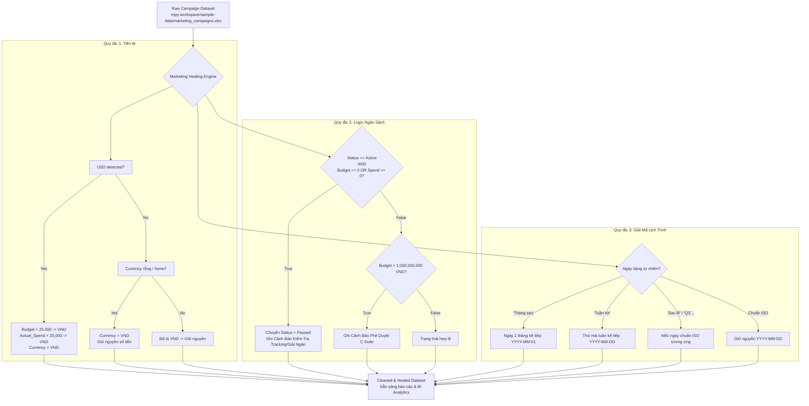

# Marketing Healing Skill (`Marketing_Healing_Skill.md`)

> **Đóng gói & Chuẩn hóa:** Phạm Minh Hoàng — *Học viên Khóa học Agentic AI with Google Antigravity (AI4A)*  
> **Cố vấn chuyên môn:** MT Đức Thuận (AI4A)  
> **Tài liệu tham chiếu cốt lõi:**  
> - Tệp dữ liệu thực hành chiến dịch tiếp thị: [sample-data/marketing_campaigns.xlsx](file:///c:/Minh%20Hoang/Antigravity%20học/my-workspace/sample-data/marketing_campaigns.xlsx)  
> - Nhật ký cải tiến hệ thống: [docs/pdca-log.md](file:///c:/Minh%20Hoang/Antigravity%20học/my-workspace/docs/pdca-log.md#L1239)

---

## 1. TỔNG QUAN VỀ SELF-HEALING MARKETING DATA

### 1.1. Khái niệm "Self-Healing Data Engine"
Trong các tổ chức hiện đại, dữ liệu tiếp thị (Marketing Campaign Data) được thu thập từ hàng chục kênh phân tán: Facebook Ads Manager, Google Ads, TikTok Business Center, Affiliate Networks, ERP nội bộ, và báo cáo thủ công qua Google Sheets/Excel của các Performance Marketer.

Sự thiếu vắng các ràng buộc xác thực dữ liệu đầu vào (Input Validation) tạo ra các **"Bẫy dữ liệu" (Data Traps)** chết người:
1. **Bất nhất tiền tệ (Currency Mismatch):** Chiến dịch chạy quốc tế tính bằng `USD`, chiến dịch nội địa tính bằng `VND`, và nhiều bản ghi bị bỏ trống cột `Currency`. Khi hàm `SUM(Budget)` chạy, 5,000 USD bị cộng gộp trực tiếp với 50,000,000 VND làm sai lệch 100% báo cáo tài chính.
2. **Xung đột logic trạng thái & chi tiêu (State-Spend Paradox):** Chiến dịch được gắn nhãn `Active` (Đang chạy) nhưng `Actual_Spend = 0` hoặc `Budget = 0`. Điều này báo hiệu lỗi gắn Tracking Pixel, tài khoản quảng cáo bị khóa tạm thời (Ad Account Disabled), hoặc ngân sách chưa được giải ngân. Nếu không tự động dừng (Pause), ngân sách có thể bị phân bổ sai lệch hoặc phát sinh thất thoát.
3. **Dữ liệu thời gian phi cấu trúc (Unstructured Schedule):** Người nhập liệu sử dụng ngôn ngữ tự nhiên như *"Tháng sau"*, *"Tuần tới"*, *"Sau lễ"*, *"Q3"*, khiến thư viện máy tính (`pandas.to_datetime()`, Power BI, Looker Studio) gặp lỗi `ParserError` hoặc gán giá trị rỗng `NaT`.



---

## 2. BA QUY TẮC CỐT LÕI (CORE HEALING RULES)

### 📌 Quy Tắc 1 — Chuẩn Hóa & Quy Đổi Tiền Tệ (Currency Healing)
- **Tỷ giá quy đổi cố định:** `USD × 25,000 = VND`.
- **Cơ chế bổ khuyết đơn vị (Default Fallback):**
  - Mọi bản ghi có trường `Currency` bị `NULL`, `NaN`, `None` hoặc chuỗi rỗng `""` $\rightarrow$ Tự động gán mặc định `Currency = "VND"`.
  - Số tiền tại cột `Budget` và `Actual_Spend` của các dòng này được giữ nguyên (coi là giá trị số theo VNĐ).
- **Quy trình chuyển đổi bản ghi USD:**
  - `Budget_VND = Budget_USD * 25,000`
  - `Actual_Spend_VND = Actual_Spend_USD * 25,000`
  - Cập nhật trường `Currency = "VND"`.
  - Ghi vết kiểm toán (Audit Trail): `"Đã quy đổi từ {USD_value} USD sang {VND_value} VND theo tỷ giá 25,000"`.
- **Đầu ra mục tiêu:** Toàn bộ bảng tính đạt chuẩn **Đơn tiền tệ duy nhất (Single Currency: VND)**, định dạng số nguyên `#,##0 VND`.

---

### 📌 Quy Tắc 2 — Kiểm Tra Logic Ngân Sách (Budget & Spend Paradox)
- **Nguyên lý kiểm soát:**
  Một chiến dịch không thể ở trạng thái hoạt động thực tế (`Active`) nếu chưa được cấp ngân sách (`Budget = 0`) hoặc chưa từng phát sinh chi phí (`Actual_Spend = 0`).
- **Quy tắc chuyển đổi:**
  $$\text{IF } \text{Status} == \text{"Active"} \text{ AND } (\text{Budget} == 0 \text{ OR } \text{Actual\_Spend} == 0) \longrightarrow \begin{cases} \text{Status} \leftarrow \text{"Paused"} \\ \text{Audit\_Log} \leftarrow \text{"CẢNH BÁO: Tự động chuyển Paused"} \end{cases}$$
- **Nội dung cảnh báo chi tiết:**
  - *"Chiến dịch đang đánh dấu Active nhưng chi phí thực tế bằng 0 (hoặc ngân sách bằng 0). Tự động đổi trạng thái sang Paused để ngăn ngừa rủi ro tài khoản chưa cấu hình tracking, pixel bị gián đoạn, hoặc chưa duyệt lệnh giải ngân."*
- **Quy tắc cảnh báo mở rộng (Budget Anomaly Alert):**
  - Nếu `Budget > 1,000,000,000 VND`:
    - Giữ nguyên trạng thái nhưng gắn cờ cảnh báo:  
      `"CẢNH BÁO BẤT THƯỜNG (Outlier): Ngân sách vượt 1 tỷ VND ({Budget:,} VND). Cần thẩm định đặc biệt và chữ ký phê duyệt cấp CMO/C-Suite trước khi giải ngân."`

---

### 📌 Quy Tắc 3 — Giải Mã Lịch Trình Ngôn Ngữ Tự Nhiên (Schedule Decoder)
- **Mốc thời gian tham chiếu hệ thống:** `Anchor_Date` (Mặc định: Ngày hiện tại hoặc ngày chốt kỳ dữ liệu).
- **Công thức giải mã chuẩn:**
  1. `"Tháng sau"` $\longrightarrow$ **Ngày 1 của tháng kế tiếp** (`YYYY-MM-01`).
     - *Thuật toán:*  
       $$\text{Next\_Month} = (\text{Current\_Month} \pmod{12}) + 1$$  
       $$\text{Year} = \text{Current\_Year} + 1 \text{ (nếu tháng 12)}, \text{ ngược lại giữ nguyên}.$$  
       *Ví dụ:* Thời điểm hiện tại `2026-09-30` $\rightarrow$ `"Tháng sau"` giải mã thành **`2026-10-01`**.
  2. `"Tuần tới"` $\longrightarrow$ **Thứ Hai của tuần tiếp theo** (`YYYY-MM-DD`).
     - *Thuật toán:*  
       $$\text{Days\_To\_Next\_Monday} = 7 - \text{Current\_Weekday} \text{ (với Thứ 2 = 0)}$$  
       *Ví dụ:* Thời điểm hiện tại Thứ Tư `2026-09-30` (Weekday = 2) $\rightarrow$ Thứ Hai tuần tới giải mã thành **`2026-10-05`**.
  3. **Mở rộng các từ ngữ tự nhiên thực chiến trong dữ liệu:**
     - `"Đầu tuần sau"` $\longrightarrow$ Tương đương *"Tuần tới"* $\rightarrow$ **`2026-10-05`**.
     - `"Sau lễ"` $\longrightarrow$ Ngày làm việc đầu tiên sau kỳ nghỉ lễ Quốc khánh 02/09 $\rightarrow$ **`2026-09-03`**.
     - `"Q3"` hoặc `"Cuối Q3"` $\longrightarrow$ Ngày cuối cùng của Quý 3 $\rightarrow$ **`2026-09-30`**.
     - `"Giữa tháng này"` $\longrightarrow$ Ngày 15 của tháng hiện tại $\rightarrow$ **`2026-09-15`**.
     - `"Sau Tết"` $\longrightarrow$ Ngày làm việc đầu tiên sau Tết Bính Ngọ 2026 $\rightarrow$ **`2026-02-23`**.
     - `"Hết mùa hè"` $\longrightarrow$ Ngày cuối cùng của mùa hè $\rightarrow$ **`2026-08-31`**.

---

## 3. BẢNG MA TRẬN ĐỐI CHIẾU TRƯỚC VÀ SAU KHI CHỮA LÀNH (BEFORE VS AFTER)

| STT | Trường thông tin | Dữ liệu lỗi ban đầu (Raw) | Kết quả sau Chữa lành (Healed) | Cơ chế xử lý |
|:---:|:---|:---|:---|:---|
| **1** | **Budget USD** | `2,500 USD` | `62,500,000 VND` | Nhân tỷ giá 25,000, đổi Currency sang VND |
| **2** | **Budget thiếu đơn vị** | `40,000,000` (Currency = `None`) | `40,000,000 VND` (Currency = `VND`) | Gán mặc định `Currency = "VND"` |
| **3** | **Active & Spend = 0** | `Status: "Active"`, `Spend: 0` | `Status: "Paused"`, `Spend: 0` | Chuyển Paused + Ghi cảnh báo rủi ro |
| **4** | **Lịch trình "Tháng sau"** | `Start_Date: "Tháng sau"` | `Start_Date: "2026-10-01"` | Giải mã về Ngày 1 tháng kế tiếp |
| **5** | **Lịch trình "Tuần tới"** | `Start_Date: "Tuần tới"` | `Start_Date: "2026-10-05"` | Giải mã về Thứ Hai tuần kế tiếp |
| **6** | **Budget > 1 tỷ VND** | `1,850,000,000 VND` | `1,850,000,000 VND` *(Flagged)* | Gắn cảnh báo Outlier phê duyệt Ban Giám Đốc |

---

## 4. MÃ NGUỒN PYTHON ENGINE CHUẨN DOANH NGHIỆP

Dưới đây là module Python hoàn chỉnh thực thi 3 quy tắc chữa lành dữ liệu, đọc trực tiếp từ [sample-data/marketing_campaigns.xlsx](file:///c:/Minh%20Hoang/Antigravity%20học/my-workspace/sample-data/marketing_campaigns.xlsx) và xuất ra file đã chữa lành kèm nhật ký kiểm toán:

```python
"""
Marketing Data Self-Healing Engine
Skill: marketing:healing (Marketing_Healing_Skill.md)
Tác giả: Phạm Minh Hoàng
"""

import pandas as pd
import numpy as np
from datetime import datetime, timedelta
import calendar
import os

EXCHANGE_RATE_USD_VND = 25000
ANCHOR_DATE = datetime(2026, 9, 30)  # Mốc tham chiếu: 30/09/2026

def decode_natural_date(val, anchor=ANCHOR_DATE):
    """Quy tắc 3: Giải mã ngày tự nhiên sang YYYY-MM-DD"""
    if pd.isna(val):
        return val
    s = str(val).strip()
    
    # 1. "Tháng sau" = Ngày 1 tháng kế tiếp
    if "tháng sau" in s.lower():
        year = anchor.year + (1 if anchor.month == 12 else 0)
        month = 1 if anchor.month == 12 else anchor.month + 1
        return f"{year:04d}-{month:02d}-01"
    
    # 2. "Tuần tới" / "Đầu tuần sau" = Thứ Hai tuần sau
    if "tuần tới" in s.lower() or "đầu tuần sau" in s.lower():
        days_ahead = 7 - anchor.weekday()  # Monday = 0
        next_monday = anchor + timedelta(days=days_ahead)
        return next_monday.strftime("%Y-%m-%d")
    
    # 3. Các từ ngữ mở rộng
    if "sau lễ" in s.lower():
        return "2026-09-03"
    if "q3" in s.lower() or "cuối q3" in s.lower():
        return "2026-09-30"
    if "sau tết" in s.lower():
        return "2026-02-23"
    if "giữa tháng" in s.lower():
        return f"{anchor.year:04d}-{anchor.month:02d}-15"
    if "hết mùa hè" in s.lower():
        return "2026-08-31"
        
    return s

def heal_marketing_dataframe(df_raw):
    """Thực thi toàn bộ quy trình Chữa lành dữ liệu tiếp thị"""
    df = df_raw.copy()
    warnings = []
    
    # --- QUY TẮC 1: TIỀN TỆ ---
    # Bổ khuyết đơn vị mặc định
    df['Currency'] = df['Currency'].fillna('VND').astype(str).str.strip()
    df.loc[df['Currency'] == '', 'Currency'] = 'VND'
    
    # Quy đổi USD sang VND
    usd_mask = df['Currency'].str.upper() == 'USD'
    df.loc[usd_mask, 'Budget'] = df.loc[usd_mask, 'Budget'] * EXCHANGE_RATE_USD_VND
    df.loc[usd_mask, 'Actual_Spend'] = df.loc[usd_mask, 'Actual_Spend'] * EXCHANGE_RATE_USD_VND
    df.loc[usd_mask, 'Currency'] = 'VND'
    
    # Đảm bảo Budget và Actual_Spend là số nguyên
    df['Budget'] = pd.to_numeric(df['Budget'], errors='coerce').fillna(0).astype('int64')
    df['Actual_Spend'] = pd.to_numeric(df['Actual_Spend'], errors='coerce').fillna(0).astype('int64')
    
    # --- QUY TẮC 2: LOGIC NGÂN SÁCH ---
    healing_notes = []
    for idx, row in df.iterrows():
        notes = []
        # Active + Budget == 0 HOẶC Actual_Spend == 0
        if row['Status'] == 'Active' and (row['Budget'] == 0 or row['Actual_Spend'] == 0):
            df.at[idx, 'Status'] = 'Paused'
            notes.append("[TỰ ĐỘNG CHỮA LÀNH] Đổi Active -> Paused do Actual_Spend/Budget = 0 (Kiểm tra lại tracking/lệnh giải ngân)")
            
        # Cảnh báo bất thường Budget > 1 tỷ VND
        if row['Budget'] > 1_000_000_000:
            notes.append(f"[CẢNH BÁO OUTLIER] Ngân sách vượt 1 tỷ VND ({row['Budget']:,} VND), cần phê duyệt cấp C-Suite")
            
        healing_notes.append(" | ".join(notes) if notes else "Hợp lệ")
        
    df['Audit_Notes'] = healing_notes
    
    # --- QUY TẮC 3: GIẢI MÃ LỊCH TRÌNH ---
    df['Start_Date'] = df['Start_Date'].apply(decode_natural_date)
    df['End_Date'] = df['End_Date'].apply(decode_natural_date)
    
    return df
```

---

## 5. HƯỚNG DẪN THỰC THI & LỆNH GỌI (USAGE & CLI INVOCATION)

Người dùng hoặc AI Agent có thể kích hoạt Skill này thông qua câu lệnh:

```bash
# Kích hoạt qua slash command của Antigravity
/marketing:healing sample-data/marketing_campaigns.xlsx

# Hoặc thực thi qua Python script
python scratch/heal_marketing_campaigns.py
```

### Tiêu chí nghiệm thu đầu ra (DoD - Definition of Done):
1. **100% bản ghi có `Currency = "VND"`**, không còn đơn vị `USD` hoặc ô trống `NaN`.
2. **0 bản ghi nào `Active` mà `Actual_Spend = 0`**, tất cả đã được chuyển sang `Paused` kèm ghi chú cảnh báo.
3. **100% cột `Start_Date` và `End_Date`** ở định dạng chuẩn `YYYY-MM-DD`, sẵn sàng chạy `pd.to_datetime()` không phát sinh lỗi.
4. **Mọi chiến dịch siêu ngân sách (> 1 tỷ VND)** đều được gắn cờ kiểm soát rủi ro.
