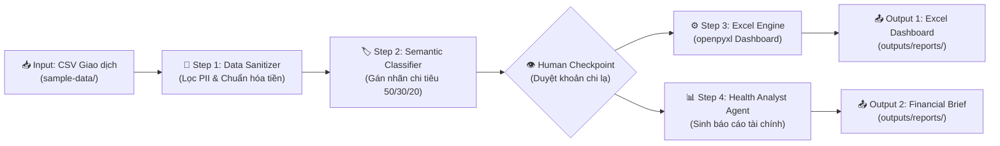

# Project Brief: Hệ Thống Phân Tích & Quản Trị Sức Khỏe Tài Chính Cá Nhân (Personal Financial Health Assistant)

**Dự án:** Personal Financial Intelligence Workspace (AI4A Capstone / Specialized Project)  
**Tác giả:** Minh Hoàng  
**Mentor hướng dẫn:** MT Đức Thuận  
**Phương pháp luận:** AI4A Brainstorm Contract & SCOPE Framework  
**Ngày khởi tạo:** 09/09/2026  
**Phiên bản:** 1.0.0  

---

## 1. Situation (Bối Cảnh Vận Hành & Nỗi Đau Hiện Tại)

- **Thực trạng:** Việc quản lý tài chính cá nhân hiện nay thường đối mặt với 3 rào cản lớn:
  1. *Dữ liệu phân mảnh:* Chi tiêu qua nhiều kênh (tài khoản ngân hàng, ví MoMo/ZaloPay, tiền mặt, thẻ tín dụng).
  2. *Nỗi đau nhập liệu (Friction):* Người dùng thường bỏ dở việc ghi chép sau 1-2 tuần vì thao tác nhập tay từng khoản quá tốn thời gian.
  3. *Thiếu chiều sâu phân tích:* Các ứng dụng thông thường chỉ dừng ở việc vẽ biểu đồ tròn thu/chi đơn giản, thiếu các khuyến nghị chiến lược theo chuẩn tài chính (như quy tắc 50/30/20, tỷ lệ tiết kiệm ròng, số tháng duy trì quỹ dự phòng khẩn cấp, cảnh báo dòng tiền âm).
- **Cơ hội tự động hóa Agentic AI:** Xây dựng một quy trình bán tự động giúp tiếp nhận dữ liệu giao dịch tổng hợp, tự động gắn nhãn ngữ nghĩa (Semantic Categorization), rà soát bất thường, tạo bảng điều khiển Executive Dashboard và xuất bản bản khuyến nghị hành động tối ưu ngân sách cá nhân.

---

## 2. Constraints & Human Checkpoints (Ràng Buộc & Trạm Kiểm Soát)

### Ràng buộc kỹ thuật & bảo mật (Critical Constraints)
- **Bảo mật PII & Quy tắc số 5 của Workspace:** Tuyệt đối **KHÔNG** đưa số tài khoản ngân hàng thật, mã giao dịch nội bộ, số dư thực tế hay danh tính đối tác vào workspace. Dữ liệu thử nghiệm phải là dữ liệu giả lập (Synthetic Data) hoặc đã qua bước ẩn danh (Anonymization) lưu tại `sample-data/personal_finance_sample.csv`.
- **Đơn vị tiền tệ:** Đồng bộ 100% về chuẩn số nguyên dương VNĐ (`integer`), không lưu trữ chuỗi hỗn hợp như "50k", "1.2tr".
- **Kiến trúc Lean:** Không sử dụng các dịch vụ SaaS trả phí hoặc API ngân hàng mở chưa được cấp phép. Toàn bộ logic chạy cục bộ (local/offline) trong workspace.

### Trạm kiểm soát người duyệt (Human Checkpoints)
- **Checkpoint 1 (Duyệt gán nhãn):** Trước khi tính toán chỉ số, hệ thống xuất danh sách các giao dịch "chưa xác định" (Uncategorized) để người dùng xác nhận gắn nhãn đúng (ví dụ: giao dịch nội dung chuyển khoản mơ hồ).
- **Checkpoint 2 (Duyệt khuyến nghị ngân sách):** Người dùng xác nhận mục tiêu tiết kiệm hàng tháng (ví dụ: 20% hay 30% thu nhập) trước khi AI chốt kế hoạch ngân sách chu kỳ tiếp theo.

---

## 3. Objective & Success Metrics (Mục Tiêu & Thước Đo Thành Công)

### Mục tiêu kinh doanh / cá nhân (Objective)
Xây dựng một pipeline phân tích tài chính cá nhân tự động hóa, chuyển đổi lịch sử giao dịch thô thành hệ thống giám sát sức khỏe tài chính toàn diện theo mô hình 50/30/20, giúp người dùng cắt giảm tối thiểu 10–15% chi phí không thiết yếu và duy trì quỹ khẩn cấp tối thiểu 3–6 tháng chi tiêu.

### Thước đo thành công (Success Metrics / KPIs)
1. **Tỷ lệ gán nhãn tự động (Auto-tagging Accuracy):** Đạt $\ge 90\%$ trên tổng số dòng giao dịch thử nghiệm.
2. **Thời gian tạo báo cáo (Generation Speed):** Xử lý 300–500 giao dịch và xuất bản Dashboard hoàn chỉnh trong dưới 15 giây.
3. **Chỉ số hiển thị Dashboard:** 100% KPI cards và biểu đồ hiển thị số liệu thực tế, không bị lỗi `#VALUE!`, `#REF!` hoặc giá trị 0.

---

## 4. Proposal: OIPO Workflow Architecture (Quy Trình Triển Khai)

Quy trình được thiết kế theo mô hình **Approach 2 (Lean-Agentic Workflow)**:

### Chi tiết các tầng OIPO:
- **Objective (O):** Giám sát và tối ưu hóa sức khỏe tài chính cá nhân hàng tháng.
- **Input (I):** 
  - `sample-data/personal_finance_sample.csv` (300-500 dòng giao dịch gồm: Ngày, Số tiền, Loại giao dịch, Mô tả, Tài khoản/Ví).
  - `knowledge-base/finance-rules.json` (Quy tắc định danh danh mục: Nhu cầu thiết yếu 50%, Mong muốn 30%, Tiết kiệm & Đầu tư 20%).
- **Process (P):**
  1. *Sanitization:* Khử trùng lặp, chuẩn hóa ngày tháng ISO, ép kiểu số tiền, loại bỏ PII.
  2. *Categorization:* Áp dụng rule-based dictionary + AI fallback cho các giao dịch nội dung khó.
  3. *Human Checkpoint:* Trình bảng xác nhận cho giao dịch không rõ ràng.
  4. *Dashboard Generation:* Tạo Workbook đa sheet (Dashboard KPI, Transaction Log, Category Breakdown, 50-30-20 Gauge).
  5. *Insight Synthesis:* Đánh giá tỷ lệ nợ, quỹ khẩn cấp, dòng tiền tự do và đề xuất cắt giảm chi tiêu thừa.
- **Output (O):**
  - `outputs/reports/Personal_Finance_Dashboard.xlsx` (Dashboard tương tác).
  - `outputs/reports/Financial_Health_Analysis.md` (Báo cáo đánh giá chi tiết).
  - `docs/pdca-log.md` (Ghi nhận chu kỳ cải tiến thực hành).

---

## 5. Out Of Scope (Những Thứ Tuyên Bố Không Làm Trong Giai Đoạn Này)

- ❌ Không kết nối trực tiếp với API ngân hàng (Vietcombank, Techcombank, MBBank...) hoặc ví điện tử (MoMo, ZaloPay).
- ❌ Không đưa ra khuyến nghị đầu tư cổ phiếu, trái phiếu hay tiền mã hóa cụ thể.
- ❌ Không xây dựng giao diện mobile app native (iOS/Android) hoặc server backend phức tạp.
- ❌ Không xử lý đa ngoại tệ phức tạp trong v1 (chỉ tập trung VNĐ).

---

## 6. Evaluation & Demo Data (Kế Hoạch Nghiệm Thu)

- **Bộ dữ liệu demo:** Tạo file dữ liệu giả lập `sample-data/personal_finance_sample.csv` mô phỏng 6 tháng chi tiêu thực tế của một nhân sự văn phòng / Remote Worker (thu nhập 25-35 triệu VNĐ/tháng, 60-80 giao dịch/tháng).
- **Kịch bản kiểm thử (Test Cases):**
  - *Case 1:* Giao dịch thông dụng (Đi siêu thị, ăn trưa, tiền nhà, xăng xe) $\rightarrow$ Gán đúng danh mục 100%.
  - *Case 2:* Giao dịch mô tả viết tắt ("CK tien cf", "Grabfood t2", "Shopee 8.8") $\rightarrow$ Xử lý ngữ nghĩa chính xác.
  - *Case 3:* Giao dịch bất thường đột biến (> 10 triệu VNĐ) $\rightarrow$ Kích hoạt cờ cảnh báo (Anomaly Alert) và đưa vào Human Checkpoint.
  - *Case 4:* File Excel sinh ra mở mượt mà trên Excel Desktop, Web và WPS Office với dữ liệu số được tính toán sẵn.
