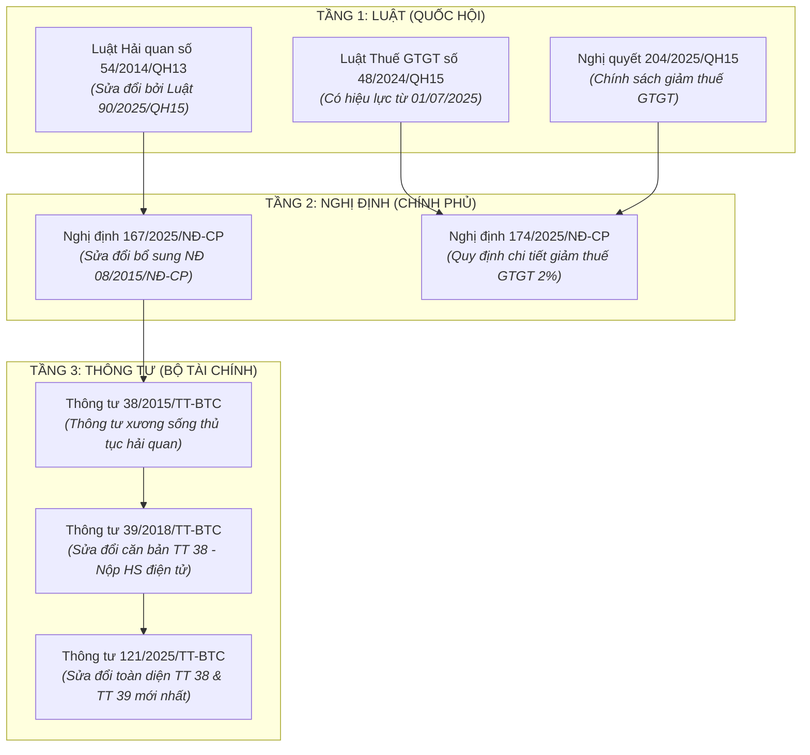

# CƠ SỞ DỮ LIỆU PHÁP LÝ & THỦ TỤC HẢI QUAN (LEGAL ASSETS DATABASE)

> **Quản lý bới:** Chuyên gia Pháp chế & Thủ tục Hải quan  
> **Vị trí lưu trữ:** `knowledge-base/legal-assets/`  
> **Cập nhật lần cuối:** 16/09/2026  
> **Định dạng dữ liệu máy đọc:** [legal_assets_registry.json](file:///c:/Minh%20Hoang/Antigravity%20h%E1%BB%8Dc/my-workspace/knowledge-base/legal-assets/legal_assets_registry.json)

---

## 1. TỔNG QUAN HỆ THỐNG CƠ SỞ DỮ LIỆU
Hệ thống lưu trữ và quản lý tập trung toàn văn các văn bản quy phạm pháp luật (Luật, Nghị định, Thông tư) điều chỉnh trực tiếp hoạt động xuất nhập khẩu, chính sách thuế, và thủ tục kiểm tra, giám sát hải quan tại Việt Nam.

Toàn bộ 7 văn bản nền tảng từ thư mục nguồn `C:\Minh Hoang\Khai bao hai quan\` đã được chuẩn hóa tên file tiếng Việt không dấu, loại bỏ lỗi font, đồng bộ hóa vào workspace và lập chỉ mục pháp lý 4 chiều: **Thẩm quyền - Hiệu lực - Mối quan hệ phả hệ - Điều khoản then chốt**.

---

## 2. PHÂN TẦNG PHÁP LÝ & CÂY PHẢ HỆ VĂN BẢN (HIERARCHY TREE)

---

## 3. DANH MỤC TÀI SẢN PHÁP LÝ (LEGAL ASSET CATALOG)

| Mã ID | Số hiệu văn bản | Cơ quan ban hành | Ngày ban hành | Hiệu lực | Tình trạng pháp lý | Tên file lưu trữ trong Workspace | Dung lượng |
|:---:|:---|:---|:---:|:---:|:---|:---|:---:|
| **DOC-01** | **Luật số 54/2014/QH13** | Quốc hội khóa XIII | 23/06/2014 | 01/01/2015 | Còn hiệu lực | [Luat_54_2014_QH13_Luat_Hai_Quan.pdf](file:///c:/Minh%20Hoang/Antigravity%20h%E1%BB%8Dc/my-workspace/knowledge-base/legal-assets/Luat_54_2014_QH13_Luat_Hai_Quan.pdf) | 3.65 MB |
| **DOC-02** | **Luật số 48/2024/QH15** | Quốc hội khóa XV | 29/11/2024 | 01/07/2025 | Còn hiệu lực (thay thế Luật 13/2008) | [Luat_48_2024_QH15_Thue_Gia_Tri_Gia_Tang.doc](file:///c:/Minh%20Hoang/Antigravity%20h%E1%BB%8Dc/my-workspace/knowledge-base/legal-assets/Luat_48_2024_QH15_Thue_Gia_Tri_Gia_Tang.doc) | 114 KB |
| **DOC-03** | **Nghị định 167/2025/NĐ-CP** | Chính phủ | 30/06/2025 | 01/07/2025 | Còn hiệu lực (sửa đổi NĐ 08/2015) | [Nghi_Dinh_167_2025_ND_CP_Sua_Doi_ND08.pdf](file:///c:/Minh%20Hoang/Antigravity%20h%E1%BB%8Dc/my-workspace/knowledge-base/legal-assets/Nghi_Dinh_167_2025_ND_CP_Sua_Doi_ND08.pdf) | 3.15 MB |
| **DOC-04** | **Nghị định 174/2025/NĐ-CP** | Chính phủ | 30/06/2025 | 01/07/2025 | Còn hiệu lực (hết hạn 31/12/2026) | [Nghi_Dinh_174_2025_ND_CP_Giam_Thue_GTGT.pdf](file:///c:/Minh%20Hoang/Antigravity%20h%E1%BB%8Dc/my-workspace/knowledge-base/legal-assets/Nghi_Dinh_174_2025_ND_CP_Giam_Thue_GTGT.pdf) | 17.68 MB |
| **DOC-05** | **Thông tư 38/2015/TT-BTC** | Bộ Tài chính | 25/03/2015 | 01/04/2015 | Còn hiệu lực một phần | [Thong_Tu_38_2015_TT_BTC_Thu_Tuc_Hai_Quan.pdf](file:///c:/Minh%20Hoang/Antigravity%20h%E1%BB%8Dc/my-workspace/knowledge-base/legal-assets/Thong_Tu_38_2015_TT_BTC_Thu_Tuc_Hai_Quan.pdf) | 17.67 MB |
| **DOC-06** | **Thông tư 39/2018/TT-BTC** | Bộ Tài chính | 20/04/2018 | 05/06/2018 | Còn hiệu lực một phần (sửa đổi TT 38) | [Thong_Tu_39_2018_TT_BTC_Sua_Doi_TT38.pdf](file:///c:/Minh%20Hoang/Antigravity%20h%E1%BB%8Dc/my-workspace/knowledge-base/legal-assets/Thong_Tu_39_2018_TT_BTC_Sua_Doi_TT38.pdf) | 9.38 MB |
| **DOC-07** | **Thông tư 121/2025/TT-BTC** | Bộ Tài chính | 18/12/2025 | 01/02/2026 | Còn hiệu lực (sửa đổi mới nhất) | [Thong_Tu_121_2025_TT_BTC_Sua_Doi_Cac_Thong_Tu_Hai_Quan.pdf](file:///c:/Minh%20Hoang/Antigravity%20h%E1%BB%8Dc/my-workspace/knowledge-base/legal-assets/Thong_Tu_121_2025_TT_BTC_Sua_Doi_Cac_Thong_Tu_Hai_Quan.pdf) | 7.89 MB |

---

## 4. MA TRẬN TRA CỨU NHANH THEO NGHIỆP VỤ (QUICK LOOKUP MATRIX)

| Tác vụ nghiệp vụ Hải quan | Văn bản trọng tâm áp dụng | Điều khoản then chốt cần đối chiếu | Hành động bắt buộc của Doanh nghiệp |
|:---|:---|:---|:---|
| **Khai báo bộ hồ sơ hải quan NK** | TT 38/2015 + TT 39/2018 + TT 121/2025 | Điều 16 TT 38 (sửa đổi bởi Khoản 5 Điều 1 TT 39) | Nộp 100% bản đính kèm điện tử ký số; không nộp bản giấy trừ trường hợp bất khả kháng. |
| **Hưởng chính sách giảm thuế VAT 8%** | NĐ 174/2025/NĐ-CP + Luật 48/2024 | Điều 1 NĐ 174 & Phụ lục I, II; Điều 8 Luật 48 | Tra cứu mã HS trên Phụ lục I & II; nếu không thuộc diện loại trừ, khai mã thuế suất giảm tương ứng trên VNACCS. |
| **Khai bổ sung sau khi thông quan** | TT 38/2015 (sửa bởi TT 39/2018 & TT 121/2025) | Điều 20 TT 38 (sửa bởi Khoản 9 Điều 1 TT 39) | Chủ động khai bổ sung trong 60 ngày kể từ ngày thông quan và trước khi cơ quan hải quan ra quyết định kiểm tra sau thông quan. |
| **Hủy tờ khai hải quan** | TT 38/2015 (sửa đổi) | Điều 21 TT 38/2015/TT-BTC | Tờ khai quá 15 ngày chưa nộp chứng từ (luồng Vàng/Đỏ) hoặc khai trùng tờ khai. |
| **Quản lý nguyên liệu Gia công / SXXK** | TT 38/2015 (sửa đổi bởi TT 39/2018) | Điều 59, 60 TT 38 (Mẫu 15/BCQT-NVL/GSQL) | Nộp Báo cáo quyết toán năm tài chính trong vòng 90 ngày kể từ ngày kết thúc năm tài chính. |
| **Địa điểm làm thủ tục & Kiểm tra thực tế** | Luật 54/2014 + NĐ 167/2025/NĐ-CP | Điều 21 Luật 54; Khoản 1 Điều 1 NĐ 167 | Đăng ký địa điểm kiểm tra hàng hóa theo phân cấp Chi cục Hải quan cửa khẩu hoặc Chi cục Hải quan ngoài cửa khẩu. |

---

## 5. HƯỚNG DẪN TƯƠNG TÁC VỚI CHUYÊN GIA PHÁP CHẾ (OPERATIONAL GUIDE)

- **Khi thực hiện GIAI ĐOẠN 1 (Search & Brief):**  
  Người dùng gửi câu hỏi từ khóa $\rightarrow$ Chuyên gia tự động quét ma trận trên, trích xuất đúng 1-3 văn bản trọng tâm, điều khoản chính xác để người dùng đối chiếu.
- **Khi thực hiện GIAI ĐOẠN 2 (Analysis & Workflow):**  
  Người dùng chỉ định văn bản (hoặc gửi nội dung cụ thể) $\rightarrow$ Chuyên gia truy cập file toàn văn trong thư mục này, phân tích theo cấu trúc 4 phần chuẩn hóa:
  1. *Thông tin pháp lý & Tình trạng hiệu lực*
  2. *Phạm vi áp dụng & Đối tượng điều chỉnh*
  3. *Nội dung quy định & Checklist thực hiện từng bước*
  4. *Lưu ý đặc biệt & Rủi ro pháp lý/xử phạt vi phạm hành chính*.
