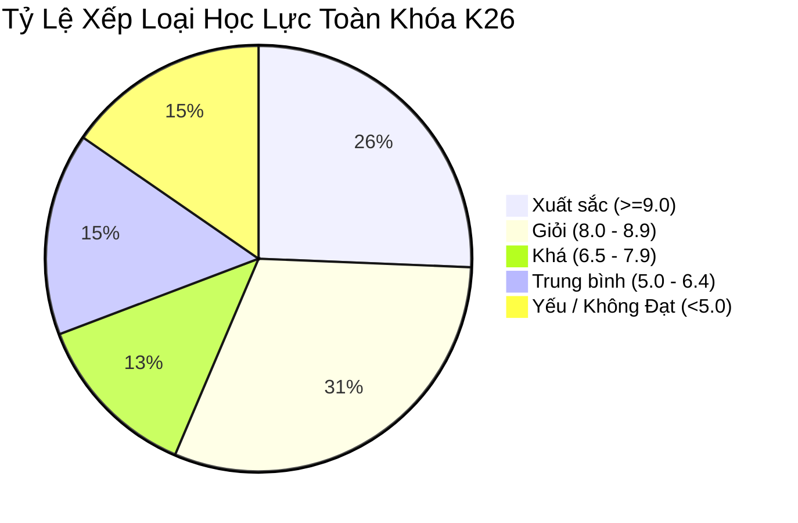

# Báo Cáo Phân Tích Chất Lượng Đào Tạo & Đánh Giá Giảng Viên — Khóa K26

**Kỳ báo cáo:** Khóa K26 (Học kỳ 1 / 2026)  
**Đơn vị thực hiện:** Phòng Đào Tạo & Quản Lý Học Vụ (Academic Operations)  
**Người lập báo cáo:** Minh Hoàng (Academic / Training Officer)  
**Kính gửi:** Ban Giám Đốc & Hội Đồng Sư Phạm  
**Tệp dữ liệu Master đã kiểm toán:** [Academic_Student_Grades_Master.xlsx](file:///c:/Minh%20Hoang/Antigravity%20h%E1%BB%8Dc/my-workspace/outputs/reports/Academic_Student_Grades_Master.xlsx)  
**Hồ sơ chỉ số hệ thống:** [academic_summary_metrics.json](file:///c:/Minh%20Hoang/Antigravity%20h%E1%BB%8Dc/my-workspace/outputs/reports/academic_summary_metrics.json)  

---

## 1. Tổng Quan Hiệu Suất Đào Tạo Toàn Trung Tâm (Executive KPI Overview)

Trải qua quá trình rà soát, thu thập dữ liệu phân tán từ các lớp học và làm sạch số học tự động theo chuẩn **AI4A**, Phòng Đào tạo xin báo cáo bức tranh tổng thể về chất lượng giảng dạy Khóa K26:

| Chỉ Số Vận Hành Học Vụ | Giá Trị Đo Lường | Đánh Giá Chuẩn Sư Phạm |
|---|---|---|
| **Tổng số lớp đào tạo hoàn thành** | **4 lớp** | Đúng tiến độ khung chương trình |
| **Tổng số học viên hợp lệ (Valid Headcount)** | **39 học viên** | 100% hồ sơ được chuẩn hóa & bảo mật PII |
| **Số bản ghi rác đã khử (Purged Records)** | **6 bản ghi** (13.3%) | Khử 2 ghost rows, 3 trùng lặp, 1 lỗi điểm |
| **Tỷ lệ Đạt Môn chung (Pass Rate)** | **84.6%** (33/39 học viên) | Nằm trong dải mục tiêu lý tưởng (80% - 90%) |
| **Điểm Trung Bình toàn trung tâm** | **7.59 / 10.0** | Phân phối phổ điểm tốt |
| **Tỷ lệ học viên Khá — Giỏi — Xuất sắc** | **56.4%** (22/39 học viên) | Chuẩn đầu ra tay nghề đáp ứng thị trường |

---

## 2. Bảng Xếp Hạng & So Sánh Hiệu Suất Từng Giảng Viên

| Giảng Viên Phụ Trách | Môn Học / Lớp | Sĩ Số | Điểm TB Lớp | Tỷ Lệ Pass (%) | Tỷ Lệ Giỏi/XS (%) | Độ Phân Hóa (Std Dev) | Nhận Định Sư Phạm |
|---|---|:---:|:---:|:---:|:---:|:---:|---|
| **Thầy Nguyễn Hoàng Nam** | `PY101-K26` (Python Core & Automation) | 10 | **7.50** | **90.0%** | 50.0% | 1.70 | **Mô hình chuẩn:** Phổ điểm hình chuông cân đối; học viên tiến bộ đồng đều. |
| **Cô Trần Mai Anh** | `DA201-K26` (Data Analysis & Dashboard) | 9 | **6.72** | **88.9%** | 22.2% | 1.21 | **Kiểm soát chặt chẽ:** Đánh giá đúng thực chất; điểm giữa kỳ gắt nhưng cuối kỳ cải thiện. |
| **Thầy Lê Quốc Bảo** | `AI301-K26` (Machine Learning & AI) | 10 | **6.96** | **60.0%** | 50.0% | **2.46** | **Cảnh báo phân cực:** Tỷ lệ rớt môn 40%; khoảng cách giữa top đầu và top đuối quá lớn. |
| **Cô Phạm Thùy Linh** | `FE102-K26` (Frontend Web Design) | 10 | **9.11** | **100.0%** | **100.0%** | **0.42** | **Cảnh báo lạm phát điểm:** Điểm số cao bất thường; thiếu tính phân hóa đánh giá năng lực. |

---

## 3. Phân Tích Chuyên Sâu & Phát Hiện Bất Thường Sư Phạm

### 3.1. Mô hình giảng dạy hiệu quả: Thầy Nguyễn Hoàng Nam (`PY101-K26`)
- **Điểm sáng:** Lớp duy trì chuyên cần cao (8.8/10), tỷ lệ đạt môn 90%. Phổ điểm phân bố chuẩn Gauss: 1 Xuất sắc, 4 Giỏi, 2 Khá, 2 Trung bình và 1 Yếu.
- **Yếu tố thành công:** Bài giảng lý thuyết đi kèm các mini-project thực hành tự động hóa ngay trên lớp giúp học viên nắm vững kiến thức từ tuần thứ 3.

### 3.2. Cảnh báo nguy cơ phân cực & rớt môn cao: Thầy Lê Quốc Bảo (`AI301-K26`)
- **Thực trạng bất thường:** 
  - Độ lệch chuẩn lên tới **2.46** (cao nhất trung tâm).
  - Có 3 học viên đạt điểm trên 9.0 (Nguyễn Đức Anh 9.8, Đoàn Minh Châu 9.2, Lương Khánh Linh 9.0), nhưng có tới **4/10 học viên không đạt** (HV-2802, HV-2804, HV-2806, HV-2808) với điểm cuối kỳ chỉ từ 3.0 đến 4.5.
- **Nguyên nhân cốt lõi:** Nội dung môn Machine Learning có độ dốc kiến thức (learning curve) quá cao về Toán giải tích và Xác suất thống kê. Các học viên nền tảng yếu không theo kịp tiến độ đồ án lớn cuối kỳ.

### 3.3. Cảnh báo lạm phát điểm số (Grade Inflation): Cô Phạm Thùy Linh (`FE102-K26`)
- **Thực trạng bất thường:** 
  - 100% học viên đều đạt loại Giỏi và Xuất sắc (Điểm TB lớp = 9.11 / 10).
  - Độ lệch chuẩn chỉ là **0.42** (cực thấp), cho thấy giảng viên chấm điểm thiếu tính phân loại.
- **Rủi ro vận hành:** Học viên có thể ảo tưởng về năng lực thực tế khi đi phỏng vấn tuyển dụng bên ngoài, ảnh hưởng đến uy tín chất lượng đào tạo của trung tâm.

---

## 4. Đề Xuất Hành Động Thực Tiễn (Actionable Recommendations)

Phòng Đào tạo kiến nghị Ban Giám Đốc và Hội Đồng Sư Phạm phê duyệt các giải pháp sau:

### 1. Đối với lớp Machine Learning (`AI301-K26`) — Can thiệp khẩn cấp:
- **Tổ chức lớp bổ trợ kiến thức (Tutoring Clinic):** Mở 2 buổi ôn tập miễn phí về Toán/Python cho 4 học viên chưa đạt (HV-2802, HV-2804, HV-2806, HV-2808) trước khi tổ chức thi lại vào tuần tới.
- **Tái cấu trúc thang đo đồ án:** Đề nghị Thầy Lê Quốc Bảo chia nhỏ đồ án cuối kỳ thành 3 milestone nộp theo tuần để chấm điểm theo tiến trình, tránh dồn áp lực vào kỳ thi cuối khóa.

### 2. Đối với lớp Frontend Web (`FE102-K26`) — Chuẩn hóa tiêu chí chấm:
- **Hội đồng chấm chéo (Cross-Evaluation):** Bắt buộc các khóa tới áp dụng hình thức 2 giám khảo chấm độc lập cho bài thi cuối kỳ môn Frontend.
- **Bổ sung Rubric kỹ thuật chi tiết:** Đánh giá code quality, responsive design và clean code thay vì chỉ chấm điểm giao diện tổng quan.

### 3. Đối với Phòng Đào tạo & Hệ thống Quản trị:
- Đưa Custom Skill `academic:training-ops` vào quy trình vận hành tiêu chuẩn hàng tháng. Mỗi khi kết thúc kỳ thi, nhân viên đào tạo chỉ mất **3 phút** để chạy pipeline, đối soát dữ liệu và xuất báo cáo cho Giám đốc.

---

*Báo cáo được khởi tạo tự động bởi Custom Skill `academic:training-ops` (AI4A Framework).*
