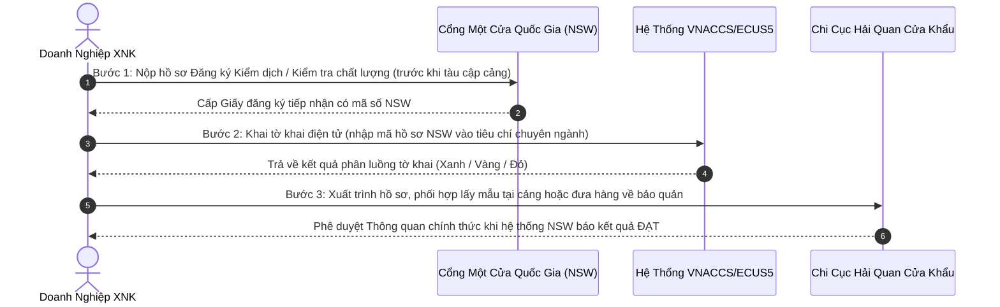

# BÁO CÁO KẾT QUẢ PHÂN TÍCH TIÊU CHUẨN — HỒ SƠ THÔNG QUAN HÀNG HÓA

**Mã hồ sơ tham chiếu:** `CUSTOMS-20260916-4389`
**Tên hàng hóa phân tích:** **ĐẬU TƯƠNG**
**Xuất xứ:** Mỹ (USA) | **Loại hình khai báo:** Nhập kinh doanh tiêu dùng (`A11`)
**Đơn vị thực hiện:** Chuyên gia Phân loại Hàng hóa & Thủ tục Hải quan (Skill `customs:hs-classifier`)
**Ngày phát hành báo cáo:** 16/09/2026

---

## 1. KẾT LUẬN VỀ TÍNH PHÁP LÝ MẶT HÀNG

- **Tình trạng:** `[XUẤT NHẬP KHẨU CÓ ĐIỀU KIỆN]`
- **Cơ quan chuyên ngành quản lý:** Bộ Nông nghiệp và Phát triển Nông thôn (Cục Bảo vệ Thực vật)
- **Căn cứ pháp lý quy phạm pháp luật:**
- Nghị định 69/2018/NĐ-CP (Phụ lục III); Thông tư 30/2014/TT-BNNPTNT & Thông tư 33/2014/TT-BNNPTNT; Thông tư 15/2018/TT-BNNPTNT & Thông tư 11/2021/TT-BNNPTNT
- Luật Quản lý ngoại thương số 05/2017/QH14
- Thông tư 38/2015/TT-BTC, Thông tư 39/2018/TT-BTC, Thông tư 121/2025/TT-BTC của Bộ Tài chính
- **Yêu cầu & Điều kiện quản lý chuyên ngành cụ thể:**
  1. Kiểm dịch thực vật nhập khẩu (Phytosanitary Inspection): Bắt buộc có Giấy chứng nhận kiểm dịch thực vật (Phyto Certificate) do cơ quan có thẩm quyền của nước xuất khẩu cấp trước khi hàng cập cảng.
  2. Đăng ký kiểm tra An toàn thực phẩm (nếu dùng làm thực phẩm cho người) theo Nghị định 15/2018/NĐ-CP.
  3. Kiểm tra danh mục sinh vật biến đổi gen (GMO): Nếu là đậu tương/ngô biến đổi gen làm thức ăn chăn nuôi, phải nằm trong Danh mục sự kiện biến đổi gen được cấp Giấy xác nhận GMO.
  4. Đăng ký trên Cổng thông tin Một cửa Quốc gia (NSW) trước khi tàu cập cảng.
- **Cảnh báo rủi ro then chốt (Risk Warning):**
  > ⚠️ **CẢNH BÁO BẪY RỦI RO:** Nếu thiếu Giấy Phyto gốc từ nước xuất khẩu hoặc lô hàng bị nhiễm đối tượng kiểm dịch thực vật nhóm 1 (côn trùng sống, mọt Trogoderma...), hải quan sẽ không cho thông quan và buộc tái xuất trong vòng 30 ngày!
  >

---

## 2. PHÂN LOẠI MÃ HS CODE & MÔ TẢ CHI TIẾT

- **Mã HS khuyến nghị (8 chữ số chuẩn hóa):** `1201`
- **Mô tả hàng hóa theo Danh mục hàng hóa XNK Việt Nam (Phụ lục I - Thông tư 31/2022/TT-BTC):**

  - *Tiếng Việt:* Đậu tương, đã hoặc chưa vỡ mảnh
  - *Tiếng Anh:* Soya beans, whether or not broken
  - *Đơn vị tính:* ``
- **Mã HS dự phòng / Tiềm năng có thể tranh chấp phân loại:**

  - `1201.10.00`: Hạt giống (nếu nhập nhằm mục đích gieo trồng)
  - `1208.10.00`: Bột và bột mịn từ hạt đậu tương (nếu đã qua nghiền)
- **Lập luận phân loại kỹ thuật & Căn cứ 6 Quy tắc GRI:**

  - **Quy tắc GRI áp dụng:** `GRI 1 & GRI 6` (Căn cứ Phụ lục II Ban hành kèm Thông tư số 31/2022/TT-BTC của Bộ Tài chính).
  - **Phân tích bản chất hàng hóa:** Căn cứ thành phần cấu tạo và trạng thái thương mại, mặt hàng là Đậu tương nguyên hạt, chưa chiết xuất dầu, chưa qua chế biến sâu làm thay đổi đặc trưng cơ bản.
  - **Căn cứ GRI 1:** Phân loại theo nội dung định danh nhóm Heading `1201` và Chú giải Phần II, Chương 12.
  - **Căn cứ GRI 6:** So sánh cấp độ phân nhóm 8 chữ số giữa các phân nhóm cùng cấp độ gạch trong cùng phân nhóm 6 số.

---

## 3. NGHĨA VỤ THUẾ & PHÍ THỰC TẾ PHẢI NỘP CHO LÔ HÀNG

> ⚖️ **LƯU Ý VỀ CĂN CỨ PHÁP LÝ ÁP THUẾ:**
> File bảng tính `assets/Bieu_thue_XNK_2026.xlsx` là **tài liệu tổng hợp nghiệp vụ dùng để tra cứu tham khảo**. Căn cứ pháp lý có hiệu lực thi hành bắt buộc của các mức thuế suất dưới đây là các **Luật của Quốc hội và Nghị định của Chính phủ** được trích dẫn đích danh cho từng sắc thuế.

### A. Bảng các loại thuế và thuế suất lô hàng THỰC SỰ PHẢI CHỊU

| Sắc Thuế Phải Chịu                      |    Thuế Suất Áp Dụng    | Căn Cứ Pháp Lý Quy Phạm Pháp Luật                                                                                                      | Điều Kiện & Cơ Chế Áp Dụng Thực Tế                                                                                                                                                                                                                                                                            |
| ------------------------------------------- | :-------------------------: | --------------------------------------------------------------------------------------------------------------------------------------------- | ---------------------------------------------------------------------------------------------------------------------------------------------------------------------------------------------------------------------------------------------------------------------------------------------------------------------- |
| **Thuế Nhập khẩu Ưu đãi (MFN)** |           `0%`           | Nghị định số 26/2023/NĐ-CP ngày 31/05/2023 của Chính phủ (sửa đổi, bổ sung bởi Nghị định số 144/2024/NĐ-CP)                | Nước xuất xứ Mỹ (USA) là thành viên của Tổ chức Thương mại Thế giới (WTO) có quan hệ Tối huệ quốc (MFN) với Việt Nam.                                                                                                                                                                           |
| **Thuế Giá trị gia tăng (VAT)**   | `0% (Không chịu thuế)` | Khoản 1 Điều 4 Thông tư số 219/2013/TT-BTC ngày 31/12/2013 của Bộ Tài chính hướng dẫn thi hành Luật Thuế Giá trị gia tăng | Sản phẩm trồng trọt chưa qua chế biến thành các sản phẩm khác hoặc chỉ qua sơ chế thông thường ở khâu nhập khẩu thuộc đối tượng KHÔNG CHỊU THUẾ GTGT. (Trường hợp kinh doanh thương mại tiếp theo cho DN/HTX không phải kê khai nộp thuế; bán cho hộ/cá nhân chịu 5%). |

### B. Xác nhận các sắc thuế KHÔNG PHẢI CHỊU

- **Thuế Tiêu thụ đặc biệt (TTĐB):** `Không áp dụng` — Hàng hóa không thuộc đối tượng chịu thuế TTĐB theo quy định tại Điều 2 Luật Thuế Tiêu thụ đặc biệt số 27/2008/QH12 (sửa đổi, bổ sung).
- **Thuế Bảo vệ môi trường (BVMT):** `Không áp dụng` — Hàng hóa không thuộc đối tượng chịu thuế BVMT theo quy định tại Điều 3 Luật Thuế Bảo vệ môi trường số 57/2010/QH12.

### C. Cơ chế xác định thuế NK ưu đãi theo Nước Xuất Xứ (Origin)

- **Quy tắc áp dụng:**
  1. Nếu nước xuất xứ (Mỹ (USA)) là thành viên thuộc Hiệp định Thương mại Tự do (FTA) với Việt Nam VÀ có chứng từ chứng nhận xuất xứ hợp lệ (C/O ưu đãi tương ứng): Hàng hóa sẽ được áp dụng **Thuế Nhập khẩu Ưu đãi Đặc biệt (FTA)** theo Nghị định Biểu thuế FTA tương ứng.
  2. Nếu nước xuất xứ (Mỹ (USA)) là quốc gia thành viên WTO có quan hệ Tối huệ quốc (như Hoa Kỳ, Brazil, Argentina...) hoặc hàng hóa từ nước có FTA nhưng không có C/O ưu đãi: Hàng hóa sẽ áp dụng **Thuế Nhập khẩu Ưu đãi (MFN)** theo Nghị định số 26/2023/NĐ-CP (sửa đổi, bổ sung bởi Nghị định số 144/2024/NĐ-CP), **chứ KHÔNG áp dụng thuế nhập khẩu thông thường**.
  3. Thuế NK Thông thường (theo Quyết định số 15/2023/QĐ-TTg của Thủ tướng Chính phủ) chỉ áp dụng đối với hàng hóa có xuất xứ từ các quốc gia/vùng lãnh thổ không có quan hệ tối huệ quốc (non-MFN) với Việt Nam.

### D. Mô phỏng Công thức Tính thuế cho Lô hàng Cụ thể

*(Giả định lô hàng có Trị giá tính thuế CIF = **100.000.000 VNĐ**)*:

- **Tiền thuế Nhập khẩu phải nộp:***Công thức:* `Tiền thuế NK = Trị giá CIF × Thuế suất NK = 100.000.000 × 0%` = **0 VNĐ**
- **Tiền thuế Giá trị gia tăng (VAT) phải nộp:***Công thức:* `Tiền thuế VAT = (Trị giá CIF + Thuế NK) × Thuế suất VAT` = **0 VNĐ (Không chịu thuế ở khâu nhập khẩu)**
- **TỔNG NGHĨA VỤ THUẾ PHẢI NỘP CỦA LÔ HÀNG:** **0 VNĐ**

---

## 4. BỘ HỒ SƠ CHỨNG TỪ & HƯỚNG DẪN THỰC THI THÔNG QUAN

### A. Danh mục Bộ chứng từ Hải quan Bắt buộc

*(Căn cứ Điều 16 Thông tư 38/2015/TT-BTC, sửa đổi bổ sung tại Thông tư 39/2018/TT-BTC và Thông tư 121/2025/TT-BTC)*

- [X] **Tờ khai hải quan điện tử (Import Declaration):** Khai báo và truyền qua hệ thống VNACCS/ECUS5.
- [X] **Hóa đơn thương mại (Commercial Invoice):** 01 bản chụp điện tử.
- [X] **Phiếu đóng gói hàng hóa (Packing List):** 01 bản chụp điện tử.
- [X] **Vận đơn đường biển (Bill of Lading / Sea Waybill):** 01 bản chụp có xác nhận nhận hàng.
- [X] **Chứng từ chứng nhận xuất xứ (C/O):** Nộp C/O ưu đãi để xét hưởng thuế suất FTA tương ứng (nếu có).
- [X] **Chứng từ kiểm tra chuyên ngành:** Giấy chứng nhận Kiểm dịch thực vật (Phytosanitary Certificate) bản gốc / Giấy đăng ký kiểm dịch & ATTP tiếp nhận trên Cổng NSW.
- [X] **Giấy thông báo kết quả kiểm tra chuyên ngành đạt chuẩn:** Cập nhật điện tử trên Cổng thông tin Một cửa Quốc gia (NSW) để công chức hải quan phê duyệt thông quan.

### B. Quy trình 3 Bước Thực Thi Tại Chi Cục Hải Quan Cửa Khẩu

1. **Bước 1 — Đăng ký Chuyên ngành trên Cổng Một cửa Quốc gia (NSW):**Đăng ký hồ sơ tối thiểu 24h - 48h trước khi tàu cập cảng tại `vnsw.gov.vn`. Đính kèm file mềm: Hóa đơn, Packing list, Vận đơn, Giấy chứng nhận từ nước xuất khẩu. Nhận mã số tiếp nhận hồ sơ NSW.
2. **Bước 2 — Khai báo Hải quan điện tử (VNACCS/ECUS5):**Nhập dữ liệu tờ khai, nhập mã số tiếp nhận NSW vào ô "Giấy phép/Chứng từ chuyên ngành". Truyền tờ khai và nhận kết quả phân luồng.
3. **Bước 3 — Thủ tục thực địa tại Cảng & Giải phóng hàng:**
   - Xuất trình Giấy đăng ký kiểm tra có xác nhận tiếp nhận của cơ quan chuyên ngành để xin Hải quan đưa hàng về bảo quản tại kho bãi của doanh nghiệp (nếu đủ điều kiện kho bãi theo Thông tư 38/2015).
   - Cơ quan chuyên ngành tiến hành kiểm tra, lấy mẫu và trả kết quả ĐẠT trên hệ thống NSW.
   - Hải quan kiểm tra số liệu thuế đã nộp, đối chiếu kết quả NSW và ấn định trạng thái **THÔNG QUAN (Customs Cleared)**.
