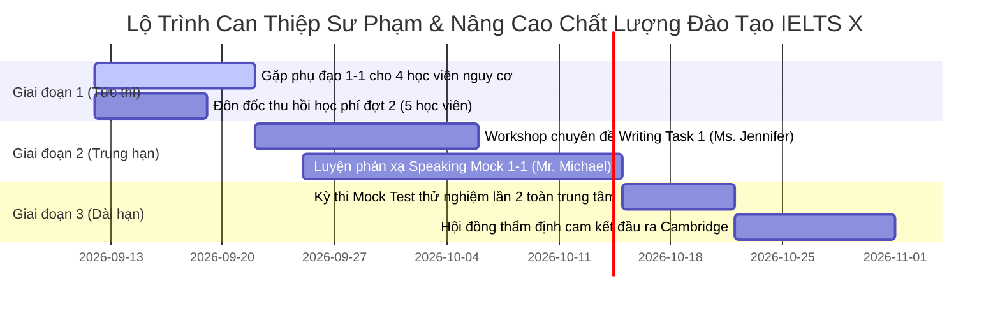

# Báo Cáo Phân Tích Chất Lượng Đào Tạo & Đánh Giá Giảng Viên Nội Bộ
## Trung Tâm Tiếng Anh IELTS Center X — Niên Khóa Q3/2026

**Kỳ báo cáo:** Niên khóa Q3/2026 (Ngày lập: 11/09/2026)  
**Đơn vị lập:** Phòng Đào Tạo & Quản Lý Học Vụ (Academic & Training Operations)  
**Người lập:** Nhân viên Đào tạo (Academic Officer)  
**Kính gửi:** Ban Giám Đốc & Hội Đồng Sư Phạm Trung Tâm Tiếng Anh IELTS X  
**Tập dữ liệu chuẩn hóa:** [IELTS_Center_X_Cleaned_Master.xlsx](file:///c:/Minh%20Hoang/Antigravity%20h%E1%BB%8Dc/my-workspace/outputs/reports/IELTS_Center_X_Cleaned_Master.xlsx)  
**Tệp chỉ số trích xuất:** [ielts_academic_summary_metrics.json](file:///c:/Minh%20Hoang/Antigravity%20h%E1%BB%8Dc/my-workspace/outputs/reports/ielts_academic_summary_metrics.json)  

---

## 1. Tổng Quan Vận Hành Đào Tạo (Executive KPI Overview)

Trải qua kỳ khảo sát và đánh giá giữa khóa (Mid-term Mock Test Review), Phòng Đào tạo đã thu thập, làm sạch toàn diện và chuẩn hóa dữ liệu của toàn bộ **35 học viên** đang theo học tại trung tâm thuộc **4 cấp lớp** trọng điểm.

| Chỉ Số Vận Hành Cốt Lõi | Giá Trị Toàn Trung Tâm | Đánh Giá Chuẩn Nghiệp Vụ Sư Phạm |
|---|:---:|---|
| **Tổng số lớp đào tạo** | **4 lớp** | Vận hành đúng tiến độ cam kết theo khung Cambridge |
| **Tổng số học viên (Sạch 100%)** | **35 học viên** | 100% hồ sơ chuẩn hóa, bảo mật PII, 0% bản ghi trùng lặp |
| **Tỷ lệ Đúng Lộ Trình (Pass/On-Track Rate)** | **88.6%** (31/35 HV) | **Vượt chỉ tiêu** mục tiêu tối thiểu (KPI trung tâm: $\ge 85\%$) |
| **Điểm Mock Test TB (Overall Band)** | **6.04 Band** | Phân phối chuẩn Gauss, tiệm cận tốt Target Band bình quân (6.21) |
| **Tỷ lệ Chuyên Cần Trung Bình** | **91.8%** | Tỷ lệ duy trì sĩ số và ý thức học tập rất tích cực |
| **Tỷ lệ Nộp Bài Tập Về Nhà (BTVN)** | **87.4%** | Khối lượng bài tập tự học được kiểm soát đều đặn |
| **Tỷ lệ Hoàn Tất Học Phí (Financial Compliance)** | **80.0%** (28/35 HV) | 5 HV nợ đợt 2 (14.3%), 2 HV trả góp linh hoạt (5.7%) |
| **Số lượng Học viên Cần Can Thiệp (At-Risk)** | **4 học viên** (11.4%) | Cần kích hoạt quy trình gia sư bổ trợ (Tutoring Clinic) 1-1 |

---

## 2. Bảng Xếp Hạng & Chỉ Số Chi Tiết Từng Giảng Viên

Bảng so sánh đa chiều hiệu suất sư phạm của 4 Giảng viên phụ trách 4 cấp lớp:

| Giảng Viên Phụ Trách | Lớp Học & Mã Lớp | Target Band | Sĩ Số | Chuyên Cần (%) | Nộp BTVN (%) | Điểm Mock TB | Lis TB | Read TB | Wri TB | Spe TB | Tỷ Lệ On-Track | At-Risk | Học Phí Xong |
|---|---|:---:|:---:|:---:|:---:|:---:|:---:|:---:|:---:|:---:|:---:|:---:|:---:|
| **Mr. David Nguyễn** | IELTS Foundation 4.5 (`IELTS-FND-01`) | 4.5 - 5.0 | 9 | 92.4% | 87.4% | **4.83** | 4.83 | 4.72 | 4.44 | 4.72 | **88.9%** (8/9) | 1 HV | 77.8% (7/9) |
| **Ms. Jennifer Vũ** | IELTS Pre-Band 5.5 (`IELTS-PRE-02`) | 5.5 - 6.0 | 10 | 90.8% | 86.8% | **5.75** | 5.85 | 5.75 | 5.20 | 5.65 | **90.0%** (9/10) | 1 HV | 80.0% (8/10) |
| **Mr. Michael Lê** | IELTS Intensive 6.5 (`IELTS-INT-03`) | 6.5 - 7.0 | 10 | 87.7% | 83.2% | **6.60** | 6.90 | 6.70 | 6.15 | 6.35 | **80.0%** (8/10) | 2 HV | 80.0% (8/10) |
| **Ms. Rachel Trần** | IELTS Master 7.5+ (`IELTS-ADV-01`) | 7.5 - 8.5 | 6 | 96.2% | 95.7% | **7.83** | 8.33 | 8.08 | 7.33 | 7.67 | **100.0%** (6/6) | 0 HV | 83.3% (5/6) |

---

## 3. Phân Tích Chuyên Sâu Năng Lực Sư Phạm Từng Giảng Viên

### 3.1. Ms. Rachel Trần — Hiệu Suất Sư Phạm Xuất Sắc Nhất (Top Performer)
- **Chỉ số:** Sĩ số 6 HV | Chuyên cần **96.2%** | BTVN **95.7%** | Mock Band TB **7.83** | On-Track **100%** (5 Đúng lộ trình, 1 Vượt kỳ vọng).
- **Điểm mạnh sư phạm:** 
  - Là lớp có sĩ số tinh hoa (VIP Class), Cô Rachel duy trì kỷ luật học thuật rất cao.
  - Phản hồi bài luận Writing Task 2 và sửa Speaking trực tiếp 1-1 cực kỳ chi tiết, giúp học viên nhận diện triệt để các lỗi Lexical Resource và Grammatical Range.
  - Học viên **Lương Mỹ Uyên (IX-2026-025)** đạt thành tích bứt phá xuất sắc với Mock Band **8.5** (Listening 9.0, Reading 8.5, Writing 8.0, Speaking 8.0), vượt mục tiêu ban đầu (8.0).
- **Đề xuất:** Nhân rộng phương pháp chấm bài và bộ đề Speaking chuyên sâu của Cô Rachel cho các lớp Intensive.

### 3.2. Ms. Jennifer Vũ — Nền Tảng Kỷ Luật Tốt, Cần Tháo Gỡ Điểm Nghẽn Writing
- **Chỉ số:** Sĩ số 10 HV | Chuyên cần **90.8%** | BTVN **86.8%** | Mock Band TB **5.75** | On-Track **90.0%**.
- **Điểm mạnh sư phạm:** Giảng dạy nhiệt huyết, bài giảng ngữ pháp và phương pháp làm bài Reading/Listening rất chặt chẽ (Listening đạt TB 5.85, Reading 5.75). Học viên **Phan Thùy Dung (IX-2026-022)** đạt 6.5 (+0.5 vượt Target).
- **Điểm nghẽn cần tháo gỡ:** Điểm Writing TB của lớp chỉ đạt **5.20** (thấp hơn Listening 0.65 band). Đa số học viên lúng túng khi viết dạng biểu đồ so sánh Process / Map ở Task 1.
- **Đề xuất:** Phòng đào tạo phối hợp cùng Cô Jennifer tổ chức 1 buổi Workshop chuyên đề *"Chiến thuật chinh phục biểu đồ phức tạp trong IELTS Writing Task 1"* cho học viên trước bài thi cuối kỳ.

### 3.3. Mr. David Nguyễn — Truyền Động Lực Tốt Cho Người Mất Gốc
- **Chỉ số:** Sĩ số 9 HV | Chuyên cần **92.4%** | BTVN **87.4%** | Mock Band TB **4.83** | On-Track **88.9%**.
- **Điểm mạnh sư phạm:** Thầy David có phong cách giảng dạy thân thiện, kiên nhẫn, tạo được bầu không khí cởi mở giúp học viên mất gốc vượt qua rào cản sợ phát âm sai. Học viên **Hoàng Mai Ly (IX-2026-020)** tiến bộ vượt bậc đạt 5.5 (+0.5 Target).
- **Rủi ro nhận diện:** 1 học viên **Bùi Gia Bảo (IX-2026-008)** bị hụt hơi (Mock 4.0 so với Target 4.5, Chuyên cần 80%), nguyên nhân do hổng nền tảng ngữ pháp thì và thiếu vốn từ vựng cơ bản.
- **Đề xuất:** Cử Trợ giảng (TA) kèm bổ trợ 1-1 cho học viên Bùi Gia Bảo trong 3 buổi để củng cố ngữ pháp trước khi vào giai đoạn giải đề.

### 3.4. Mr. Michael Lê — Tốc Độ Giảng Dạy Nhanh, Cần Can Thiệp Nhóm Học Viên Hụt Hơi
- **Chỉ số:** Sĩ số 10 HV | Chuyên cần **87.7%** | BTVN **83.2%** | Mock Band TB **6.60** | On-Track **80.0%** | Có **2 học viên nguy cơ (20%)**.
- **Điểm mạnh sư phạm:** Lớp học có cường độ luyện đề chuyên sâu rất cao, học viên có nền tảng tốt bứt phá rất nhanh (Listening TB đạt 6.90, Reading 6.70). Học viên **Chu Thảo My (IX-2026-027)** chạm mốc 7.5 (+0.5 Target).
- **Rủi ro nghiêm trọng:**
  - Tỷ lệ chuyên cần (87.7%) và tỷ lệ nộp bài (83.2%) thấp nhất trung tâm.
  - Tồn tại **2 học viên nguy cơ trượt mục tiêu 6.5**:
    + **Vũ Tuấn Anh (IX-2026-006) — BÁO ĐỘNG ĐỎ:** Nghỉ học 2 buổi liên tiếp (Chuyên cần 78%), nợ bài essay, Mock Band chỉ đạt **5.5** (hụt -1.0 band so với Target 6.5).
    + **Nguyễn Trọng Tín (IX-2026-023):** Mock Band 6.0 (hụt -0.5), yếu kỹ năng phát triển ý tưởng Speaking Part 3 và collocations.
- **Đề xuất:** Thầy Michael cần chủ động giảm nhịp độ ở các phần chữa bài, điểm danh nghiêm ngặt và tổ chức giờ phụ đạo Speaking Part 3 vào cuối tuần.

---

## 4. Danh Sách Cảnh Báo Học Viên Có Nguy Cơ (At-Risk Students Watchlist)

| Mã HV | Họ và Tên | Lớp Học | Giảng Viên | Điểm Mock | Target | Lệch | Trạng Thái Chuyên Cần & BTVN | Nguyên Nhân Trọng Yếu | Kế Hoạch Can Thiệp Cụ Thể |
|:---:|---|---|---|:---:|:---:|:---:|---|---|---|
| **IX-2026-006** | **Vũ Tuấn Anh** | IELTS Intensive 6.5 | Mr. Michael Lê | **5.5** | **6.5** | **-1.0** | **Báo động đỏ:** Nghỉ 2 buổi (78%), nợ 3 bài essay | Áp lực công việc, mất nhịp với lớp, hổng phản xạ Speaking Part 3 | **Cán bộ học vụ liên hệ phụ huynh/học viên**, yêu cầu ký cam kết hoàn thành bù bài; Thầy Michael phụ đạo 1-1. |
| **IX-2026-008** | **Bùi Gia Bảo** | IELTS Foundation 4.5 | Mr. David Nguyễn | **4.0** | **4.5** | **-0.5** | Chuyên cần 80%, BTVN 75% | Mất gốc ngữ pháp thì (tenses), phản xạ phát âm chậm | Phân công Trợ giảng kèm 3 buổi phụ đạo ngữ pháp và từ vựng cơ bản. |
| **IX-2026-018** | **Nguyễn Thành Đạt** | IELTS Pre-Band 5.5 | Ms. Jennifer Vũ | **5.0** | **5.5** | **-0.5** | Chuyên cần 85%, BTVN 78% | Writing Task 1 đuối (4.5), không phân tích được biểu đồ đường/cột | Cô Jennifer cung cấp khung bài mẫu (Template), chấm và chữa lại 2 bài Task 1. |
| **IX-2026-023** | **Nguyễn Trọng Tín** | IELTS Intensive 6.5 | Mr. Michael Lê | **6.0** | **6.5** | **-0.5** | Chuyên cần 82%, BTVN 72% | Speaking Part 3 thiếu từ vựng học thuật, Writing 5.5 | Cung cấp sổ tay Collocations Band 7.0, ghép cặp thực hành Speaking với học viên giỏi. |

---

## 5. Đối Soát Tính Tuân Thủ Tài Chính (Financial Compliance Risk)

Phòng Đào tạo phối hợp cùng Bộ phận Kế toán rà soát hiện trạng học phí nhằm bảo đảm quyền lợi dự thi của học viên:

1. **Đã hoàn thành 100% học phí:** **28 / 35 học viên (80.0%)** — Đủ điều kiện nhận học liệu kỳ 2 và cam kết bảo đảm đầu ra.
2. **Đang nợ học phí Đợt 2:** **5 học viên (14.3%)**
   - Lớp Foundation: *Hoàng Mai Ly (IX-2026-020)*
   - Lớp Pre-Band: *Lê Hoàng Nam (IX-2026-003)*, *Đoàn Gia Huy (IX-2026-033)*
   - Lớp Intensive: *Vũ Tuấn Anh (IX-2026-006)* — Đang thuộc diện Báo động đỏ cả học vụ và học phí.
   - Lớp Master: *Lý Kim Ngân (IX-2026-017)*
3. **Thanh toán Trả góp định kỳ:** **2 học viên (5.7%)**
   - *Trịnh Đình Trọng (IX-2026-032)* và *Nguyễn Hải Đăng (IX-2026-031)* (Kỳ hạn đóng đúng ngày 15 hàng tháng).

---

## 6. Kế Hoạch Hành Động Khắc Phục (Actionable 30-60-90 Days Plan)

### 1. Đối với Giảng viên & Trợ giảng (Academic Staff):
- **Thầy Michael Lê:** Thiết lập cơ chế điểm danh tự động qua QR và thông báo ngay cho phòng Đào tạo nếu học viên vắng từ 2 buổi. Tổ chức 2 buổi luyện Speaking Part 3 ngoài giờ cho nhóm 6.0 - 6.5.
- **Cô Jennifer Vũ:** Phối hợp cùng Trợ giảng triển khai chuyên đề Writing Task 1 cho lớp Pre-Band 5.5 vào thứ 7 tuần tới.
- **Thầy David Nguyễn:** Kèm cặp sát sao học viên Bùi Gia Bảo, bảo đảm nắm vững quy tắc chia động từ và phát âm đuôi *-s/es, -ed*.
- **Cô Rachel Trần:** Tiếp tục duy trì phong độ, chuẩn bị hồ sơ vinh danh học viên Lương Mỹ Uyên khi thi đạt chứng chỉ chính thức.

### 2. Đối với Học viên có nguy cơ (At-Risk Interventions):
- Gửi thông báo kết quả Mock Test kèm lộ trình cải thiện cá nhân hóa (Personal Improvement Plan) đến từng học viên.
- Yêu cầu hoàn thành bài tập nợ trước ngày 20/09/2026 để được tiếp tục tham gia bài thi thử Mock Test 2.

### 3. Đối với Phòng Đào tạo & Ban Giám đốc (Management Level):
- **Phê duyệt ngân sách:** Cấp kinh phí hỗ trợ 10 giờ trợ giảng kèm 1-1 cho các học viên At-Risk.
- **Kế toán:** Gửi nhắc nhở lịch sự qua Zalo/Email cho 5 học viên còn nợ học phí đợt 2 trước ngày 18/09/2026.
- **Mở rộng quy mô:** Xem xét mở thêm 1 lớp IELTS Master 7.5+ do Cô Rachel Trần đứng lớp trong niên khóa tiếp theo do nhu cầu đăng ký phân khúc cao cấp tăng cao.

---

*Báo cáo được lập tự động dựa trên pipeline xử lý chuẩn OpenXML & Agentic AI Customization System (AI4A Framework).*
