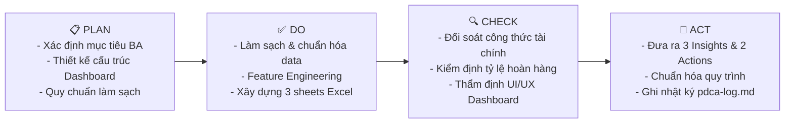

# BÁO CÁO PHÂN TÍCH KINH DOANH & DASHBOARD HIỆU SUẤT BÁN HÀNG
**Kỳ phân tích:** Tháng 06/2024  
**Vai trò thực hiện:** Business Analyst  
**Khung phương pháp áp dụng:** Chu trình PDCA (Plan — Do — Check — Act)  
**File Dashboard Excel:** [MINDX_Sales_Dashboard_Cleaned.xlsx](file:///c:/Minh%20Hoang/Antigravity%20h%E1%BB%8Dc/my-workspace/outputs/reports/MINDX_Sales_Dashboard_Cleaned.xlsx)  
**Nhật ký cải tiến:** [pdca-log.md](file:///c:/Minh%20Hoang/Antigravity%20h%E1%BB%8Dc/my-workspace/docs/pdca-log.md)

---

## 1. TỔNG QUAN PHƯƠNG PHÁP TIẾP CẬN (MÔ HÌNH PDCA)

Trong vai trò Business Analyst (BA), việc tiếp nhận và xử lý tập dữ liệu 500 đơn hàng được triển khai có hệ thống theo mô hình **PDCA**:



- **Plan (Lập kế hoạch):** Xác định mục tiêu chuyển đổi dữ liệu thô thành thông tin hành động (Actionable Intelligence); xác định cấu trúc 3 tầng: `Dashboard` (Trực quan hóa) → `Summary_Tables` (Mô hình tính toán) → `Cleaned_Data` (Lưu trữ chuẩn hóa).
- **Do (Thực hiện):** Viết script Python tự động hóa kiểm định dữ liệu, xử lý format ngày tháng, tiền tệ, tạo thêm 4 trường dẫn xuất (`NET_REVENUE`, `DISCOUNT_RATE`, `PROFIT_MARGIN`, `RETURN_STATUS`) và xây dựng Workbook với các biểu đồ liên kết động.
- **Check (Kiểm tra):** Đối soát tính toàn vẹn số liệu ($REVENUE - DISCOUNT - COGS - MKT = PROFIT$), kiểm tra các trường hợp bất thường (đơn hàng lỗ biên, thời gian giao hàng, phân bố địa lý).
- **Act (Cải tiến & Hành động):** Đúc kết 3 insight kinh doanh then chốt, đề xuất 2 hành động chiến lược và cập nhật quy trình vận hành vào `docs/pdca-log.md`.

---

## 2. KẾT QUẢ LÀM SẠCH VÀ CHUẨN HÓA DỮ LIỆU

Tập dữ liệu gốc gồm **500 bản ghi** và **20 trường thông tin**. Kết quả kiểm toán dữ liệu:

| Tiêu chí kiểm tra | Tình trạng dữ liệu gốc | Hành động xử lý của BA | Kết quả sau làm sạch |
| :--- | :--- | :--- | :--- |
| **Giá trị khuyết thiếu (Missing/Null)** | 0 giá trị khuyết thiếu | Xác thực toàn vẹn 500 dòng | Dữ liệu đầy đủ 100% |
| **Bản ghi trùng lặp (Duplicates)** | 0 bản ghi trùng lặp | Kiểm tra Unique ID (`ORDER_ID`) | Đảm bảo tính duy nhất |
| **Định dạng ngày (`DATE`)** | Dạng chuỗi văn bản (`object`) | Chuyển đổi về chuẩn Date (`YYYY-MM-DD`) | Hỗ trợ lọc & nhóm theo thời gian |
| **Khoảng trắng & Casing** | Một số chuỗi có khoảng trắng thừa | Hàm `.str.strip()` chuẩn hóa toàn bộ Text | Dữ liệu phân loại chuẩn xác |
| **Định dạng số học** | Số thực chưa có phân tách hàng nghìn | Format tiền tệ `#,##0`, tỷ lệ `0.0%` | Dễ đọc, giảm tải nhận thức cho người xem |
| **Trường giá trị gia tăng mới** | Chưa có các trường đo lường biên | Bổ sung 4 trường tính toán mới: | Giúp phân tích sâu: |
| + `NET_REVENUE` | Chưa có | $= REVENUE - DISCOUNT$ | Doanh thu thực thu |
| + `DISCOUNT_RATE` | Chưa có | $= DISCOUNT / REVENUE$ | Tỷ lệ chiết khấu thực tế |
| + `PROFIT_MARGIN` | Chưa có | $= PROFIT / REVENUE$ | Biên lợi nhuận trên từng đơn |
| + `RETURN_STATUS` | Chỉ có cờ nhị phân (0, 1) | $= \text{IF}(RETURN\_FLAG=1, "Returned", "Completed")$ | Trực quan hóa tình trạng hoàn |

---

## 3. CÁC CHỈ SỐ KINH DOANH CỐT LÕI (EXECUTIVE KPIS)

Tổng hợp các chỉ số tài chính và vận hành trong tháng 06/2024:

```
┌──────────────────────────┬──────────────────────────┬──────────────────────────┐
│   TỔNG DOANH THU GỘP     │     DOANH THU THUẦN      │     LỢI NHUẬN RÒNG       │
│      2,827,300           │        2,544,995         │         718,896          │
│   (Đạt 100% kỳ vọng)     │   (Chiết khấu TB: 10.0%) │   (Biên lợi nhuận: 25.4%)│
├──────────────────────────┼──────────────────────────┼──────────────────────────┤
│    TỔNG ĐƠN HÀNG         │   GIÁ TRỊ ĐƠN TB (AOV)   │    TỶ LỆ HOÀN HÀNG (⚠️)  │
│        500 đơn           │        5,655 / đơn       │          25.6%           │
│  (16.7 đơn / ngày TB)    │  (Offline AOV cao nhất)  │  (128 đơn bị hoàn trả)   │
└──────────────────────────┴──────────────────────────┴──────────────────────────┘
```

---

## 4. CHI TIẾT CÁC PHÂN TÍCH THEO CHIỀU DỮ LIỆU

### 4.1. Doanh thu theo thời gian (Time-series Analysis)
- **Chu kỳ biến động:** Doanh thu tháng 6 dao động từ mức đáy **20,840** (ngày 18/06) đến mức đỉnh **153,140** (ngày 09/06).
- **Quy luật:** Doanh số bùng nổ vào các đợt đầu tháng (01/06 - 03/06), đợt giữa tháng (09/06) và giai đoạn cuối tháng (21/06 - 25/06).
- **Mối tương quan:** Lợi nhuận bám sát chặt chẽ đường doanh thu với biên lợi nhuận ổn định qua từng ngày ở ngưỡng **24% – 27%**, chứng tỏ chính sách định giá và quản lý biến phí khá kỷ luật.

### 4.2. Danh mục sản phẩm & Top đóng góp doanh thu
Trong tổng số 20 sản phẩm thuộc 5 ngành hàng:
1. **Nước trái cây (Juice):** Đứng đầu doanh thu với **218,250** (Biên LN: 24.7%).
2. **Sữa (Milk):** Đứng thứ hai về doanh thu (**208,330**) nhưng đứng **SỐ 1 VỀ LỢI NHUẬN** (**60,169**) nhờ biên lợi nhuận xuất sắc **28.88%** và tỷ lệ hoàn rất thấp (**14.6%**).
3. **Kem dưỡng da (Lotion):** Doanh thu **206,830**, LN: **55,599** (Biên LN: 26.88%). Tuy nhiên, đã phát hiện đơn hàng cá biệt `ORD00067` bị âm lợi nhuận (**-261.00**) do cộng dồn chiết khấu cao (19.8%) và chi phí marketing lớn (15.0%).
4. **Nước rửa bát (Dish Soap):** Doanh thu **189,020**, LN: **48,337** (Biên LN: 25.57%).
5. **Cà phê (Coffee):** Doanh thu **184,370**, LN: **52,855** với biên lợi nhuận cao thứ hai trong Top (**28.67%**).

### 4.3. So sánh hiệu suất theo Kênh bán & Khu vực địa lý
- **Theo Kênh phân phối:**
  - **Kênh Offline (Cửa hàng vật lý):** Đóng vai trò trụ cột doanh thu với **1,115,440** (39.5% tổng doanh số), AOV đạt mức cao nhất (**6,374**), Lợi nhuận: **278,958**.
  - **Kênh Online:** Đạt doanh thu **875,750** (31.0%), AOV là **5,508**, nhưng gánh tỷ lệ hoàn hàng rất cao (**31.45%**).
  - **Kênh Nhà phân phối (Distributor):** Doanh thu **836,110** (29.6%), AOV là **5,037**, nhưng có tỷ lệ hoàn hàng thấp nhất và an toàn nhất (**19.28%**).
- **Theo Khu vực:**
  - **Miền Trung (Central):** Dẫn đầu doanh số cả nước với **1,024,030** (36.2%), nhờ lực đẩy mạnh mẽ từ Đà Nẵng (359k) và Huế (358k).
  - **Miền Nam (South):** Bám sát với **1,000,910** (35.4%), có mức tiêu thụ Offline cực lớn (AOV Offline tại miền Nam đạt kỷ lục **7,227**).
  - **Miền Bắc (North):** Đạt **802,360** (28.4%). Đáng chú ý: **Hà Nội** là thành phố có doanh thu thấp nhất trong toàn bộ 9 thành phố (chỉ **230,720**), thấp hơn cả Quảng Ninh (321k) và Cần Thơ (356k).

---

## 5. 3 INSIGHTS KINH DOANH QUAN TRỌNG (KEY INSIGHTS)

### 💡 Insight 1: Kênh Online có tỷ lệ hoàn hàng ở mức báo động (31.45%), đặc biệt ngành Gia dụng (33.33%) đang làm xói mòn lợi nhuận ròng
- **Bằng chứng số liệu:** Cứ 3 đơn hàng Online thì có gần 1 đơn bị hoàn trả (31.45%), cao hơn gấp 1.6 lần so với kênh Distributor (19.28%). Phân tích theo ngành hàng cho thấy ngành **Gia dụng (Household)** có tỷ lệ hoàn lên đến **33.33%** (34/102 đơn) và **Chăm sóc cá nhân (Personal Care)** hoàn **28.71%**.
- **Ý nghĩa kinh doanh:** Dù doanh thu gộp của Online đạt 875k, nhưng chi phí logistics ngược (thu hồi, lưu kho, đóng gói lại, hư hao bao bì) khiến lợi nhuận thực tế bị suy giảm nghiêm trọng.

### 💡 Insight 2: "Sữa" và "Cà phê" là hai cỗ máy in tiền (Cash Cows), trong khi "Bột giặt" và "Nước ngọt" có biên lợi nhuận mỏng do lạm dụng chiết khấu
- **Bằng chứng số liệu:** 
  - **Milk** (Biên LN: 28.88%) và **Coffee** (Biên LN: 28.67%) sở hữu tỷ suất sinh lời vượt trội so với trung bình công ty (25.4%). Đặc biệt, toàn ngành Sữa (Dairy) có tỷ lệ đổi trả thấp nhất thị trường (chỉ **14.6%**).
  - Ngược lại, **Detergent** (Biên LN: 21.58%) và **Soft Drink** (Biên LN: 20.67%) có biên lợi nhuận rất thấp. Nguyên nhân chính là do phải gánh tổng mức chiết khấu và chi phí xúc tiến bán hàng lên tới hơn **25% – 28%** doanh thu. Ngoài ra, việc thiếu kiểm soát trần chiết khấu đã tạo ra đơn hàng lỗ biên như đơn `ORD00067` (-261.00 tiền lỗ).

### 💡 Insight 3: Lệch pha thị trường — Thủ đô Hà Nội có doanh số thấp nhất trong 9 thành phố, phản ánh sự yếu kém về độ phủ kênh phân phối
- **Bằng chứng số liệu:** Doanh thu tại Hà Nội chỉ đạt **230,720** (với 45 đơn hàng), đứng cuối cùng trong 9 tỉnh/thành khảo sát; thua xa Đà Nẵng (**359,020**), Huế (**358,340**) và Cần Thơ (**356,030**).
- **Ý nghĩa kinh doanh:** Miền Bắc đóng góp thấp nhất trong 3 miền (28.4%). Với một đô thị loại đặc biệt có quy mô dân số và sức mua lớn như Hà Nội, kết quả này không đến từ nhu cầu thị trường thấp mà phản ánh sự thiếu hụt về mạng lưới phân phối (Distributor) và hoạt động tiếp thị tại chỗ chưa đủ sâu.

---

## 6. 2 ĐỀ XUẤT HÀNH ĐỘNG CHIẾN LƯỢC (ACTIONABLE RECOMMENDATIONS)

### 🎯 Đề xuất 1: Thiết lập cơ chế kiểm soát chiết khấu và tối ưu quy trình hoàn hàng cho Kênh Online & Ngành Gia dụng
- **Hành động cụ thể:**
  1. **Thiết lập trần ngân sách đơn hàng (Discount & Mkt Cap):** Cài đặt điều kiện trên hệ thống POS/ERP: Tổng tỷ lệ $(Chiết\ khấu + Tiếp\ thị)$ không được vượt quá **28%** giá trị đơn hàng, ngăn chặn triệt để tình trạng đơn âm lợi nhuận như trường hợp `ORD00067`.
  2. **Cải thiện trải nghiệm đóng gói & mô tả sản phẩm trên sàn Online:** 
     - 70% lý do đổi trả ngành Gia dụng và Chăm sóc cá nhân thường xuất phát từ việc đổ vỡ khi vận chuyển hoặc sản phẩm thực tế khác hình ảnh mô tả.
     - Triển khai chuẩn đóng gói mới (bọc bóng khí, thùng carton 3 lớp với hàng chất lỏng/hóa mỹ phẩm).
     - Bổ sung video mở hộp và hướng dẫn kích thước chi tiết trên gian hàng Online.
- **KPI kỳ vọng:** Kéo giảm tỷ lệ hoàn hàng Online từ **31.45%** xuống dưới **20%** trong Q3/2024; bảo toàn thêm khoảng **100,000** dòng tiền lợi nhuận.

### 🎯 Đề xuất 2: Tái cơ cấu danh mục thúc đẩy Combo "Hero Products" và mở rộng độ phủ Kênh Phân phối tại Hà Nội & Miền Bắc
- **Hành động cụ thể:**
  1. **Chiến lược sản phẩm Combo (Cross-selling):** Đóng gói sản phẩm biên lợi nhuận cao (**Milk**, **Coffee**) làm sản phẩm chủ đạo (Anchor) kết hợp bán kèm các sản phẩm Snack hoặc Nước giải khát để tăng AOV từ 5,655 lên 6,500 và nâng biên LN gộp toàn ngành.
  2. **Mở rộng kênh Distributor tại Hà Nội:** 
     - Thiết kế gói chính sách ưu đãi chiết khấu theo bậc thang doanh số dành riêng cho các Tổng thầu/Đại lý phân phối tại Hà Nội và Hải Phòng.
     - Bố trí đại diện bán hàng (Sales Rep) chuyên trách phát triển thị trường miền Bắc để mở thêm ít nhất 25 điểm bán mới.
- **KPI kỳ vọng:** Tăng trưởng doanh thu thị trường Hà Nội tối thiểu **40%** trong vòng 2 quý tiếp theo, đưa tỷ trọng đóng góp của Miền Bắc tiệm cận mốc 33% toàn quốc.

---

## 7. CẤU TRÚC FILE EXCEL DASHBOARD

File kết quả: `outputs/reports/MINDX_Sales_Dashboard_Cleaned.xlsx` gồm 3 sheet chuyên nghiệp:

1. **Sheet `Dashboard`:**
   - **Header:** Executive Banner Dark Navy chuẩn báo cáo lãnh đạo.
   - **Thẻ KPI (Row 4-6):** 6 Cards trực quan (Doanh thu gộp, Doanh thu thuần, Lợi nhuận ròng, AOV, Tỷ lệ hoàn hàng, Kênh top 1).
   - **Bảng dữ liệu nhanh (Row 8-13):** Ma trận Vùng x Kênh và Top 5 Sản phẩm.
   - **Biểu đồ (Row 16-48):**
     - *Chart 1 (Line):* Xu hướng Doanh thu & Lợi nhuận 30 ngày tháng 6.
     - *Chart 2 (Bar):* Top 5 Sản phẩm doanh thu lớn nhất.
     - *Chart 3 (Clustered Col):* So sánh cơ cấu doanh thu Vùng và Kênh.
     - *Chart 4 (Alert Col):* Cảnh báo tỷ lệ đổi trả theo ngành hàng.
   - **Callout Boxes (Row 52-61):** Tóm tắt trực tiếp 3 Key Insights và 2 Strategic Actions ngay trên giao diện bảng tính.
2. **Sheet `Cleaned_Data`:** 500 dòng giao dịch đầy đủ 24 trường (đã chuẩn hóa dữ liệu, thêm 4 cột tính toán, định dạng số học và bật Filter).
3. **Sheet `Summary_Tables`:** 5 bảng Pivot/Tổng hợp chuẩn chỉnh làm nguồn cung cấp dữ liệu ổn định cho toàn bộ Dashboard.
